### Todo stack ✨

[![bun](https://img.shields.io/badge/bun-DDF56D?style=for-the-badge&logo=data:image/svg%2bxml;base64,PHN2ZyBpZD0iQnVuIiB4bWxucz0iaHR0cDovL3d3dy53My5vcmcvMjAwMC9zdmciIHZpZXdCb3g9IjAgMCA4MCA3MCI+CiAgICA8ZyBpZD0iQm9keSI+CiAgICAgICAgPHBhdGggaWQ9IkJhY2tncm91bmQiIGQ9Ik03MywzNS43YzAsMTUuMjEtMTUuNjcsMjcuNTQtMzUsMjcuNTRTMyw1MC45MSwzLDM1LjdDMywyNi4yNyw5LDE3Ljk0LDE4LjIyLDEzUzMzLjE4LDMsMzgsM3M4Ljk0LDQuMTMsMTkuNzgsMTBDNjcsMTcuOTQsNzMsMjYuMjcsNzMsMzUuN1oiIHN0eWxlPSJmaWxsOiNmYmYwZGYiLz4KICAgICAgICA8cGF0aCBpZD0iVG9wIiBkPSJNMzUuMTIsNS41M0ExNi40MSwxNi40MSwwLDAsMSwyOS40OSwxOGMtLjI4LjI1LS4wNi43My4zLjU5LDMuMzctMS4zMSw3LjkyLTUuMjMsNi0xMy4xNEMzNS43MSw1LDM1LjEyLDUuMTIsMzUuMTIsNS41M1ptMi4yNywwQTE2LjI0LDE2LjI0LDAsMCwxLDM5LDE5Yy0uMTIuMzUuMzEuNjUuNTUuMzZDNDEuNzQsMTYuNTYsNDMuNjUsMTEsMzcuOTMsNSwzNy42NCw0Ljc0LDM3LjE5LDUuMTQsMzcuMzksNS40OVptMi43Ni0uMTdBMTYuNDIsMTYuNDIsMCwwLDEsNDcsMTcuMTJhLjMzLjMzLDAsMCwwLC42NS4xMWMuOTItMy40OS40LTkuNDQtNy4xNy0xMi41M0M0MC4wOCw0LjU0LDM5LjgyLDUuMDgsNDAuMTUsNS4zMlpNMjEuNjksMTUuNzZhMTYuOTQsMTYuOTQsMCwwLDAsMTAuNDctOWMuMTgtLjM2Ljc1LS4yMi42Ni4xOC0xLjczLDgtNy41Miw5LjY3LTExLjEyLDkuNDVDMjEuMzIsMTYuNCwyMS4zMywxNS44NywyMS42OSwxNS43NloiIHN0eWxlPSJmaWxsOiNjY2JlYTc7ZmlsbC1ydWxlOmV2ZW5vZGQiLz4KICAgICAgICA8cGF0aCBkPSJNNDUuMDUsNDNhOC45Myw4LjkzLDAsMCwxLTIuOTIsNC43MSw2LjgxLDYuODEsMCwwLDEtNCwxLjg4QTYuODQsNi44NCwwLDAsMSwzNCw0Ny43MSw4LjkzLDguOTMsMCwwLDEsMzEuMTIsNDNhLjcyLjcyLDAsMCwxLC44LS44MUg0NC4yNkEuNzIuNzIsMCwwLDEsNDUuMDUsNDNaIiBzdHlsZT0iZmlsbDojYjcxNDIyIi8+CiAgICA8L2c+ICAgIAogICAgPGcgaWQ9IlRvbmd1ZSI+CiAgICAgICAgPHBhdGggaWQ9IkJhY2tncm91bmQtMyIgZGF0YS1uYW1lPSJCYWNrZ3JvdW5kIiBkPSJNMzQsNDcuNzlhNi45MSw2LjkxLDAsMCwwLDQuMTIsMS45LDYuOTEsNi45MSwwLDAsMCw0LjExLTEuOSwxMC42MywxMC42MywwLDAsMCwxLTEuMDcsNi44Myw2LjgzLDAsMCwwLTQuOS0yLjMxLDYuMTUsNi4xNSwwLDAsMC01LDIuNzhDMzMuNTYsNDcuNCwzMy43Niw0Ny42LDM0LDQ3Ljc5WiIgc3R5bGU9ImZpbGw6I2ZmNjE2NCIvPgogICAgICAgIDxwYXRoIGlkPSJPdXRsaW5lLTIiIGRhdGEtbmFtZT0iT3V0bGluZSIgZD0iTTM0LjE2LDQ3YTUuMzYsNS4zNiwwLDAsMSw0LjE5LTIuMDgsNiw2LDAsMCwxLDQsMS42OWMuMjMtLjI1LjQ1LS41MS42Ni0uNzdhNyw3LDAsMCwwLTQuNzEtMS45Myw2LjM2LDYuMzYsMCwwLDAtNC44OSwyLjM2QTkuNTMsOS41MywwLDAsMCwzNC4xNiw0N1oiLz4KICAgIDwvZz4KCiAgICA8ZyBpZD0iRmFjZSI+CiAgICAgICAgPGVsbGlwc2UgaWQ9IlJpZ2h0X0JsdXNoIiBkYXRhLW5hbWU9IlJpZ2h0IEJsdXNoIiBjeD0iNTMuMjIiIGN5PSI0MC4xOCIgcng9IjUuODUiIHJ5PSIzLjQ0IiBzdHlsZT0iZmlsbDojZmViYmQwIi8+CiAgICAgICAgPGVsbGlwc2UgaWQ9IkxlZnRfQmx1Y2giIGRhdGEtbmFtZT0iTGVmdCBCbHVjaCIgY3g9IjIyLjk1IiBjeT0iNDAuMTgiIHJ4PSI1Ljg1IiByeT0iMy40NCIgc3R5bGU9ImZpbGw6I2ZlYmJkMCIvPgogICAgICAgIDxwYXRoIGlkPSJFeWVzIiBkPSJNMjUuNywzOC44YTUuNTEsNS41MSwwLDEsMC01LjUtNS41MUE1LjUxLDUuNTEsMCwwLDAsMjUuNywzOC44Wm0yNC43NywwQTUuNTEsNS41MSwwLDEsMCw0NSwzMy4yOSw1LjUsNS41LDAsMCwwLDUwLjQ3LDM4LjhaIiBzdHlsZT0iZmlsbC1ydWxlOmV2ZW5vZGQiLz4KICAgICAgICA8cGF0aCBpZD0iSXJpcyIgZD0iTTI0LDMzLjY0YTIuMDcsMi4wNywwLDEsMC0yLjA2LTIuMDdBMi4wNywyLjA3LDAsMCwwLDI0LDMzLjY0Wm0yNC43NywwYTIuMDcsMi4wNywwLDEsMC0yLjA2LTIuMDdBMi4wNywyLjA3LDAsMCwwLDQ4Ljc1LDMzLjY0WiIgc3R5bGU9ImZpbGw6I2ZmZjtmaWxsLXJ1bGU6ZXZlbm9kZCIvPgogICAgPC9nPgo8L3N2Zz4=)](https://bun.sh/)

[![grpc](https://img.shields.io/badge/grpc-DDF56D?style=for-the-badge&logo=data:image/svg%2bxml;base64,PHN2ZyB4bWxucz0iaHR0cDovL3d3dy53My5vcmcvMjAwMC9zdmciIHdpZHRoPSI2NCIgaGVpZ2h0PSI2NCI+PHBhdGggZD0iTTI3LjEyNSAzNi4xNnYxMi40NmMwIDIuNTkzLjQ0IDQuODQ3IDEuMzIzIDYuNzYyczIuMDQ0IDMuNTA2IDMuNDg1IDQuNzczIDMuMDYgMi4yMjUgNC44NTMgMi44NzNTNDAuMzkgNjQgNDIuMjEyIDY0czMuNjMyLS4zMjQgNS40MjYtLjk3MiAzLjQxMi0xLjYwNiA0Ljg1My0yLjg3MyAyLjYwMy0yLjg1OCAzLjQ4NS00Ljc3MyAxLjMyMy00LjE3IDEuMzIzLTYuNzYyVjI3Ljg2bC0xNi4xMjYtLjAyNS0uMDIgOC4zMjVINDguM3YxMi40NmMwIDIuMTgtLjYwMyAzLjc4Ni0xLjggNC44MThzLTIuNjMyIDEuNTQ3LTQuMjggMS41NDctMy4wNzMtLjUxNi00LjI4LTEuNTQ3LTEuOC0yLjYzNy0xLjgtNC44MThWMTUuMzhjMC0yLjE4LjYwMy0zLjc4NiAxLjgtNC44MThzMi42MzItMS41NDcgNC4yOC0xLjU0NyAzLjA3My41MTYgNC4yOCAxLjU0NyAxLjggMi42MzggMS44IDQuODE4djMuMTgyaDlWMTUuMzhjMC0yLjUzNC0uNDQtNC43NzMtMS4zMjMtNi43MThzLTIuMDQ0LTMuNTUtMy40ODUtNC44MThTNDkuNDMyIDEuNjIgNDcuNjQuOTcgNDQuMDM1IDAgNDIuMjEyIDBzLTMuNjMyLjMyNC01LjQyNi45NzItMy40MTIgMS42MDYtNC44NTMgMi44NzMtMi42MDMgMi44NzMtMy40ODUgNC44MTgtMS4zMjMgNC4xODQtMS4zMjMgNi43MTh2MTIuNDZoLTkuMjA3di05LjI4aDIuODI0bC03LjAyLTkuOTItNy4wMiA5LjkyaDIuOTJWMzJjMCAyLjI5OCAxLjg1NyA0LjE2IDQuMTUgNC4xNmgxMy4zNTV6IiBmaWxsPSIjMmRhNmIwIiBmaWxsLXJ1bGU9ImV2ZW5vZGQiLz48L3N2Zz4=&logoColor=black)](https://grpc.io/)

[![elasticstack](https://img.shields.io/badge/elasticstack-DDF56D?style=for-the-badge&logo=data:image/svg%2bxml;base64,PHN2ZyB3aWR0aD0iMjU2cHgiIGhlaWdodD0iMjU2cHgiIHZpZXdCb3g9IjAgMCAyNTYgMjU2IiB4bWxucz0iaHR0cDovL3d3dy53My5vcmcvMjAwMC9zdmciIHByZXNlcnZlQXNwZWN0UmF0aW89InhNaW5ZTWluIG1lZXQiPjxwYXRoIGQ9Ik0yNTUuOTYgMTM0LjM5M2MwLTIxLjUyMS0xMy4zNzMtNDAuMTE3LTMzLjIyMy00Ny40M2E3NS4yMzkgNzUuMjM5IDAgMCAwIDEuMjUzLTEzLjc5MWMwLTM5LjkwOS0zMi4zODYtNzIuMjk1LTcyLjI5NS03Mi4yOTUtMjMuMTkzIDAtNDQuOTIzIDExLjA3NC01OC41MDUgMzAuMDg4LTYuNjg2LTUuMjI0LTE0LjgzNS03Ljk0LTIzLjQwMi03Ljk0LTIxLjEwNCAwLTM4LjQ0NiAxNy4xMzMtMzguNDQ2IDM4LjQ0NiAwIDQuNTk3LjgzNiA5LjE5NCAyLjI5OCAxMy4zNzNDMTMuNTgyIDgxLjczOSAwIDEwMC45NjIgMCAxMjIuMjc0YzAgMjEuNTIyIDEzLjM3MyA0MC4zMjcgMzMuNDMxIDQ3LjY0LS44MzUgNC4zODgtMS4yNTMgOC45ODUtMS4yNTMgMTMuNzkgMCAzOS43IDMyLjM4NiA3Mi4wODcgNzIuMDg2IDcyLjA4NyAyMy40MDIgMCA0NC45MjQtMTEuMjgzIDU4LjUwNS0zMC4wODggNi42ODYgNS4yMjMgMTUuMDQ0IDguMTQ5IDIzLjYxMSA4LjE0OSAyMS4xMDQgMCAzOC40NDYtMTcuMTM0IDM4LjQ0Ni0zOC40NDYgMC00LjU5Ny0uODM2LTkuMTk0LTIuMjk4LTEzLjM3MyAxOS42NC03LjEwNCAzMy40MzEtMjYuMzI3IDMzLjQzMS00Ny42NHoiIGZpbGw9IiNGRkYiLz48cGF0aCBkPSJNMTAwLjA4NSAxMTAuMzY0bDU3LjA0MyAyNi4xMTkgNTcuNjY5LTUwLjU2NWE2NC4zMTIgNjQuMzEyIDAgMCAwIDEuMjUzLTEyLjc0NmMwLTM1LjUyLTI4LjgzNC02NC4zNTUtNjQuMzU1LTY0LjM1NS0yMS4zMTMgMC00MS4xNjIgMTAuNDQ3LTUzLjA3MiAyNy45OThsLTkuNjEyIDQ5LjczIDExLjA3NCAyMy44MnoiIGZpbGw9IiNGNEJEMTkiLz48cGF0aCBkPSJNNDAuOTUzIDE3MC43NWMtLjgzNSA0LjE3OS0xLjI1MyA4LjU2Ny0xLjI1MyAxMi45NTUgMCAzNS41MiAyOS4wNDMgNjQuNTY0IDY0LjU2NCA2NC41NjQgMjEuNTIyIDAgNDEuMzcyLTEwLjY1NiA1My40OS0yOC4yMDhsOS40MDMtNDkuNzI5LTEyLjc0Ni0yNC4yMzgtNTcuMjUxLTI2LjExOC01Ni4yMDcgNTAuNzc0eiIgZmlsbD0iIzNDQkVCMSIvPjxwYXRoIGQ9Ik00MC41MzYgNzEuOTE4bDM5LjA3MyA5LjE5NCA4Ljc3NS00NC41MDZjLTUuNDMyLTQuMTc5LTExLjkxLTYuMjY4LTE4LjgwNS02LjI2OC0xNi45MjUgMC0zMC45MjQgMTMuNzktMzAuOTI0IDMwLjkyNCAwIDMuNTUyLjYyNyA3LjMxMyAxLjg4IDEwLjY1NnoiIGZpbGw9IiNFOTQ3OEMiLz48cGF0aCBkPSJNMzcuMTkyIDgxLjMyYy0xNy41NTEgNS42NDItMjkuNjcgMjIuNTY3LTI5LjY3IDQwLjk1NCAwIDE3Ljk3IDExLjA3NCAzNC4wNTkgMjcuNzkgNDAuMzI3bDU0Ljk1My00OS43My0xMC4wMy0yMS41Mi00My4wNDMtMTAuMDN6IiBmaWxsPSIjMkM0NThGIi8+PHBhdGggZD0iTTE2Ny43ODQgMjE5Ljg1MmM1LjQzMiA0LjE4IDExLjkxIDYuNDc4IDE4LjU5NiA2LjQ3OCAxNi45MjUgMCAzMC45MjQtMTMuNzkgMzAuOTI0LTMwLjkyNCAwLTMuNzYxLS42MjctNy4zMTQtMS44OC0xMC42NTdsLTM5LjA3My05LjE5My04LjU2NyA0NC4yOTZ6IiBmaWxsPSIjOTVDNjNEIi8+PHBhdGggZD0iTTE3NS43MjQgMTY1LjMxN2w0My4wNDMgMTAuMDNjMTcuNTUxLTUuODUgMjkuNjctMjIuNTY2IDI5LjY3LTQwLjk1NCAwLTE3Ljk3LTExLjA3NC0zMy44NDktMjcuNzktNDAuMzI2bC01Ni40MTUgNDkuMzExIDExLjQ5MiAyMS45NHoiIGZpbGw9IiMxNzY2NTUiLz48L3N2Zz4=)](https://www.elastic.co/)
---

### 🔥 InfinitySquare - Supporting all Stacks-based tokens, Infinity Square is the most optimized platform for the stacks ecosystem, covering NFT trading, management and Defi.

Website : [InfinitySquare](https://infinitysquare.io)

 
<table>
  <tr>
    <td>
      <a href="https://infinitysquare.io" target="_blank">
        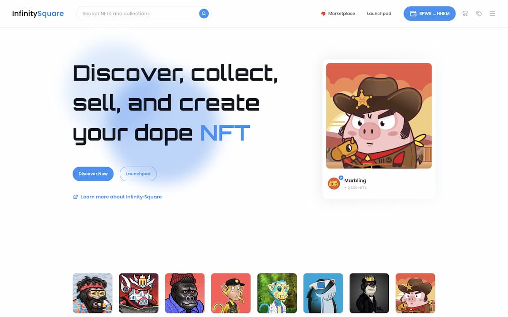
      </a>
    </td>
    <td>
      <a href="https://infinitysquare.io" target="_blank">
        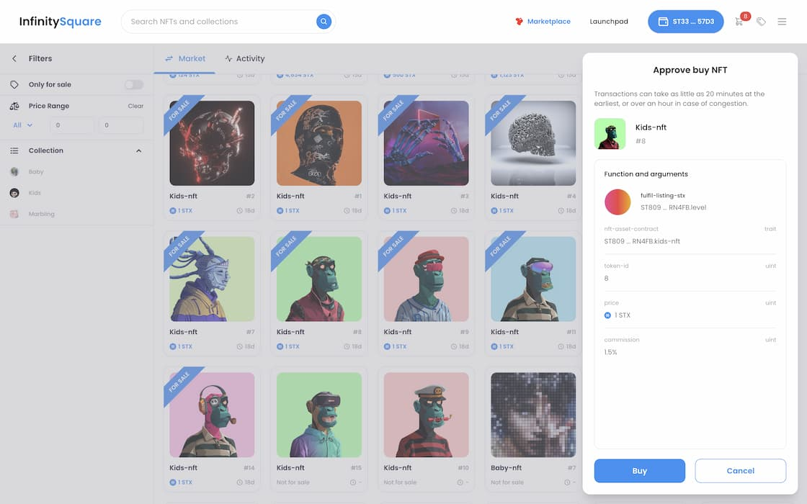
      </a>
    </td>
  </tr>
</table>

[![react-query](https://img.shields.io/badge/React--query-black?style=for-the-badge&logo=data:image/webp;base64,UklGRooGAABXRUJQVlA4WAoAAAAQAAAAPgAAPgAAQUxQSKkBAAABoAPbtmnbGs+2zdC2bdu2bdu2bds2I9u2ovmwz1pjzfXe/2lETAD+X2Zrs3h5l5KUjE0WL26T3dno7/LnhqI2yabdk8C56d3MltBLchq1viuhdzkZIsbdQhXYLsZDXFwxk0VxAzqI5RMHRcT2XCEAk8S6FW+mlXxth41iP5b30k7ksBBn8b4wqMt5L5Rs5t1WcoB3Wcky3jEl/XmzlVTnNVWSgZdBSQQedNyBw+cqDtNS9HssSucUYVRaKZrvTM1gMeSaaP88MqFB7jPi493OIYaIr4sDtoq/QwC0EJ9bIa/4nXedZ+vkv/1cz+Zm9yw7GnnVAkB7j4bgz/6+nC6B4IIbvBgfBYbVj2n7vLgcLOuv+KHoXM/UIMZttFvJ4nJgR3mi4h74mUWng5pKsvP6K2nFW6pkLu+UkmO810ou8z4quc27oeQF77CSL7xVjCGMl7wJhLZo99VuJq+u1ZtqAAqdsyrCi/HR4noB/Bl3kcUVOBxl9GN8coTsZjbEBW4bLM0G05xLDGbD7baAy3PLwLbohoDvo+G6eP0+VZKAWrLL8sVtsuH/JQBWUDggugQAABAWAJ0BKj8APwA+jTaXR6UioiE19dmYoBGJbDbAAODb9zXKCmcf2f8G8HKVau96gPE26QHmA/Yr9RveY9Fn+j9QD+ydQB+zPsAeWz7Hf7h/th7Uf//uwFehvxyymC2lTZo3h7UcQJ3bGCXVlo8YauNsU0uWGLowfJlVibqtaaiOikdZQplbXGmCzSYSq0y6M9DJbLLXmoFIEqv5ukLekafOBDtvYA4CaSIa9b9qONNw8/uGq3UHuFAAAP79JB//zEvUb/+0vX/+rNxP8zhif+x5vD//pc9LCGi6x8uuA8klf5W/H/U3vKtGkgHX1sCT/XFMta1uUbhlkamajsmnEpsB67HpMVxy8/rR9/wb/wELKOc2qn5FQ4f0NisaQo8+c409/srP85xyx0G2Crr5E+L6EzYwfYkaNhIzGO5OLXfWI+tHH4CvwczJv6xBhi/7Nrlyc1CjTjFWbAEh67flq5f9/Z7Z6Gi9nsWv4cF/qpYsploptBiqXKDcyN2TSZJXgv+HxP2/OZOtfHJA9+0AOia0IT2Xc9zvpsdSAyRLpYTVLgBQLoDQ9Zy9oylOrj6i/sHwOPyIpnL7D9BtDzYY6d64UEec/4NqeWxZgt+3n8ydb7uzPPbNV1n/BAY+8vQXyLw7WxUsrWawwKHwmpKzKYn3go+cYexK9a3VPtJDQfaLkkm44/kcuT74KuC8t4jPxDObU436+jQSjB88s3ZgOkNffShlDK3hp6mWB46Ec4wXfjHeTYAUOgaOu8h22CiAgKDmN9dVQDzs5ybIC5Wl+8K/169b2yTzNkiGD8dZBNx6eYj5Cr3JjuE5vw6KOOoR7op/TbC0FQ2R3mnqXASuDMEjG6T9T0Q9qi09yJ3hMt56/m5q1mp5hz9bM6YvkNyhewfOfXhVat2qCPynSVyzBl05I6zl7Xv3MODitbVPj2PVJNvmXWE35hfdtH+mGvyC2d1goT66Vt9ZdreVaVbtIJxDSYaquIIi2Z2sav7vWvJXT3nVeY2K383zTfIsot91s5BCL5yPGY85HJ/pS80NUCV6tG4460amkKzb4XrMQKF/VZ++ehDIeQrKF7lDkPTMa0inbDyQpk4dXjFnwZ6/2Zoqi3x4/XlHK4czdafz7WC9NV2DM5iT0/rVmS1Km/kroV/JqCupyAriXneKpuDrqdgVaAxTnT1k45ID2LL545pY5bPS7Fdl3Ihd5kE4ZfS+ovMF+D42TJ/m+ZNhUzJVrv9w8C+13UqBSRTd74UDr8jcYhkgWSycDVOyUMB9D3U84LLKNBgBWTb91IufqliQbntuyxIlYvfWGn83wcGe2XlQYD2OhGu2SUTNTDJW07kS4W4O0caJ7P5xRVxC+wLF1K+lCWFF7OIHhCz3XaRAijQO8H//zb/f1P9mt/jo2tx/Fbf8zi6wP//v/z7+VH8o9F2PYq9OUnT/rsKa38Wiiuo3i/TzjbG01LO9G4ain4/cQdOD0r3ln0UdewheRc4D2tuG2WOd/+LJ1rWBuzUvyts4wj/DFgIzAYzDePbhj0VA06owlyQ9XDzNP1pAvgvCIAMOtH/OXBa5rG2pLLUoOC0oAsWyNjQmvksYpUfr1BDfMaIrhgJz/LapAAA=)](https://tanstack.com/query/)
[![jotai](https://img.shields.io/badge/Jotai-black?style=for-the-badge&logo=data:image/svg%2bxml;base64,PHN2ZyB4bWxucz0iaHR0cDovL3d3dy53My5vcmcvMjAwMC9zdmciIHZpZXdCb3g9IjAgMCAyODkuMTkgOTkuNzciIGNsYXNzPSJ0ZXh0LWJsYWNrIGRhcms6dGV4dC13aGl0ZSB3LWZ1bGwgbWF4LXctWzEycmVtXSBsZzptYXgtdy1bMTZyZW1dIDJ4bDptYXgtdy1bMThyZW1dIj48dGl0bGU+Sm90YWk8L3RpdGxlPjxwYXRoIGQ9Ik00Mi4zNiw1LjMySDYxLjgyVjcwLjIzYTI5LjQ2LDI5LjQ2LDAsMCwxLTQsMTUuNjFBMjcuMTksMjcuMTksMCwwLDEsNDYuNjQsOTYuMDdhMzYuMjYsMzYuMjYsMCwwLDEtMTYuNTksMy42MSwzNy41NiwzNy41NiwwLDAsMS0xNS4yNS0zQTI0LjMsMjQuMywwLDAsMSw0LDg3LjU5UTAsODEuNSwwLDcyLjIzSDE5LjU5Yy4wNiwzLjY5LDEuMTMsNi41NywzLjIxLDguNjFhMTEuMjEsMTEuMjEsMCwwLDAsOC4yNSwzLjA3cTExLjIyLDAsMTEuMzEtMTMuNjhaIiBmaWxsPSIjZmZmZmZmIj48L3BhdGg+PHBhdGggZD0iTTEwNSw5OS43N3EtMTAuNTksMC0xOC4yOS00LjUyQTMwLjU0LDMwLjU0LDAsMCwxLDc0LjgyLDgyLjYxYTQwLjUyLDQwLjUyLDAsMCwxLTQuMTgtMTguODQsNDAuNzUsNDAuNzUsMCwwLDEsNC4xOC0xOC45M0EzMC42LDMwLjYsMCwwLDEsODYuNzEsMzIuMiwzNS41MiwzNS41MiwwLDAsMSwxMDUsMjcuNjhhMzUuNTgsMzUuNTgsMCwwLDEsMTguMyw0LjUyLDMwLjU3LDMwLjU3LDAsMCwxLDExLjg4LDEyLjY0LDQwLjc2LDQwLjc2LDAsMCwxLDQuMTksMTguOTMsNDAuNTIsNDAuNTIsMCwwLDEtNC4xOSwxOC44NEEzMC41MSwzMC41MSwwLDAsMSwxMjMuMyw5NS4yNVExMTUuNTksOTkuNzgsMTA1LDk5Ljc3Wk0xMjcuMTQsNS4zMnYxMC41SDgyLjg3VjUuMzJabS0yMiw3OS40NWExMiwxMiwwLDAsMCwxMC44OS02cTMuNy02LDMuNy0xNS4xM1QxMTYsNDguNDhhMTIsMTIsMCwwLDAtMTAuODktNiwxMi4xNSwxMi4xNSwwLDAsMC0xMSw2cS0zLjczLDYtMy43MywxNS4xNnQzLjczLDE1LjEzQTEyLjE2LDEyLjE2LDAsMCwwLDEwNS4wOSw4NC43N1oiIGZpbGw9IiNmZmZmZmYiPjwvcGF0aD48cGF0aCBkPSJNMTg2LjMsMjguNTlWNDMuMTRIMTczLjE2Vjc3cTAsNCwxLjgyLDUuNGE3LjUsNy41LDAsMCwwLDQuNzMsMS40MSwxNC43MiwxNC43MiwwLDAsMCwyLjcyLS4yNWwyLjA5LS4zOCwzLDE0LjQxYy0xLC4zLTIuMzMuNjYtNC4wOSwxLjA2YTM0LjEzLDM0LjEzLDAsMCwxLTYuNDEuNzVxLTEwLjU1LjQ3LTE2LjkzLTQuNTZUMTUzLjgsNzkuNVY0My4xNGgtOS41NVYyOC41OWg5LjU1VjExLjg2aDE5LjM2VjI4LjU5WiIgZmlsbD0iI2ZmZmZmZiI+PC9wYXRoPjxwYXRoIGQ9Ik0yMTYsOTkuNzNxLTEwLDAtMTYuNTktNS4yM3QtNi41OS0xNS41OXEwLTcuODEsMy42OC0xMi4yN2EyMS4xOSwyMS4xOSwwLDAsMSw5LjY2LTYuNTNBNTQuNzgsNTQuNzgsMCwwLDEsMjE5LDU3LjQxYTk4LjU3LDk4LjU3LDAsMCwwLDEzLTEuOTFxMy45Mi0xLDMuOTEtNC4zNnYtLjI4YTguNDIsOC40MiwwLDAsMC0yLjctNi42OHEtMi43Mi0yLjM1LTcuNjYtMi4zNmExMy43NywxMy43NywwLDAsMC04LjMyLDIuMjcsMTAuNywxMC43LDAsMCwwLTQuMDksNS43N2wtMTcuOTEtMS40NWEyMy44OCwyMy44OCwwLDAsMSw5LjkzLTE1LjE0cTcuOTQtNS41OCwyMC40OC01LjU5YTQyLjI0LDQyLjI0LDAsMCwxLDE0LjU0LDIuNDYsMjQuMTksMjQuMTksMCwwLDEsMTAuOTQsNy42NnE0LjE2LDUuMjEsNC4xNiwxMy41MlY5OC40MUgyMzYuOTJWODguNzNoLS41NGEyMC4xOCwyMC4xOCwwLDAsMS03LjYyLDcuOTNRMjIzLjY5LDk5LjczLDIxNiw5OS43M1ptNS41NC0xMy4zN0ExNSwxNSwwLDAsMCwyMzIsODIuNjZhMTEuOTQsMTEuOTQsMCwwLDAsNC4wOS05LjJWNjYuMDVhMTEuMzgsMTEuMzgsMCwwLDEtMy41MiwxLjM2Yy0xLjYuMzktMy4yOS43My01LjEsMXMtMy40MS41NC00Ljg0Ljc1YTE5LjE5LDE5LjE5LDAsMCwwLTguMiwyLjg3LDcuMDYsNy4wNiwwLDAsMC0zLjExLDYuMjIsNi45NCw2Ljk0LDAsMCwwLDIuODgsNkExMi40MywxMi40MywwLDAsMCwyMjEuNTEsODYuMzZaIiBmaWxsPSIjZmZmZmZmIj48L3BhdGg+PHBhdGggZD0iTTI3OC42OSwxOS41OWExMC40MSwxMC40MSwwLDAsMS03LjM3LTIuODksOS4xNCw5LjE0LDAsMCwxLTMuMDktNi45Myw5LjEsOS4xLDAsMCwxLDMuMDktNi45MSwxMSwxMSwwLDAsMSwxNC43OCwwLDkuMSw5LjEsMCwwLDEsMy4wOSw2LjkxLDkuMTQsOS4xNCwwLDAsMS0zLjA5LDYuOTNBMTAuNDUsMTAuNDUsMCwwLDEsMjc4LjY5LDE5LjU5Wk0yNjksOTguNDFWMjguNTloMTkuMzZWOTguNDFaIiBmaWxsPSIjZmZmZmZmIj48L3BhdGg+PC9zdmc+)](https://jotai.org/)
[![react-virtualized](https://img.shields.io/badge/react--virtualized-black?style=for-the-badge&logo=data:image/webp;base64,UklGRs4FAABXRUJQVlA4WAoAAAAQAAAAQgAAQgAAQUxQSMgCAAABoKztn2Hb+VXX/5zYzuxwFuceNLJt27ZuwMkwGdq2NTu2bfa/qr5g7b17dZ0LiIgJUJfBGkkHnXTbKz/MXbfDd6yf99Prd55yiKTGgnoZTNLEWz9YylhXfHLXFEkWemCSnfOJAyWlXApQSk6pAPnrC3eTbFhNVLxuBuCpMNaSHJh7+25qmqGYdMYMSKnQbUkO8y6QrLtgOvJt8Mwws8NnExRDR4105gZSZtjZ2X6J1HQSpefB6aPDC1LsIEpvkTL9zIlPTHFMUfFL2kJvW37dQ3EMjfQlLX1u+W2cmlGFoLdo6XfLZ1IYjel5Wvre8rLiKExnkErvcK6UjdDoiI1k+p9ppygOinobp0bnG4UBptNJ1OlcLpMU1MwkV5JZsqeCZLoOp1bnfpmC4kxyNZml+yiYzsap17lK1uhTUkWJ3xQ0wSkVAUdLt+LU7DwmfUCqKvG1DlxKqaqwaeJJFOrOnHYbqbLEI69Ul3nvB3JlhelzKdWtWVcdbN1B/Tt9F+A7dgHtekp1W+dVV1j7E7m6Ga+TKst8eEd1iSdOpVSWOeOQ5ZSqClum6GNSVYnvpLvwqpynpSmFUlPhBDX6hlRR5m/JdCFekXODLGi3eeRqCqsOVJDpdrwa5wmZFDR+PrmSzOr9FSSZLsArcW6U6f+NPsercH6VwggTtpMrKHCUogabLiFV4Nwq08hRL9D2ruUNNRplkD6l7VnLTxqdGtmvtL1qmbmPokYftcdvtD1qmXGwTGONGvcZKfekOD/uI9PYo/QyeC8c3pRMXTbSlTvxPLTslFukqG5D1JSvwfNQisPPR6lp1LlJly8BT51lh9U3SqZhxqC9HlgCeCpjKsmBVY8fIEUN2aR9rvwVIKecy4BScsoAf91woGRBQw8m6ehHv97EWLd899SJkiyol8GCpImnPfretDVbd3q7de2MD544Y6okWVCXVlA4IOACAADwEACdASpDAEMAPpFGnEqlo6Kho/VbQLASCWIA1LvEzhpkrAHqY20XmA6DG8n8sB8NX7MsMFaDLA0rLP+7V9CBjfMeUfPmNu9S/gifQgsyjHUfMJhL+upsXlE/indVoMXmTk/v00zPiH+PJ+0gdbvoAnGZ9L96rQ4E3sqEsDA5ZL3ZK8khCF+uzwtoi0dY6sAA/u9yP/8/7//n5j//z4glVf3ptaQHdi4B95sNcruFkbzb3F8WYBoJ++2NfXevc1b9vdBfBdyqCFlJUhhgcK7T/2bpi7hPRf5/pz5Lfo+KfdYXY/yLj/KQ/9Dzmdk5PynD9B92wEqZJjiUxEZCiaQEd6hSW3sf9yuoSzvgLNvH/adrlYHryhOt0r/a2DdvvjDAV+6EM3bYOUgtneKfvR7CIge9lVoTbLngKk0tBfXIBjXEpM3/iDWcURVFm1FVkiqbsFsjvXhXIqXM3eXljMek8eyHIy7KHz/bFU6WQaZzM/FLGnTs+/69/3PgMz+fuM5MPDxE86Ynt/eM4hv1eDfTzQqDDz1Q41SeUsUJgGNYqqVHgE7hyIZZs2EwHfZbp8WvgwXTgqOLiZRm3fUuvwzlRWSLr+f8RfOawc3gwOEeiqnStdvhfDrpEoHihqsNNXkgcbU2xCd0r+pOKpXkeVOFx4SHvC8K8RqPYhraPG3mLhTKl6cdncl3p6kVe8TJDWqRaaU3ImPb8nf0PIh3p/14q+3v/JQroeOiwCJfoj44fXKdLI3DlDlunSupolxXUR09BXlW1q+PmzaiOFL1zx9ju1H/m2f1NrCdebNycNv4+3Zvioc5KrzWg8kEfQN2f4lc3sNZ4/46W28mjI+2nzjALMP9sBVe2APnAAGpEO2NqscxseZtC+Z38djDVl1BmbBgv5qG47cENXc1dtFKMTqgo3NWSNf/taz//+rN8f/OfR8wTSpoZXvjC34euJ8F+auAgHN0L7Qf/Pu//+rNAAAA)](https://github.com/bvaughn/react-virtualized)
[![react-hook-form](https://img.shields.io/badge/React--hook--form-black.svg?style=for-the-badge&logo=data:image/svg%2bxml;base64,PHN2ZyB4bWxucz0iaHR0cDovL3d3dy53My5vcmcvMjAwMC9zdmciIHZpZXdCb3g9IjAgMCAxMDAgMTAwIiBmaWxsPSIjRUE0RTg1IiA+PHBhdGggZD0iTTczLjU2LDEzLjMySDU4LjE0YTguNTQsOC41NCwwLDAsMC0xNi4yNywwSDI2LjQ0YTExLDExLDAsMCwwLTExLDExVjgxLjYzYTExLDExLDAsMCwwLDExLDExSDczLjU2YTExLDExLDAsMCwwLDExLTExVjI0LjMyQTExLDExLDAsMCwwLDczLjU2LDEzLjMyWm0tMzAuOTIsMmExLDEsMCwwLDAsMS0uNzksNi41NCw2LjU0LDAsMCwxLDEyLjc4LDAsMSwxLDAsMCwwLDEsLjc5aDUuMzh2Ni41NWEzLDMsMCwwLDEtMywzSDQwLjI1YTMsMywwLDAsMS0zLTNWMTUuMzJaTTgyLjU2LDgxLjYzYTksOSwwLDAsMS05LDlIMjYuNDRhOSw5LDAsMCwxLTktOVYyNC4zMmE5LDksMCwwLDEsOS05aDguODF2Ni41NWE1LDUsMCwwLDAsNSw1aDE5LjVhNSw1LDAsMCwwLDUtNVYxNS4zMmg4LjgxYTksOSwwLDAsMSw5LDlaIj48L3BhdGg+PHBhdGggZD0iTTcxLjYsNDUuOTJINTRhMSwxLDAsMCwwLDAsMkg3MS42YTEsMSwwLDAsMCwwLTJaIiBzdHlsZT0idHJhbnNmb3JtOiB0cmFuc2xhdGVYKC0yNXB4KTsiPjwvcGF0aD48cGF0aCBkPSJNNzEuNiw0NS45Mkg1NGExLDEsMCwwLDAsMCwySDcxLjZhMSwxLDAsMCwwLDAtMloiPjwvcGF0aD48cGF0aCBkPSJNNzEuMSw2OS40OUg1My40NWExLDEsMCwxLDAsMCwySDcxLjFhMSwxLDAsMCwwLDAtMloiIHN0eWxlPSJ0cmFuc2Zvcm06IHRyYW5zbGF0ZVgoLTI1cHgpOyI+PC9wYXRoPjxwYXRoIGQ9Ik03MS4xLDY5LjQ5SDUzLjQ1YTEsMSwwLDEsMCwwLDJINzEuMWExLDEsMCwwLDAsMC0yWiI+PC9wYXRoPjwvc3ZnPg==)](https://react-hook-form.com/)

[![elasticbeanstalk](https://img.shields.io/badge/elastic--beanstalk-black?style=for-the-badge&logo=data:image/svg%2bxml;base64,PHN2ZyB4bWxucz0iaHR0cDovL3d3dy53My5vcmcvMjAwMC9zdmciIHhtbG5zOnhsaW5rPSJodHRwOi8vd3d3LnczLm9yZy8xOTk5L3hsaW5rIiB2aWV3Qm94PSIwIDAgNjMuNzUgODUiIGZpbGw9IiNmZmYiIGZpbGwtcnVsZT0iZXZlbm9kZCIgc3Ryb2tlPSIjMDAwIiBzdHJva2UtbGluZWNhcD0icm91bmQiIHN0cm9rZS1saW5lam9pbj0icm91bmQiPjx1c2UgeGxpbms6aHJlZj0iI0EiIHg9IjEuODc1IiB5PSIyLjUiLz48c3ltYm9sIGlkPSJBIiBvdmVyZmxvdz0idmlzaWJsZSI+PGcgc3Ryb2tlPSJub25lIj48cGF0aCBkPSJNMTkuNzExIDQuOTU2VjQwaC00LjI0N3YzMy4wMDNMMzAgODBsOC43NDYtNDBMMzAgMCAxOS43MTEgNC45NTZ6IiBmaWxsPSIjOWQ1MDI1Ii8+PHBhdGggZD0iTTMwIDB2NDAgNDBsMTAuMjg5LTQuOTU2VjQwaDQuMjQ3VjYuOTk3TDMwIDB6IiBmaWxsPSIjZjU4NTM2Ii8+PHBhdGggZD0iTTYwIDI5Ljc3N0w0MS42MSAzMS40NDlsLTYuMDQyLS43MjkgMTkuMTY2LTE4LjgwNUw2MCAyOS43Nzd6IiBmaWxsPSIjNmIzYTE5Ii8+PHBhdGggZD0iTTU0LjczNCAxMS45MTVMNjAgMTQuNDUxdjE1LjMyNmwtNS4yNjYtMS4wMTFWMTEuOTE1eiIgZmlsbD0iI2Y1ODUzNiIvPjxwYXRoIGQ9Ik0zNS41NjggMzAuNzJsMTkuMTY2LTEuOTUzVjExLjkxNUwzNS41NjggMTYuOTFWMzAuNzJ6IiBmaWxsPSIjOWQ1MDI1Ii8+PHBhdGggZD0iTTAgNTAuMjI0bDE4LjM4OS0xLjY3MiA2LjA0Mi43MjlMNS4yNjYgNjguMDg2IDAgNTAuMjI0eiIgZmlsbD0iI2ZiYmY5MyIvPjxwYXRoIGQ9Ik01LjI2NiA2OC4wODZMMCA2NS41NVY1MC4yMjRsNS4yNjYgMS4wNjl2MTYuNzkzeiIgZmlsbD0iIzlkNTAyNSIvPjxwYXRoIGQ9Ik0yNC40MzIgNDkuMjgxTDUuMjY2IDUxLjI5M3YxNi43OTNsMTkuMTY2LTQuOTk1VjQ5LjI4MXoiIGZpbGw9IiNmNTg1MzYiLz48L2c+PC9zeW1ib2w+PC9zdmc+)](https://aws.amazon.com/elasticbeanstalk/)

[![clarity](https://img.shields.io/badge/clarity-black?style=for-the-badge&logo=data:image/png;base64,iVBORw0KGgoAAAANSUhEUgAAAEMAAABDCAYAAADHyrhzAAAAAXNSR0IArs4c6QAACrBJREFUeF7tnH1UVHUax7933mmGGRTkbeQdkwpNzX2pY66aaZYilKbmqr2I27bHPSZiuX/srrHZ/lNu9mJJum2arYJWGqarKAiZu0W6mykJCgzyogMlLzMDDDN3z/PM3GHg6CI1LVb3nnPP4Qy/e+f3+9zv8zy/+zwPCKHhUSJ+xIcIiIIAQRRRIcgwZBg+W5CV4ecWZBgyjCtHCVkZsjJkZfS7g5LNRDaTwTQTQYAoihAEodcsfJ+Jfm8B3jH0O4VCAYVCgMvl7rn+KmP9733F+/ZrJMB3ZyZ+i1IqlaCTDrfLhW6Xi3+mBfhDcosigrRa6G8I4vGdnZ243NYOQth3rASLxikEAXSt0+nsfd9rAOA/JPAw/CDQAjQaDZq/+gpdtlbv9yoRGhHBP0sgpIWFDR2C8tOnei0hyBSKG3RaHut/aNRqdBCspou+j0PCIhji9aGMPmqgWVobLmDU2PFISr4RIUOGwGAwQKsLQlHhQZR9VobQ0FBo1Wqo1SrUnK/EtHtmIH12OpKTkxEZFQmD3oCcnGfw1y2bEROfCLujA2qVCo11FkTHJuDWMWMRNmwY9Ppgvvdnn/4Lh/+xDxHRMeju7h6QNgKrDK/s6enYbHa4RDdmzUzDiJEp0AUFQXS7fZPbX7AXx0uLEJuQBIulDnB1IPeNzUhLS0NYWJhPCS6XCyuzsvDKSxsQl5gMu8MBa0Mdpt03G6PHjEVwsJFsnWQGhVKJYyXF2L/3XUSYY9HtNZtrJRI4GF4Q5PTIdg16PdIyHkBU9HB0dzsZhFKl4kXSeWDfBygr+xQmUwiaL9ah8PARTJk8CV3Obr5eq9XyGshvZK9ejY2vvIyE5BtRVXkW8xc9iptuSYXb7QbBUvF9AUEh4OPSozjwwXuDD4MmTxO7WGdB5m9WIDYuAZ0dDi8EoLGhDjXVVbDbbKiuroJWrULl2XIcPFSIqXdNQbvNztfT+fnnn6O4uBj1DQ04eOgQzlfXorX5IuYuXIJRo8f4nCUBbrJeQk3VebS1tqK21gKr1QryKX39TH8KCZgySKpqtZpBTJ+Zjp/fMYGfGpmMw2HHsdKjKD1yyDsfATFx8aitqcKixQ/jtdc2crQgVXV1dSE3NxdZK5/0zV1nHAqVQkBMTAwy5sxjWNJx8kQZ9uTvIDvhj4KHDING4wHRO5D3hyKQoVUQfKp44snViIiI9DmwwwcP4KPiQnZ4FFpposEGPaui+GgJJkyYgI6ODr5+w4YNyF6VhZSbU3kcRQxndzfqLdXIeHAhxoy7jVVBY/9z8gR279jGJkEgCb7bTad3T9MnAvWHI2DKEBQKODo6EBUZiTnzHuKQSqpoqK/DaxuehzkuEQ6Hg+dD0YD2D7HmaJQeLUKIycSmdPr0aYwelYqbU0ejqfkr3o+QYug+l+ovYHnW0wj1Oldbezte/MsLCDEZGRr5D9/Ga4AQJEgBg6HymsjUGbMwYeIkfkr0tEqKj+DwgQKPQ/OGuiCdFhdqqjB/wUJs3PgqO0utTos97+9FRnoaUm5JxSVrs890WlrbMCI5CbPvn8tgSBUVZ7/Eti2vIyomnp0sg/iGEAIOQ63RoPFCDR5YsAijbx3LMEjO7+bvQE2NBXr9DR6HJoowGoM5Kjy95ndYu3YtQyJ/s27dOvzxD7/nqNHa1s5jSTGX6mtxx8QpmDp9Bt+DgHzyz49R8F5+D+RvCYKjc6Cy4xqtBg21NViS+QQSk5L5fcLhsOGdbW+hra2NFyvBMJmMOF/xJdY+k4M1a9YwDJL5ihUr8EbuJt572OyOXjAmTJqKKXdP98H4qKQYB/ftuV5haNFQW43HHl+O2PgEuNxuDqHbt74Ju90TMqVNlwTj2XV/Rnb2KgZBYx5buhTv7sqHOTaBHSodkjLunHw3JhMM2q8olWx+hfs/+Eb7ias50gAqwwPj0ceXI+6aYTyH7OxsH4zMZcuwK2/ntcEoOoxCyRcNcKf5vYCxNDMTu/PzZBhkJjIMPzORYcgwPKH12XW9HaisDFkZsjKusOmSzQQ9O1AZhgzjyu8msjJkZcjK6PcVXjaTq5pJZuYy7MqXX+E5ufOD245LmS7KXtnITN56E3bHNWS6HA4sW7YM+Tt3YHhcAhyOfjJd13VyR6NBw4UaLF76ayQlj+CEMJUGdmzfisstLT0VLlH0mYl/DpSyT1mrVnEZMS4hGe12+/c3Byplx6VCD8GgRO/7u/NQee4cjMHBnN7j7HiwAVXnKpC9+ink5OQwOEoYr1+/Hk+tzkbiiJGg8kBPdrwOt9/5C9x9z73ehLAKZZ8cx97dOxFpjuUi07ctEwQ0Oy7VTSZPuxcTJ93FlS1K3B4/VspVcZp0l9PJ9Q2dVos6SxXmzJ2HTZs2geooVDcpKNiHWTPv4yJS4yUrj6WTFBZtNuOBufN9xanz5yrxt9xXr8+6CVXUqE5iNBqxYOFibkGgIlJzUxNeev45njT9ntShUinR1eUEFEp8cbKMWxBo0RaLBclJiYhPTIaz28UVOvpcKmY//tssREaZGTRlz7fkvg6Xy1NzIRVKFbXBb1YRBG44abxgwa+WZyF6+HA4u7p86uA2gegYBsQFYoMeZ8tPY9+H+zF9+nR++jqdDlu3bsUjDy9BdEwcTEYjw2u3O1BXcx4zM+biJz+73VtrVaPiyzN4+81cUMdOUFAQmwqZjK/UOMDCUsBKBVQDpydINdGJd03DpClTfe1E5BOoo6awsBBdthaGEWmOQWNdLWamzcb2t99m+UuLyMvLw+JFv/TL6KswZFgYd/lQHZfKkTSWmlMISPGRwwyLDp0hBAaD3nOv/irNfX4fMBjwNqvQoqjM+NCSpdxQQnVQT9eeAi2XL6OpycqKOfHZp+jqsKPqXCW2bX8HCxfM5xYlKplqNFrU19ejvLwcLS0t2LxlC/bvK+Cp3zMrg9sdaLF0kolQCLdeuojOzg6cOf0FTp06xcVsqvgP5AgoDP8vbrPZsGDBQiQmjYAoejpsJCiAgP0Fe/BxaQli4+NhqapE3q7dyEhPZzWRb5EKzLTgJ1euxMsbXkTSiBScqyjHrPsfxJhx41mJ7CsINlXrVSpuY/pwz25PlBlgcSlwMIiEXysTLf5rayPuTZ+DkSNvgiE42NP+SBECwIcFe3C8pIgdqwAR9bU1WJvzJ8yfNw9ms9kXNbini2B4e7o6u5ysPCpEjxv/U5hCQlgdXIpUqvBRSZEveg0ujD5ASAlUQTcODUdKSgoio6IwLDyCJ0+dPGfOlPMGjKKAKdjAzSt0PPzIY7ht/G0YlZrKTvWF9eux8+/vwBwbD0dHJ4MiRw0oMGrsOAyPieH76vV6/PvkCRwrLkJ4dDRcg9rtJ9mJX7MrLZyeULPVCrg9Tat0mELDvY1pPf2dQ0NMHE7rLNW9TV0ZhPDwUF/zCpmSp5VJxNeXW+C0t/nG60NCEaTTDbID7eup+jTHcievN6xKIbBvC7Wn90LBmzI66RryGZdbWn0gpK+RrpX8kLTHkNobvknzSmB9xv9y3VfoH7/q5ui7GttPaPn/wRhIjBuksTIMP/AyDBnGle1QVoasDFkZ/cYo2UyuZiZDw6N6/jqmX44/yAFuQRCUoiieFUIjftz/TIRSC/S+I4pCtTA0POrsD/J5X/ui6O+ZNIBY8V+YEQ/QNO2n+AAAAABJRU5ErkJggg==)](https://clarity-lang.org/)

---

### 🔥 Transtacks - Transfer Stacks coin, fungible tokens and NFT all together at once

Website : [Transtacks](https://transtacks.xyz)

 

<table>
  <tr>
    <td>
      <a href="https://transtacks.xyz/" target="_blank">
        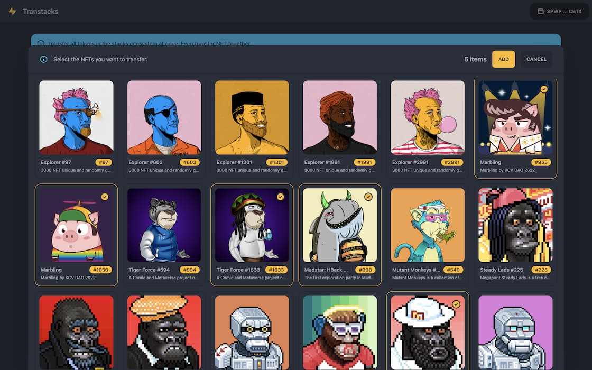
      </a>
    </td>
    <td>
      <a href="https://transtacks.xyz/" target="_blank">
        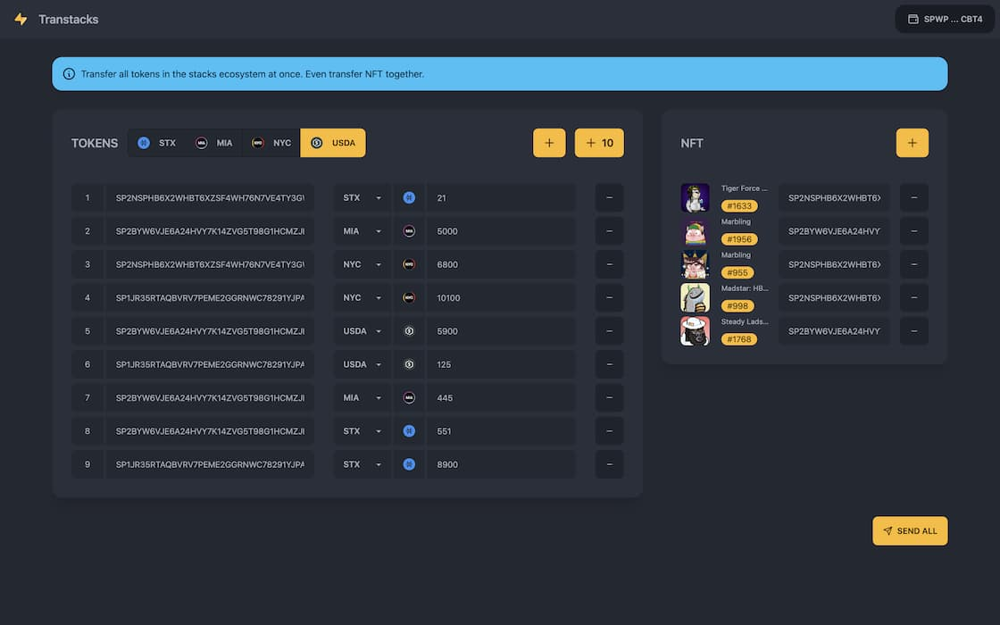
      </a>
    </td>
  </tr>
</table>

[![react-query](https://img.shields.io/badge/React--query-black?style=for-the-badge&logo=data:image/webp;base64,UklGRooGAABXRUJQVlA4WAoAAAAQAAAAPgAAPgAAQUxQSKkBAAABoAPbtmnbGs+2zdC2bdu2bdu2bds2I9u2ovmwz1pjzfXe/2lETAD+X2Zrs3h5l5KUjE0WL26T3dno7/LnhqI2yabdk8C56d3MltBLchq1viuhdzkZIsbdQhXYLsZDXFwxk0VxAzqI5RMHRcT2XCEAk8S6FW+mlXxth41iP5b30k7ksBBn8b4wqMt5L5Rs5t1WcoB3Wcky3jEl/XmzlVTnNVWSgZdBSQQedNyBw+cqDtNS9HssSucUYVRaKZrvTM1gMeSaaP88MqFB7jPi493OIYaIr4sDtoq/QwC0EJ9bIa/4nXedZ+vkv/1cz+Zm9yw7GnnVAkB7j4bgz/6+nC6B4IIbvBgfBYbVj2n7vLgcLOuv+KHoXM/UIMZttFvJ4nJgR3mi4h74mUWng5pKsvP6K2nFW6pkLu+UkmO810ou8z4quc27oeQF77CSL7xVjCGMl7wJhLZo99VuJq+u1ZtqAAqdsyrCi/HR4noB/Bl3kcUVOBxl9GN8coTsZjbEBW4bLM0G05xLDGbD7baAy3PLwLbohoDvo+G6eP0+VZKAWrLL8sVtsuH/JQBWUDggugQAABAWAJ0BKj8APwA+jTaXR6UioiE19dmYoBGJbDbAAODb9zXKCmcf2f8G8HKVau96gPE26QHmA/Yr9RveY9Fn+j9QD+ydQB+zPsAeWz7Hf7h/th7Uf//uwFehvxyymC2lTZo3h7UcQJ3bGCXVlo8YauNsU0uWGLowfJlVibqtaaiOikdZQplbXGmCzSYSq0y6M9DJbLLXmoFIEqv5ukLekafOBDtvYA4CaSIa9b9qONNw8/uGq3UHuFAAAP79JB//zEvUb/+0vX/+rNxP8zhif+x5vD//pc9LCGi6x8uuA8klf5W/H/U3vKtGkgHX1sCT/XFMta1uUbhlkamajsmnEpsB67HpMVxy8/rR9/wb/wELKOc2qn5FQ4f0NisaQo8+c409/srP85xyx0G2Crr5E+L6EzYwfYkaNhIzGO5OLXfWI+tHH4CvwczJv6xBhi/7Nrlyc1CjTjFWbAEh67flq5f9/Z7Z6Gi9nsWv4cF/qpYsploptBiqXKDcyN2TSZJXgv+HxP2/OZOtfHJA9+0AOia0IT2Xc9zvpsdSAyRLpYTVLgBQLoDQ9Zy9oylOrj6i/sHwOPyIpnL7D9BtDzYY6d64UEec/4NqeWxZgt+3n8ydb7uzPPbNV1n/BAY+8vQXyLw7WxUsrWawwKHwmpKzKYn3go+cYexK9a3VPtJDQfaLkkm44/kcuT74KuC8t4jPxDObU436+jQSjB88s3ZgOkNffShlDK3hp6mWB46Ec4wXfjHeTYAUOgaOu8h22CiAgKDmN9dVQDzs5ybIC5Wl+8K/169b2yTzNkiGD8dZBNx6eYj5Cr3JjuE5vw6KOOoR7op/TbC0FQ2R3mnqXASuDMEjG6T9T0Q9qi09yJ3hMt56/m5q1mp5hz9bM6YvkNyhewfOfXhVat2qCPynSVyzBl05I6zl7Xv3MODitbVPj2PVJNvmXWE35hfdtH+mGvyC2d1goT66Vt9ZdreVaVbtIJxDSYaquIIi2Z2sav7vWvJXT3nVeY2K383zTfIsot91s5BCL5yPGY85HJ/pS80NUCV6tG4460amkKzb4XrMQKF/VZ++ehDIeQrKF7lDkPTMa0inbDyQpk4dXjFnwZ6/2Zoqi3x4/XlHK4czdafz7WC9NV2DM5iT0/rVmS1Km/kroV/JqCupyAriXneKpuDrqdgVaAxTnT1k45ID2LL545pY5bPS7Fdl3Ihd5kE4ZfS+ovMF+D42TJ/m+ZNhUzJVrv9w8C+13UqBSRTd74UDr8jcYhkgWSycDVOyUMB9D3U84LLKNBgBWTb91IufqliQbntuyxIlYvfWGn83wcGe2XlQYD2OhGu2SUTNTDJW07kS4W4O0caJ7P5xRVxC+wLF1K+lCWFF7OIHhCz3XaRAijQO8H//zb/f1P9mt/jo2tx/Fbf8zi6wP//v/z7+VH8o9F2PYq9OUnT/rsKa38Wiiuo3i/TzjbG01LO9G4ain4/cQdOD0r3ln0UdewheRc4D2tuG2WOd/+LJ1rWBuzUvyts4wj/DFgIzAYzDePbhj0VA06owlyQ9XDzNP1pAvgvCIAMOtH/OXBa5rG2pLLUoOC0oAsWyNjQmvksYpUfr1BDfMaIrhgJz/LapAAA=)](https://tanstack.com/query/)
[![jotai](https://img.shields.io/badge/Jotai-black?style=for-the-badge&logo=data:image/svg%2bxml;base64,PHN2ZyB4bWxucz0iaHR0cDovL3d3dy53My5vcmcvMjAwMC9zdmciIHZpZXdCb3g9IjAgMCAyODkuMTkgOTkuNzciIGNsYXNzPSJ0ZXh0LWJsYWNrIGRhcms6dGV4dC13aGl0ZSB3LWZ1bGwgbWF4LXctWzEycmVtXSBsZzptYXgtdy1bMTZyZW1dIDJ4bDptYXgtdy1bMThyZW1dIj48dGl0bGU+Sm90YWk8L3RpdGxlPjxwYXRoIGQ9Ik00Mi4zNiw1LjMySDYxLjgyVjcwLjIzYTI5LjQ2LDI5LjQ2LDAsMCwxLTQsMTUuNjFBMjcuMTksMjcuMTksMCwwLDEsNDYuNjQsOTYuMDdhMzYuMjYsMzYuMjYsMCwwLDEtMTYuNTksMy42MSwzNy41NiwzNy41NiwwLDAsMS0xNS4yNS0zQTI0LjMsMjQuMywwLDAsMSw0LDg3LjU5UTAsODEuNSwwLDcyLjIzSDE5LjU5Yy4wNiwzLjY5LDEuMTMsNi41NywzLjIxLDguNjFhMTEuMjEsMTEuMjEsMCwwLDAsOC4yNSwzLjA3cTExLjIyLDAsMTEuMzEtMTMuNjhaIiBmaWxsPSIjZmZmZmZmIj48L3BhdGg+PHBhdGggZD0iTTEwNSw5OS43N3EtMTAuNTksMC0xOC4yOS00LjUyQTMwLjU0LDMwLjU0LDAsMCwxLDc0LjgyLDgyLjYxYTQwLjUyLDQwLjUyLDAsMCwxLTQuMTgtMTguODQsNDAuNzUsNDAuNzUsMCwwLDEsNC4xOC0xOC45M0EzMC42LDMwLjYsMCwwLDEsODYuNzEsMzIuMiwzNS41MiwzNS41MiwwLDAsMSwxMDUsMjcuNjhhMzUuNTgsMzUuNTgsMCwwLDEsMTguMyw0LjUyLDMwLjU3LDMwLjU3LDAsMCwxLDExLjg4LDEyLjY0LDQwLjc2LDQwLjc2LDAsMCwxLDQuMTksMTguOTMsNDAuNTIsNDAuNTIsMCwwLDEtNC4xOSwxOC44NEEzMC41MSwzMC41MSwwLDAsMSwxMjMuMyw5NS4yNVExMTUuNTksOTkuNzgsMTA1LDk5Ljc3Wk0xMjcuMTQsNS4zMnYxMC41SDgyLjg3VjUuMzJabS0yMiw3OS40NWExMiwxMiwwLDAsMCwxMC44OS02cTMuNy02LDMuNy0xNS4xM1QxMTYsNDguNDhhMTIsMTIsMCwwLDAtMTAuODktNiwxMi4xNSwxMi4xNSwwLDAsMC0xMSw2cS0zLjczLDYtMy43MywxNS4xNnQzLjczLDE1LjEzQTEyLjE2LDEyLjE2LDAsMCwwLDEwNS4wOSw4NC43N1oiIGZpbGw9IiNmZmZmZmYiPjwvcGF0aD48cGF0aCBkPSJNMTg2LjMsMjguNTlWNDMuMTRIMTczLjE2Vjc3cTAsNCwxLjgyLDUuNGE3LjUsNy41LDAsMCwwLDQuNzMsMS40MSwxNC43MiwxNC43MiwwLDAsMCwyLjcyLS4yNWwyLjA5LS4zOCwzLDE0LjQxYy0xLC4zLTIuMzMuNjYtNC4wOSwxLjA2YTM0LjEzLDM0LjEzLDAsMCwxLTYuNDEuNzVxLTEwLjU1LjQ3LTE2LjkzLTQuNTZUMTUzLjgsNzkuNVY0My4xNGgtOS41NVYyOC41OWg5LjU1VjExLjg2aDE5LjM2VjI4LjU5WiIgZmlsbD0iI2ZmZmZmZiI+PC9wYXRoPjxwYXRoIGQ9Ik0yMTYsOTkuNzNxLTEwLDAtMTYuNTktNS4yM3QtNi41OS0xNS41OXEwLTcuODEsMy42OC0xMi4yN2EyMS4xOSwyMS4xOSwwLDAsMSw5LjY2LTYuNTNBNTQuNzgsNTQuNzgsMCwwLDEsMjE5LDU3LjQxYTk4LjU3LDk4LjU3LDAsMCwwLDEzLTEuOTFxMy45Mi0xLDMuOTEtNC4zNnYtLjI4YTguNDIsOC40MiwwLDAsMC0yLjctNi42OHEtMi43Mi0yLjM1LTcuNjYtMi4zNmExMy43NywxMy43NywwLDAsMC04LjMyLDIuMjcsMTAuNywxMC43LDAsMCwwLTQuMDksNS43N2wtMTcuOTEtMS40NWEyMy44OCwyMy44OCwwLDAsMSw5LjkzLTE1LjE0cTcuOTQtNS41OCwyMC40OC01LjU5YTQyLjI0LDQyLjI0LDAsMCwxLDE0LjU0LDIuNDYsMjQuMTksMjQuMTksMCwwLDEsMTAuOTQsNy42NnE0LjE2LDUuMjEsNC4xNiwxMy41MlY5OC40MUgyMzYuOTJWODguNzNoLS41NGEyMC4xOCwyMC4xOCwwLDAsMS03LjYyLDcuOTNRMjIzLjY5LDk5LjczLDIxNiw5OS43M1ptNS41NC0xMy4zN0ExNSwxNSwwLDAsMCwyMzIsODIuNjZhMTEuOTQsMTEuOTQsMCwwLDAsNC4wOS05LjJWNjYuMDVhMTEuMzgsMTEuMzgsMCwwLDEtMy41MiwxLjM2Yy0xLjYuMzktMy4yOS43My01LjEsMXMtMy40MS41NC00Ljg0Ljc1YTE5LjE5LDE5LjE5LDAsMCwwLTguMiwyLjg3LDcuMDYsNy4wNiwwLDAsMC0zLjExLDYuMjIsNi45NCw2Ljk0LDAsMCwwLDIuODgsNkExMi40MywxMi40MywwLDAsMCwyMjEuNTEsODYuMzZaIiBmaWxsPSIjZmZmZmZmIj48L3BhdGg+PHBhdGggZD0iTTI3OC42OSwxOS41OWExMC40MSwxMC40MSwwLDAsMS03LjM3LTIuODksOS4xNCw5LjE0LDAsMCwxLTMuMDktNi45Myw5LjEsOS4xLDAsMCwxLDMuMDktNi45MSwxMSwxMSwwLDAsMSwxNC43OCwwLDkuMSw5LjEsMCwwLDEsMy4wOSw2LjkxLDkuMTQsOS4xNCwwLDAsMS0zLjA5LDYuOTNBMTAuNDUsMTAuNDUsMCwwLDEsMjc4LjY5LDE5LjU5Wk0yNjksOTguNDFWMjguNTloMTkuMzZWOTguNDFaIiBmaWxsPSIjZmZmZmZmIj48L3BhdGg+PC9zdmc+)](https://jotai.org/)

[![elasticbeanstalk](https://img.shields.io/badge/elastic--beanstalk-black?style=for-the-badge&logo=data:image/svg%2bxml;base64,PHN2ZyB4bWxucz0iaHR0cDovL3d3dy53My5vcmcvMjAwMC9zdmciIHhtbG5zOnhsaW5rPSJodHRwOi8vd3d3LnczLm9yZy8xOTk5L3hsaW5rIiB2aWV3Qm94PSIwIDAgNjMuNzUgODUiIGZpbGw9IiNmZmYiIGZpbGwtcnVsZT0iZXZlbm9kZCIgc3Ryb2tlPSIjMDAwIiBzdHJva2UtbGluZWNhcD0icm91bmQiIHN0cm9rZS1saW5lam9pbj0icm91bmQiPjx1c2UgeGxpbms6aHJlZj0iI0EiIHg9IjEuODc1IiB5PSIyLjUiLz48c3ltYm9sIGlkPSJBIiBvdmVyZmxvdz0idmlzaWJsZSI+PGcgc3Ryb2tlPSJub25lIj48cGF0aCBkPSJNMTkuNzExIDQuOTU2VjQwaC00LjI0N3YzMy4wMDNMMzAgODBsOC43NDYtNDBMMzAgMCAxOS43MTEgNC45NTZ6IiBmaWxsPSIjOWQ1MDI1Ii8+PHBhdGggZD0iTTMwIDB2NDAgNDBsMTAuMjg5LTQuOTU2VjQwaDQuMjQ3VjYuOTk3TDMwIDB6IiBmaWxsPSIjZjU4NTM2Ii8+PHBhdGggZD0iTTYwIDI5Ljc3N0w0MS42MSAzMS40NDlsLTYuMDQyLS43MjkgMTkuMTY2LTE4LjgwNUw2MCAyOS43Nzd6IiBmaWxsPSIjNmIzYTE5Ii8+PHBhdGggZD0iTTU0LjczNCAxMS45MTVMNjAgMTQuNDUxdjE1LjMyNmwtNS4yNjYtMS4wMTFWMTEuOTE1eiIgZmlsbD0iI2Y1ODUzNiIvPjxwYXRoIGQ9Ik0zNS41NjggMzAuNzJsMTkuMTY2LTEuOTUzVjExLjkxNUwzNS41NjggMTYuOTFWMzAuNzJ6IiBmaWxsPSIjOWQ1MDI1Ii8+PHBhdGggZD0iTTAgNTAuMjI0bDE4LjM4OS0xLjY3MiA2LjA0Mi43MjlMNS4yNjYgNjguMDg2IDAgNTAuMjI0eiIgZmlsbD0iI2ZiYmY5MyIvPjxwYXRoIGQ9Ik01LjI2NiA2OC4wODZMMCA2NS41NVY1MC4yMjRsNS4yNjYgMS4wNjl2MTYuNzkzeiIgZmlsbD0iIzlkNTAyNSIvPjxwYXRoIGQ9Ik0yNC40MzIgNDkuMjgxTDUuMjY2IDUxLjI5M3YxNi43OTNsMTkuMTY2LTQuOTk1VjQ5LjI4MXoiIGZpbGw9IiNmNTg1MzYiLz48L2c+PC9zeW1ib2w+PC9zdmc+)](https://aws.amazon.com/elasticbeanstalk/)
[![clarity](https://img.shields.io/badge/clarity-black?style=for-the-badge&logo=data:image/png;base64,iVBORw0KGgoAAAANSUhEUgAAAEMAAABDCAYAAADHyrhzAAAAAXNSR0IArs4c6QAACrBJREFUeF7tnH1UVHUax7933mmGGRTkbeQdkwpNzX2pY66aaZYilKbmqr2I27bHPSZiuX/srrHZ/lNu9mJJum2arYJWGqarKAiZu0W6mykJCgzyogMlLzMDDDN3z/PM3GHg6CI1LVb3nnPP4Qy/e+f3+9zv8zy/+zwPCKHhUSJ+xIcIiIIAQRRRIcgwZBg+W5CV4ecWZBgyjCtHCVkZsjJkZfS7g5LNRDaTwTQTQYAoihAEodcsfJ+Jfm8B3jH0O4VCAYVCgMvl7rn+KmP9733F+/ZrJMB3ZyZ+i1IqlaCTDrfLhW6Xi3+mBfhDcosigrRa6G8I4vGdnZ243NYOQth3rASLxikEAXSt0+nsfd9rAOA/JPAw/CDQAjQaDZq/+gpdtlbv9yoRGhHBP0sgpIWFDR2C8tOnei0hyBSKG3RaHut/aNRqdBCspou+j0PCIhji9aGMPmqgWVobLmDU2PFISr4RIUOGwGAwQKsLQlHhQZR9VobQ0FBo1Wqo1SrUnK/EtHtmIH12OpKTkxEZFQmD3oCcnGfw1y2bEROfCLujA2qVCo11FkTHJuDWMWMRNmwY9Ppgvvdnn/4Lh/+xDxHRMeju7h6QNgKrDK/s6enYbHa4RDdmzUzDiJEp0AUFQXS7fZPbX7AXx0uLEJuQBIulDnB1IPeNzUhLS0NYWJhPCS6XCyuzsvDKSxsQl5gMu8MBa0Mdpt03G6PHjEVwsJFsnWQGhVKJYyXF2L/3XUSYY9HtNZtrJRI4GF4Q5PTIdg16PdIyHkBU9HB0dzsZhFKl4kXSeWDfBygr+xQmUwiaL9ah8PARTJk8CV3Obr5eq9XyGshvZK9ejY2vvIyE5BtRVXkW8xc9iptuSYXb7QbBUvF9AUEh4OPSozjwwXuDD4MmTxO7WGdB5m9WIDYuAZ0dDi8EoLGhDjXVVbDbbKiuroJWrULl2XIcPFSIqXdNQbvNztfT+fnnn6O4uBj1DQ04eOgQzlfXorX5IuYuXIJRo8f4nCUBbrJeQk3VebS1tqK21gKr1QryKX39TH8KCZgySKpqtZpBTJ+Zjp/fMYGfGpmMw2HHsdKjKD1yyDsfATFx8aitqcKixQ/jtdc2crQgVXV1dSE3NxdZK5/0zV1nHAqVQkBMTAwy5sxjWNJx8kQZ9uTvIDvhj4KHDING4wHRO5D3hyKQoVUQfKp44snViIiI9DmwwwcP4KPiQnZ4FFpposEGPaui+GgJJkyYgI6ODr5+w4YNyF6VhZSbU3kcRQxndzfqLdXIeHAhxoy7jVVBY/9z8gR279jGJkEgCb7bTad3T9MnAvWHI2DKEBQKODo6EBUZiTnzHuKQSqpoqK/DaxuehzkuEQ6Hg+dD0YD2D7HmaJQeLUKIycSmdPr0aYwelYqbU0ejqfkr3o+QYug+l+ovYHnW0wj1Oldbezte/MsLCDEZGRr5D9/Ga4AQJEgBg6HymsjUGbMwYeIkfkr0tEqKj+DwgQKPQ/OGuiCdFhdqqjB/wUJs3PgqO0utTos97+9FRnoaUm5JxSVrs890WlrbMCI5CbPvn8tgSBUVZ7/Eti2vIyomnp0sg/iGEAIOQ63RoPFCDR5YsAijbx3LMEjO7+bvQE2NBXr9DR6HJoowGoM5Kjy95ndYu3YtQyJ/s27dOvzxD7/nqNHa1s5jSTGX6mtxx8QpmDp9Bt+DgHzyz49R8F5+D+RvCYKjc6Cy4xqtBg21NViS+QQSk5L5fcLhsOGdbW+hra2NFyvBMJmMOF/xJdY+k4M1a9YwDJL5ihUr8EbuJt572OyOXjAmTJqKKXdP98H4qKQYB/ftuV5haNFQW43HHl+O2PgEuNxuDqHbt74Ju90TMqVNlwTj2XV/Rnb2KgZBYx5buhTv7sqHOTaBHSodkjLunHw3JhMM2q8olWx+hfs/+Eb7ias50gAqwwPj0ceXI+6aYTyH7OxsH4zMZcuwK2/ntcEoOoxCyRcNcKf5vYCxNDMTu/PzZBhkJjIMPzORYcgwPKH12XW9HaisDFkZsjKusOmSzQQ9O1AZhgzjyu8msjJkZcjK6PcVXjaTq5pJZuYy7MqXX+E5ufOD245LmS7KXtnITN56E3bHNWS6HA4sW7YM+Tt3YHhcAhyOfjJd13VyR6NBw4UaLF76ayQlj+CEMJUGdmzfisstLT0VLlH0mYl/DpSyT1mrVnEZMS4hGe12+/c3Byplx6VCD8GgRO/7u/NQee4cjMHBnN7j7HiwAVXnKpC9+ink5OQwOEoYr1+/Hk+tzkbiiJGg8kBPdrwOt9/5C9x9z73ehLAKZZ8cx97dOxFpjuUi07ctEwQ0Oy7VTSZPuxcTJ93FlS1K3B4/VspVcZp0l9PJ9Q2dVos6SxXmzJ2HTZs2geooVDcpKNiHWTPv4yJS4yUrj6WTFBZtNuOBufN9xanz5yrxt9xXr8+6CVXUqE5iNBqxYOFibkGgIlJzUxNeev45njT9ntShUinR1eUEFEp8cbKMWxBo0RaLBclJiYhPTIaz28UVOvpcKmY//tssREaZGTRlz7fkvg6Xy1NzIRVKFbXBb1YRBG44abxgwa+WZyF6+HA4u7p86uA2gegYBsQFYoMeZ8tPY9+H+zF9+nR++jqdDlu3bsUjDy9BdEwcTEYjw2u3O1BXcx4zM+biJz+73VtrVaPiyzN4+81cUMdOUFAQmwqZjK/UOMDCUsBKBVQDpydINdGJd03DpClTfe1E5BOoo6awsBBdthaGEWmOQWNdLWamzcb2t99m+UuLyMvLw+JFv/TL6KswZFgYd/lQHZfKkTSWmlMISPGRwwyLDp0hBAaD3nOv/irNfX4fMBjwNqvQoqjM+NCSpdxQQnVQT9eeAi2XL6OpycqKOfHZp+jqsKPqXCW2bX8HCxfM5xYlKplqNFrU19ejvLwcLS0t2LxlC/bvK+Cp3zMrg9sdaLF0kolQCLdeuojOzg6cOf0FTp06xcVsqvgP5AgoDP8vbrPZsGDBQiQmjYAoejpsJCiAgP0Fe/BxaQli4+NhqapE3q7dyEhPZzWRb5EKzLTgJ1euxMsbXkTSiBScqyjHrPsfxJhx41mJ7CsINlXrVSpuY/pwz25PlBlgcSlwMIiEXysTLf5rayPuTZ+DkSNvgiE42NP+SBECwIcFe3C8pIgdqwAR9bU1WJvzJ8yfNw9ms9kXNbini2B4e7o6u5ysPCpEjxv/U5hCQlgdXIpUqvBRSZEveg0ujD5ASAlUQTcODUdKSgoio6IwLDyCJ0+dPGfOlPMGjKKAKdjAzSt0PPzIY7ht/G0YlZrKTvWF9eux8+/vwBwbD0dHJ4MiRw0oMGrsOAyPieH76vV6/PvkCRwrLkJ4dDRcg9rtJ9mJX7MrLZyeULPVCrg9Tat0mELDvY1pPf2dQ0NMHE7rLNW9TV0ZhPDwUF/zCpmSp5VJxNeXW+C0t/nG60NCEaTTDbID7eup+jTHcievN6xKIbBvC7Wn90LBmzI66RryGZdbWn0gpK+RrpX8kLTHkNobvknzSmB9xv9y3VfoH7/q5ui7GttPaPn/wRhIjBuksTIMP/AyDBnGle1QVoasDFkZ/cYo2UyuZiZDw6N6/jqmX44/yAFuQRCUoiieFUIjftz/TIRSC/S+I4pCtTA0POrsD/J5X/ui6O+ZNIBY8V+YEQ/QNO2n+AAAAABJRU5ErkJggg==)](https://clarity-lang.org/)

---

### 🔥 Stxbet - A game that predicts and bets the price of the stacks coin of the upcoming block

Website : [Stxbet](https://stxbet.com)

 

<table>
  <tr>
    <td>
      <a href="https://stxbet.com" target="_blank">
        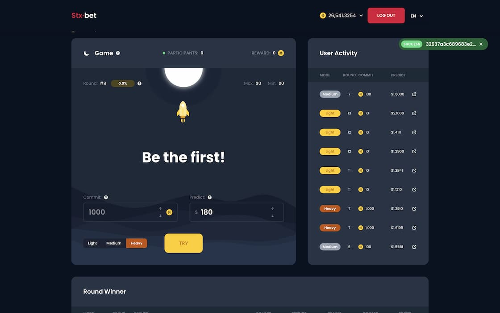
      </a>
    </td>
    <td>
      <a href="https://stxbet.com" target="_blank">
        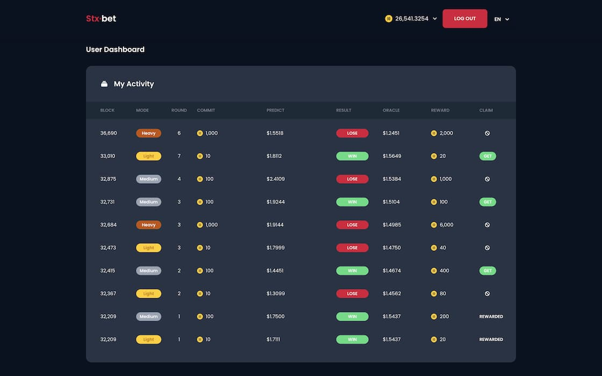
      </a>
    </td>
  </tr>
</table>

[![swr](https://img.shields.io/badge/swr-black.svg?style=for-the-badge&logo=data:image/svg%2bxml;base64,DQo8c3ZnIHhtbG5zPSJodHRwOi8vd3d3LnczLm9yZy8yMDAwL3N2ZyIgaGVpZ2h0PSIxMiIgdmlld0JveD0iMCAwIDI5MSA2OSI+PHBhdGggZD0iTTAgMzYuNTNjLjA3IDE3LjYgMTQuNCAzMi4wMSAzMi4wMSAzMi4wMWEzMi4wNSAzMi4wNSAwIDAwMzIuMDEtMzJWMzJhMTMuMiAxMy4yIDAgMDEyMy40LTguMzFoMjAuN0EzMi4wNyAzMi4wNyAwIDAwNzcuMiAwYTMyLjA1IDMyLjA1IDAgMDAtMzIgMzIuMDF2NC41MkExMy4yIDEzLjIgMCAwMTMyIDQ5LjcxYTEzLjIgMTMuMiAwIDAxLTEzLjE4LTEzLjE4IDMuNzcgMy43NyAwIDAwLTMuNzctMy43N0gzLjc2QTMuNzcgMy43NyAwIDAwMCAzNi41M3pNMTIyLjQ5IDY4LjU0YTMyLjE0IDMyLjE0IDAgMDEtMzAuODktMjMuN2gyMC42N2ExMy4xNiAxMy4xNiAwIDAwMjMuNC04LjNWMzJBMzIuMDUgMzIuMDUgMCAwMTE2Ny42OCAwYzE3LjQzIDAgMzEuNjQgMTQgMzIgMzEuMzNsLjEgNS4yYTEzLjIgMTMuMiAwIDAwMjMuNCA4LjMxaDIwLjdhMzIuMDcgMzIuMDcgMCAwMS0zMC45MSAyMy43Yy0xNy42MSAwLTMxLjk0LTE0LjQyLTMyLjAxLTMybC0uMS00Ljd2LS4yYTEzLjIgMTMuMiAwIDAwLTEzLjE4LTEyLjgxIDEzLjIgMTMuMiAwIDAwLTEzLjE4IDEzLjE4djQuNTJhMzIuMDUgMzIuMDUgMCAwMS0zMi4wMSAzMi4wMXpNMjQ3Ljk0IDIzLjdhMTMuMTYgMTMuMTYgMCAwMTIzLjQgOC4zMSAzLjc3IDMuNzcgMCAwMDMuNzcgMy43N2gxMS4zYTMuNzcgMy43NyAwIDAwMy43Ni0zLjc3QTMyLjA1IDMyLjA1IDAgMDAyNTguMTYgMGEzMi4wNyAzMi4wNyAwIDAwLTMwLjkyIDIzLjdoMjAuN3oiIGZpbGw9IiNmZmZmZmYiPjwvcGF0aD48L3N2Zz4=)](https://swr.vercel.app/ko)

[![elasticbeanstalk](https://img.shields.io/badge/elastic--beanstalk-black?style=for-the-badge&logo=data:image/svg%2bxml;base64,PHN2ZyB4bWxucz0iaHR0cDovL3d3dy53My5vcmcvMjAwMC9zdmciIHhtbG5zOnhsaW5rPSJodHRwOi8vd3d3LnczLm9yZy8xOTk5L3hsaW5rIiB2aWV3Qm94PSIwIDAgNjMuNzUgODUiIGZpbGw9IiNmZmYiIGZpbGwtcnVsZT0iZXZlbm9kZCIgc3Ryb2tlPSIjMDAwIiBzdHJva2UtbGluZWNhcD0icm91bmQiIHN0cm9rZS1saW5lam9pbj0icm91bmQiPjx1c2UgeGxpbms6aHJlZj0iI0EiIHg9IjEuODc1IiB5PSIyLjUiLz48c3ltYm9sIGlkPSJBIiBvdmVyZmxvdz0idmlzaWJsZSI+PGcgc3Ryb2tlPSJub25lIj48cGF0aCBkPSJNMTkuNzExIDQuOTU2VjQwaC00LjI0N3YzMy4wMDNMMzAgODBsOC43NDYtNDBMMzAgMCAxOS43MTEgNC45NTZ6IiBmaWxsPSIjOWQ1MDI1Ii8+PHBhdGggZD0iTTMwIDB2NDAgNDBsMTAuMjg5LTQuOTU2VjQwaDQuMjQ3VjYuOTk3TDMwIDB6IiBmaWxsPSIjZjU4NTM2Ii8+PHBhdGggZD0iTTYwIDI5Ljc3N0w0MS42MSAzMS40NDlsLTYuMDQyLS43MjkgMTkuMTY2LTE4LjgwNUw2MCAyOS43Nzd6IiBmaWxsPSIjNmIzYTE5Ii8+PHBhdGggZD0iTTU0LjczNCAxMS45MTVMNjAgMTQuNDUxdjE1LjMyNmwtNS4yNjYtMS4wMTFWMTEuOTE1eiIgZmlsbD0iI2Y1ODUzNiIvPjxwYXRoIGQ9Ik0zNS41NjggMzAuNzJsMTkuMTY2LTEuOTUzVjExLjkxNUwzNS41NjggMTYuOTFWMzAuNzJ6IiBmaWxsPSIjOWQ1MDI1Ii8+PHBhdGggZD0iTTAgNTAuMjI0bDE4LjM4OS0xLjY3MiA2LjA0Mi43MjlMNS4yNjYgNjguMDg2IDAgNTAuMjI0eiIgZmlsbD0iI2ZiYmY5MyIvPjxwYXRoIGQ9Ik01LjI2NiA2OC4wODZMMCA2NS41NVY1MC4yMjRsNS4yNjYgMS4wNjl2MTYuNzkzeiIgZmlsbD0iIzlkNTAyNSIvPjxwYXRoIGQ9Ik0yNC40MzIgNDkuMjgxTDUuMjY2IDUxLjI5M3YxNi43OTNsMTkuMTY2LTQuOTk1VjQ5LjI4MXoiIGZpbGw9IiNmNTg1MzYiLz48L2c+PC9zeW1ib2w+PC9zdmc+)](https://aws.amazon.com/elasticbeanstalk/)
[![clarity](https://img.shields.io/badge/clarity-black?style=for-the-badge&logo=data:image/png;base64,iVBORw0KGgoAAAANSUhEUgAAAEMAAABDCAYAAADHyrhzAAAAAXNSR0IArs4c6QAACrBJREFUeF7tnH1UVHUax7933mmGGRTkbeQdkwpNzX2pY66aaZYilKbmqr2I27bHPSZiuX/srrHZ/lNu9mJJum2arYJWGqarKAiZu0W6mykJCgzyogMlLzMDDDN3z/PM3GHg6CI1LVb3nnPP4Qy/e+f3+9zv8zy/+zwPCKHhUSJ+xIcIiIIAQRRRIcgwZBg+W5CV4ecWZBgyjCtHCVkZsjJkZfS7g5LNRDaTwTQTQYAoihAEodcsfJ+Jfm8B3jH0O4VCAYVCgMvl7rn+KmP9733F+/ZrJMB3ZyZ+i1IqlaCTDrfLhW6Xi3+mBfhDcosigrRa6G8I4vGdnZ243NYOQth3rASLxikEAXSt0+nsfd9rAOA/JPAw/CDQAjQaDZq/+gpdtlbv9yoRGhHBP0sgpIWFDR2C8tOnei0hyBSKG3RaHut/aNRqdBCspou+j0PCIhji9aGMPmqgWVobLmDU2PFISr4RIUOGwGAwQKsLQlHhQZR9VobQ0FBo1Wqo1SrUnK/EtHtmIH12OpKTkxEZFQmD3oCcnGfw1y2bEROfCLujA2qVCo11FkTHJuDWMWMRNmwY9Ppgvvdnn/4Lh/+xDxHRMeju7h6QNgKrDK/s6enYbHa4RDdmzUzDiJEp0AUFQXS7fZPbX7AXx0uLEJuQBIulDnB1IPeNzUhLS0NYWJhPCS6XCyuzsvDKSxsQl5gMu8MBa0Mdpt03G6PHjEVwsJFsnWQGhVKJYyXF2L/3XUSYY9HtNZtrJRI4GF4Q5PTIdg16PdIyHkBU9HB0dzsZhFKl4kXSeWDfBygr+xQmUwiaL9ah8PARTJk8CV3Obr5eq9XyGshvZK9ejY2vvIyE5BtRVXkW8xc9iptuSYXb7QbBUvF9AUEh4OPSozjwwXuDD4MmTxO7WGdB5m9WIDYuAZ0dDi8EoLGhDjXVVbDbbKiuroJWrULl2XIcPFSIqXdNQbvNztfT+fnnn6O4uBj1DQ04eOgQzlfXorX5IuYuXIJRo8f4nCUBbrJeQk3VebS1tqK21gKr1QryKX39TH8KCZgySKpqtZpBTJ+Zjp/fMYGfGpmMw2HHsdKjKD1yyDsfATFx8aitqcKixQ/jtdc2crQgVXV1dSE3NxdZK5/0zV1nHAqVQkBMTAwy5sxjWNJx8kQZ9uTvIDvhj4KHDING4wHRO5D3hyKQoVUQfKp44snViIiI9DmwwwcP4KPiQnZ4FFpposEGPaui+GgJJkyYgI6ODr5+w4YNyF6VhZSbU3kcRQxndzfqLdXIeHAhxoy7jVVBY/9z8gR279jGJkEgCb7bTad3T9MnAvWHI2DKEBQKODo6EBUZiTnzHuKQSqpoqK/DaxuehzkuEQ6Hg+dD0YD2D7HmaJQeLUKIycSmdPr0aYwelYqbU0ejqfkr3o+QYug+l+ovYHnW0wj1Oldbezte/MsLCDEZGRr5D9/Ga4AQJEgBg6HymsjUGbMwYeIkfkr0tEqKj+DwgQKPQ/OGuiCdFhdqqjB/wUJs3PgqO0utTos97+9FRnoaUm5JxSVrs890WlrbMCI5CbPvn8tgSBUVZ7/Eti2vIyomnp0sg/iGEAIOQ63RoPFCDR5YsAijbx3LMEjO7+bvQE2NBXr9DR6HJoowGoM5Kjy95ndYu3YtQyJ/s27dOvzxD7/nqNHa1s5jSTGX6mtxx8QpmDp9Bt+DgHzyz49R8F5+D+RvCYKjc6Cy4xqtBg21NViS+QQSk5L5fcLhsOGdbW+hra2NFyvBMJmMOF/xJdY+k4M1a9YwDJL5ihUr8EbuJt572OyOXjAmTJqKKXdP98H4qKQYB/ftuV5haNFQW43HHl+O2PgEuNxuDqHbt74Ju90TMqVNlwTj2XV/Rnb2KgZBYx5buhTv7sqHOTaBHSodkjLunHw3JhMM2q8olWx+hfs/+Eb7ias50gAqwwPj0ceXI+6aYTyH7OxsH4zMZcuwK2/ntcEoOoxCyRcNcKf5vYCxNDMTu/PzZBhkJjIMPzORYcgwPKH12XW9HaisDFkZsjKusOmSzQQ9O1AZhgzjyu8msjJkZcjK6PcVXjaTq5pJZuYy7MqXX+E5ufOD245LmS7KXtnITN56E3bHNWS6HA4sW7YM+Tt3YHhcAhyOfjJd13VyR6NBw4UaLF76ayQlj+CEMJUGdmzfisstLT0VLlH0mYl/DpSyT1mrVnEZMS4hGe12+/c3Byplx6VCD8GgRO/7u/NQee4cjMHBnN7j7HiwAVXnKpC9+ink5OQwOEoYr1+/Hk+tzkbiiJGg8kBPdrwOt9/5C9x9z73ehLAKZZ8cx97dOxFpjuUi07ctEwQ0Oy7VTSZPuxcTJ93FlS1K3B4/VspVcZp0l9PJ9Q2dVos6SxXmzJ2HTZs2geooVDcpKNiHWTPv4yJS4yUrj6WTFBZtNuOBufN9xanz5yrxt9xXr8+6CVXUqE5iNBqxYOFibkGgIlJzUxNeev45njT9ntShUinR1eUEFEp8cbKMWxBo0RaLBclJiYhPTIaz28UVOvpcKmY//tssREaZGTRlz7fkvg6Xy1NzIRVKFbXBb1YRBG44abxgwa+WZyF6+HA4u7p86uA2gegYBsQFYoMeZ8tPY9+H+zF9+nR++jqdDlu3bsUjDy9BdEwcTEYjw2u3O1BXcx4zM+biJz+73VtrVaPiyzN4+81cUMdOUFAQmwqZjK/UOMDCUsBKBVQDpydINdGJd03DpClTfe1E5BOoo6awsBBdthaGEWmOQWNdLWamzcb2t99m+UuLyMvLw+JFv/TL6KswZFgYd/lQHZfKkTSWmlMISPGRwwyLDp0hBAaD3nOv/irNfX4fMBjwNqvQoqjM+NCSpdxQQnVQT9eeAi2XL6OpycqKOfHZp+jqsKPqXCW2bX8HCxfM5xYlKplqNFrU19ejvLwcLS0t2LxlC/bvK+Cp3zMrg9sdaLF0kolQCLdeuojOzg6cOf0FTp06xcVsqvgP5AgoDP8vbrPZsGDBQiQmjYAoejpsJCiAgP0Fe/BxaQli4+NhqapE3q7dyEhPZzWRb5EKzLTgJ1euxMsbXkTSiBScqyjHrPsfxJhx41mJ7CsINlXrVSpuY/pwz25PlBlgcSlwMIiEXysTLf5rayPuTZ+DkSNvgiE42NP+SBECwIcFe3C8pIgdqwAR9bU1WJvzJ8yfNw9ms9kXNbini2B4e7o6u5ysPCpEjxv/U5hCQlgdXIpUqvBRSZEveg0ujD5ASAlUQTcODUdKSgoio6IwLDyCJ0+dPGfOlPMGjKKAKdjAzSt0PPzIY7ht/G0YlZrKTvWF9eux8+/vwBwbD0dHJ4MiRw0oMGrsOAyPieH76vV6/PvkCRwrLkJ4dDRcg9rtJ9mJX7MrLZyeULPVCrg9Tat0mELDvY1pPf2dQ0NMHE7rLNW9TV0ZhPDwUF/zCpmSp5VJxNeXW+C0t/nG60NCEaTTDbID7eup+jTHcievN6xKIbBvC7Wn90LBmzI66RryGZdbWn0gpK+RrpX8kLTHkNobvknzSmB9xv9y3VfoH7/q5ui7GttPaPn/wRhIjBuksTIMP/AyDBnGle1QVoasDFkZ/cYo2UyuZiZDw6N6/jqmX44/yAFuQRCUoiieFUIjftz/TIRSC/S+I4pCtTA0POrsD/J5X/ui6O+ZNIBY8V+YEQ/QNO2n+AAAAABJRU5ErkJggg==)](https://clarity-lang.org/)

---

### 🔥 CitycoinBeach - Analyze citycoin mining, stacking, and rewards tracking

Website : [CitycoinBeach](https://citycoinbeach.com)

 

<table>
  <tr>
    <td>
      
    </td>
    <td>
      <a href="https://citycoinbeach.com" target="_blank">
        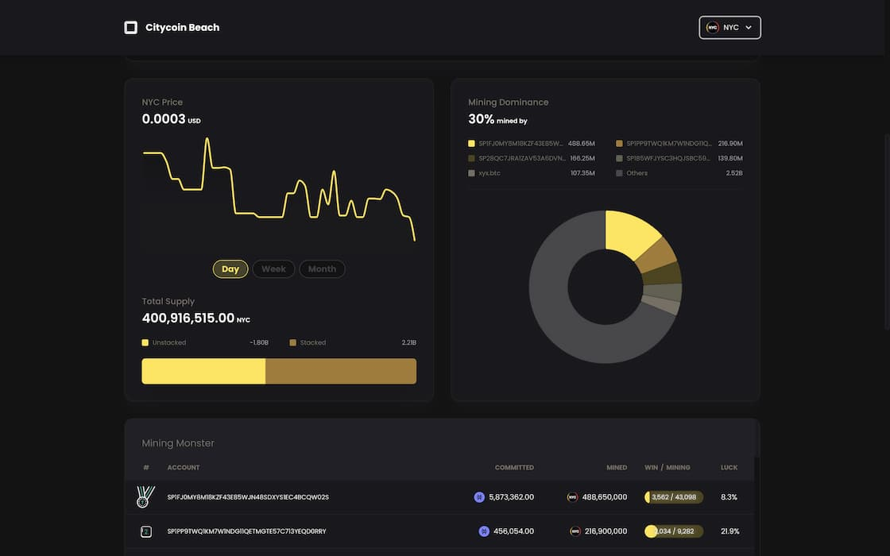
      </a>
    </td>
  </tr>
</table>

[![swr](https://img.shields.io/badge/swr-black.svg?style=for-the-badge&logo=data:image/svg%2bxml;base64,DQo8c3ZnIHhtbG5zPSJodHRwOi8vd3d3LnczLm9yZy8yMDAwL3N2ZyIgaGVpZ2h0PSIxMiIgdmlld0JveD0iMCAwIDI5MSA2OSI+PHBhdGggZD0iTTAgMzYuNTNjLjA3IDE3LjYgMTQuNCAzMi4wMSAzMi4wMSAzMi4wMWEzMi4wNSAzMi4wNSAwIDAwMzIuMDEtMzJWMzJhMTMuMiAxMy4yIDAgMDEyMy40LTguMzFoMjAuN0EzMi4wNyAzMi4wNyAwIDAwNzcuMiAwYTMyLjA1IDMyLjA1IDAgMDAtMzIgMzIuMDF2NC41MkExMy4yIDEzLjIgMCAwMTMyIDQ5LjcxYTEzLjIgMTMuMiAwIDAxLTEzLjE4LTEzLjE4IDMuNzcgMy43NyAwIDAwLTMuNzctMy43N0gzLjc2QTMuNzcgMy43NyAwIDAwMCAzNi41M3pNMTIyLjQ5IDY4LjU0YTMyLjE0IDMyLjE0IDAgMDEtMzAuODktMjMuN2gyMC42N2ExMy4xNiAxMy4xNiAwIDAwMjMuNC04LjNWMzJBMzIuMDUgMzIuMDUgMCAwMTE2Ny42OCAwYzE3LjQzIDAgMzEuNjQgMTQgMzIgMzEuMzNsLjEgNS4yYTEzLjIgMTMuMiAwIDAwMjMuNCA4LjMxaDIwLjdhMzIuMDcgMzIuMDcgMCAwMS0zMC45MSAyMy43Yy0xNy42MSAwLTMxLjk0LTE0LjQyLTMyLjAxLTMybC0uMS00Ljd2LS4yYTEzLjIgMTMuMiAwIDAwLTEzLjE4LTEyLjgxIDEzLjIgMTMuMiAwIDAwLTEzLjE4IDEzLjE4djQuNTJhMzIuMDUgMzIuMDUgMCAwMS0zMi4wMSAzMi4wMXpNMjQ3Ljk0IDIzLjdhMTMuMTYgMTMuMTYgMCAwMTIzLjQgOC4zMSAzLjc3IDMuNzcgMCAwMDMuNzcgMy43N2gxMS4zYTMuNzcgMy43NyAwIDAwMy43Ni0zLjc3QTMyLjA1IDMyLjA1IDAgMDAyNTguMTYgMGEzMi4wNyAzMi4wNyAwIDAwLTMwLjkyIDIzLjdoMjAuN3oiIGZpbGw9IiNmZmZmZmYiPjwvcGF0aD48L3N2Zz4=)](https://swr.vercel.app/ko)

[![elasticbeanstalk](https://img.shields.io/badge/elastic--beanstalk-black?style=for-the-badge&logo=data:image/svg%2bxml;base64,PHN2ZyB4bWxucz0iaHR0cDovL3d3dy53My5vcmcvMjAwMC9zdmciIHhtbG5zOnhsaW5rPSJodHRwOi8vd3d3LnczLm9yZy8xOTk5L3hsaW5rIiB2aWV3Qm94PSIwIDAgNjMuNzUgODUiIGZpbGw9IiNmZmYiIGZpbGwtcnVsZT0iZXZlbm9kZCIgc3Ryb2tlPSIjMDAwIiBzdHJva2UtbGluZWNhcD0icm91bmQiIHN0cm9rZS1saW5lam9pbj0icm91bmQiPjx1c2UgeGxpbms6aHJlZj0iI0EiIHg9IjEuODc1IiB5PSIyLjUiLz48c3ltYm9sIGlkPSJBIiBvdmVyZmxvdz0idmlzaWJsZSI+PGcgc3Ryb2tlPSJub25lIj48cGF0aCBkPSJNMTkuNzExIDQuOTU2VjQwaC00LjI0N3YzMy4wMDNMMzAgODBsOC43NDYtNDBMMzAgMCAxOS43MTEgNC45NTZ6IiBmaWxsPSIjOWQ1MDI1Ii8+PHBhdGggZD0iTTMwIDB2NDAgNDBsMTAuMjg5LTQuOTU2VjQwaDQuMjQ3VjYuOTk3TDMwIDB6IiBmaWxsPSIjZjU4NTM2Ii8+PHBhdGggZD0iTTYwIDI5Ljc3N0w0MS42MSAzMS40NDlsLTYuMDQyLS43MjkgMTkuMTY2LTE4LjgwNUw2MCAyOS43Nzd6IiBmaWxsPSIjNmIzYTE5Ii8+PHBhdGggZD0iTTU0LjczNCAxMS45MTVMNjAgMTQuNDUxdjE1LjMyNmwtNS4yNjYtMS4wMTFWMTEuOTE1eiIgZmlsbD0iI2Y1ODUzNiIvPjxwYXRoIGQ9Ik0zNS41NjggMzAuNzJsMTkuMTY2LTEuOTUzVjExLjkxNUwzNS41NjggMTYuOTFWMzAuNzJ6IiBmaWxsPSIjOWQ1MDI1Ii8+PHBhdGggZD0iTTAgNTAuMjI0bDE4LjM4OS0xLjY3MiA2LjA0Mi43MjlMNS4yNjYgNjguMDg2IDAgNTAuMjI0eiIgZmlsbD0iI2ZiYmY5MyIvPjxwYXRoIGQ9Ik01LjI2NiA2OC4wODZMMCA2NS41NVY1MC4yMjRsNS4yNjYgMS4wNjl2MTYuNzkzeiIgZmlsbD0iIzlkNTAyNSIvPjxwYXRoIGQ9Ik0yNC40MzIgNDkuMjgxTDUuMjY2IDUxLjI5M3YxNi43OTNsMTkuMTY2LTQuOTk1VjQ5LjI4MXoiIGZpbGw9IiNmNTg1MzYiLz48L2c+PC9zeW1ib2w+PC9zdmc+)](https://aws.amazon.com/elasticbeanstalk/)

[![clarity](https://img.shields.io/badge/clarity-black?style=for-the-badge&logo=data:image/png;base64,iVBORw0KGgoAAAANSUhEUgAAAEMAAABDCAYAAADHyrhzAAAAAXNSR0IArs4c6QAACrBJREFUeF7tnH1UVHUax7933mmGGRTkbeQdkwpNzX2pY66aaZYilKbmqr2I27bHPSZiuX/srrHZ/lNu9mJJum2arYJWGqarKAiZu0W6mykJCgzyogMlLzMDDDN3z/PM3GHg6CI1LVb3nnPP4Qy/e+f3+9zv8zy/+zwPCKHhUSJ+xIcIiIIAQRRRIcgwZBg+W5CV4ecWZBgyjCtHCVkZsjJkZfS7g5LNRDaTwTQTQYAoihAEodcsfJ+Jfm8B3jH0O4VCAYVCgMvl7rn+KmP9733F+/ZrJMB3ZyZ+i1IqlaCTDrfLhW6Xi3+mBfhDcosigrRa6G8I4vGdnZ243NYOQth3rASLxikEAXSt0+nsfd9rAOA/JPAw/CDQAjQaDZq/+gpdtlbv9yoRGhHBP0sgpIWFDR2C8tOnei0hyBSKG3RaHut/aNRqdBCspou+j0PCIhji9aGMPmqgWVobLmDU2PFISr4RIUOGwGAwQKsLQlHhQZR9VobQ0FBo1Wqo1SrUnK/EtHtmIH12OpKTkxEZFQmD3oCcnGfw1y2bEROfCLujA2qVCo11FkTHJuDWMWMRNmwY9Ppgvvdnn/4Lh/+xDxHRMeju7h6QNgKrDK/s6enYbHa4RDdmzUzDiJEp0AUFQXS7fZPbX7AXx0uLEJuQBIulDnB1IPeNzUhLS0NYWJhPCS6XCyuzsvDKSxsQl5gMu8MBa0Mdpt03G6PHjEVwsJFsnWQGhVKJYyXF2L/3XUSYY9HtNZtrJRI4GF4Q5PTIdg16PdIyHkBU9HB0dzsZhFKl4kXSeWDfBygr+xQmUwiaL9ah8PARTJk8CV3Obr5eq9XyGshvZK9ejY2vvIyE5BtRVXkW8xc9iptuSYXb7QbBUvF9AUEh4OPSozjwwXuDD4MmTxO7WGdB5m9WIDYuAZ0dDi8EoLGhDjXVVbDbbKiuroJWrULl2XIcPFSIqXdNQbvNztfT+fnnn6O4uBj1DQ04eOgQzlfXorX5IuYuXIJRo8f4nCUBbrJeQk3VebS1tqK21gKr1QryKX39TH8KCZgySKpqtZpBTJ+Zjp/fMYGfGpmMw2HHsdKjKD1yyDsfATFx8aitqcKixQ/jtdc2crQgVXV1dSE3NxdZK5/0zV1nHAqVQkBMTAwy5sxjWNJx8kQZ9uTvIDvhj4KHDING4wHRO5D3hyKQoVUQfKp44snViIiI9DmwwwcP4KPiQnZ4FFpposEGPaui+GgJJkyYgI6ODr5+w4YNyF6VhZSbU3kcRQxndzfqLdXIeHAhxoy7jVVBY/9z8gR279jGJkEgCb7bTad3T9MnAvWHI2DKEBQKODo6EBUZiTnzHuKQSqpoqK/DaxuehzkuEQ6Hg+dD0YD2D7HmaJQeLUKIycSmdPr0aYwelYqbU0ejqfkr3o+QYug+l+ovYHnW0wj1Oldbezte/MsLCDEZGRr5D9/Ga4AQJEgBg6HymsjUGbMwYeIkfkr0tEqKj+DwgQKPQ/OGuiCdFhdqqjB/wUJs3PgqO0utTos97+9FRnoaUm5JxSVrs890WlrbMCI5CbPvn8tgSBUVZ7/Eti2vIyomnp0sg/iGEAIOQ63RoPFCDR5YsAijbx3LMEjO7+bvQE2NBXr9DR6HJoowGoM5Kjy95ndYu3YtQyJ/s27dOvzxD7/nqNHa1s5jSTGX6mtxx8QpmDp9Bt+DgHzyz49R8F5+D+RvCYKjc6Cy4xqtBg21NViS+QQSk5L5fcLhsOGdbW+hra2NFyvBMJmMOF/xJdY+k4M1a9YwDJL5ihUr8EbuJt572OyOXjAmTJqKKXdP98H4qKQYB/ftuV5haNFQW43HHl+O2PgEuNxuDqHbt74Ju90TMqVNlwTj2XV/Rnb2KgZBYx5buhTv7sqHOTaBHSodkjLunHw3JhMM2q8olWx+hfs/+Eb7ias50gAqwwPj0ceXI+6aYTyH7OxsH4zMZcuwK2/ntcEoOoxCyRcNcKf5vYCxNDMTu/PzZBhkJjIMPzORYcgwPKH12XW9HaisDFkZsjKusOmSzQQ9O1AZhgzjyu8msjJkZcjK6PcVXjaTq5pJZuYy7MqXX+E5ufOD245LmS7KXtnITN56E3bHNWS6HA4sW7YM+Tt3YHhcAhyOfjJd13VyR6NBw4UaLF76ayQlj+CEMJUGdmzfisstLT0VLlH0mYl/DpSyT1mrVnEZMS4hGe12+/c3Byplx6VCD8GgRO/7u/NQee4cjMHBnN7j7HiwAVXnKpC9+ink5OQwOEoYr1+/Hk+tzkbiiJGg8kBPdrwOt9/5C9x9z73ehLAKZZ8cx97dOxFpjuUi07ctEwQ0Oy7VTSZPuxcTJ93FlS1K3B4/VspVcZp0l9PJ9Q2dVos6SxXmzJ2HTZs2geooVDcpKNiHWTPv4yJS4yUrj6WTFBZtNuOBufN9xanz5yrxt9xXr8+6CVXUqE5iNBqxYOFibkGgIlJzUxNeev45njT9ntShUinR1eUEFEp8cbKMWxBo0RaLBclJiYhPTIaz28UVOvpcKmY//tssREaZGTRlz7fkvg6Xy1NzIRVKFbXBb1YRBG44abxgwa+WZyF6+HA4u7p86uA2gegYBsQFYoMeZ8tPY9+H+zF9+nR++jqdDlu3bsUjDy9BdEwcTEYjw2u3O1BXcx4zM+biJz+73VtrVaPiyzN4+81cUMdOUFAQmwqZjK/UOMDCUsBKBVQDpydINdGJd03DpClTfe1E5BOoo6awsBBdthaGEWmOQWNdLWamzcb2t99m+UuLyMvLw+JFv/TL6KswZFgYd/lQHZfKkTSWmlMISPGRwwyLDp0hBAaD3nOv/irNfX4fMBjwNqvQoqjM+NCSpdxQQnVQT9eeAi2XL6OpycqKOfHZp+jqsKPqXCW2bX8HCxfM5xYlKplqNFrU19ejvLwcLS0t2LxlC/bvK+Cp3zMrg9sdaLF0kolQCLdeuojOzg6cOf0FTp06xcVsqvgP5AgoDP8vbrPZsGDBQiQmjYAoejpsJCiAgP0Fe/BxaQli4+NhqapE3q7dyEhPZzWRb5EKzLTgJ1euxMsbXkTSiBScqyjHrPsfxJhx41mJ7CsINlXrVSpuY/pwz25PlBlgcSlwMIiEXysTLf5rayPuTZ+DkSNvgiE42NP+SBECwIcFe3C8pIgdqwAR9bU1WJvzJ8yfNw9ms9kXNbini2B4e7o6u5ysPCpEjxv/U5hCQlgdXIpUqvBRSZEveg0ujD5ASAlUQTcODUdKSgoio6IwLDyCJ0+dPGfOlPMGjKKAKdjAzSt0PPzIY7ht/G0YlZrKTvWF9eux8+/vwBwbD0dHJ4MiRw0oMGrsOAyPieH76vV6/PvkCRwrLkJ4dDRcg9rtJ9mJX7MrLZyeULPVCrg9Tat0mELDvY1pPf2dQ0NMHE7rLNW9TV0ZhPDwUF/zCpmSp5VJxNeXW+C0t/nG60NCEaTTDbID7eup+jTHcievN6xKIbBvC7Wn90LBmzI66RryGZdbWn0gpK+RrpX8kLTHkNobvknzSmB9xv9y3VfoH7/q5ui7GttPaPn/wRhIjBuksTIMP/AyDBnGle1QVoasDFkZ/cYo2UyuZiZDw6N6/jqmX44/yAFuQRCUoiieFUIjftz/TIRSC/S+I4pCtTA0POrsD/J5X/ui6O+ZNIBY8V+YEQ/QNO2n+AAAAABJRU5ErkJggg==)](https://clarity-lang.org/)

---

### 🔥 Dataisyummy - Visualize meaningful data and show it beautifully

Website : [Dataisyummy](https://www.youtube.com/watch?v=w1K_IiUV-Es)

 

<table>
  <tr>
    <td>
      
    </td>
    <td>
      <a href="https://www.youtube.com/channel/UCYb7uvbrZDfXNV7deYVt2LQ/videos" target="_blank">
        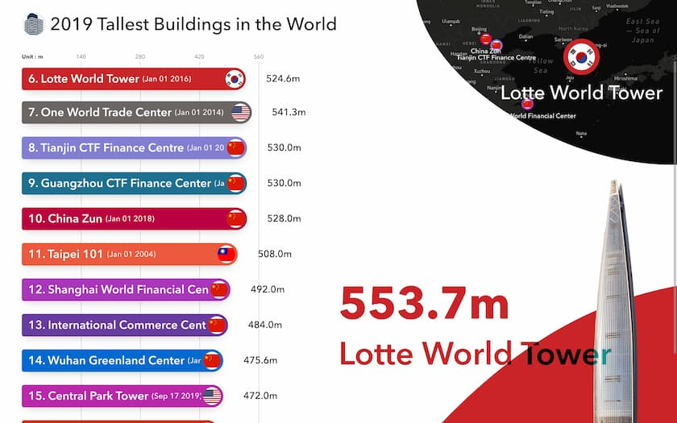
      </a>
    </td>
  </tr>
</table>

[![gsap](https://img.shields.io/badge/gsap-black?style=for-the-badge&logo=data:image/webp;base64,UklGRmYGAABXRUJQVlA4WAoAAAAQAAAAMQAAOgAAQUxQSKYCAAANoAVJtmnbqp5zrn3ufbZt27Zt27Zt+8+2bdu2bb+3zzkT42lr3ce/iJgAhnUhgdoyMMO6IUlYNszA2mrphZlZCzlZMjNg6MgjjzLyCCMONyQEQRwc/OWnH77/7ofvm9kAvKwYqBSjb+Ipp55y4vGHo9Bu1WgMN8JII48U7OdP3nvj9bc+aBrIVPrmWmj+KQotzcxa/FGSH26UMcabZKqpJ9Ubjz7wxIBstuv4YzYkhJPUFmAYZqgx4QzzLjTR8i8yPlGSgui6EBKYmTEBnzHYcI56SlIhgqi5jNoPC/+tyur3/6NBCqpXhB9HrJX4Gb4e1ZtqYy7+CF/40anz14a+/3rS4mpT3Ds4n5+aw1Qb07M4uGcxUVtxH2Tum2V0U00s/Pgs2fwXTy6TfU2yvwufgDO3FDUV5wJk3T10gexrUapX3iYDrhx6MPUs7jhCArK/pbl6rGqQ+559gcQfjR2OG7m43omd8PlPSnj/4LNMPRscchJhgD9P4cJP94xVj+LwT1xOpnXWbvOtM9joSRr6xeb41IY5W2PzlWNQ9+LQn1YgDNBucWW5jTfIuG4NDv/tslRN2i+urDPzAcSqK8WGvrwu1S90Wpzt+9r5oyXnOot9OvcUQpPOi8KVe52wOjGovRSqz7YFP0A3LYePtx7uxIlIXq2Sa3D6aYSc6HJyuuigzXYbnuQFWPYVN+4PoZ/uFwvfH3nlLlsMT3KUynPrURBypKdJ/t1jb99y03HB9V95GngbpNdWvH/7jOsX32joFVdBxQDdl3zwIYTKOYavPj3zujjh1NPkX5Jy+tNSrBNVDe+8nOScgxHG+CGO8d13RilWihXLOcbSgaWUzSiYFSulRClXQfLCCYeTo+OSc4wxp1RyLqUUQ3LOO++d6KmZFfsjvQRWUDggmgMAANAPAJ0BKjIAOwA+oUicSqYkIqGqGZugwBQJZADPgZDDAW4DeHfQA6TCfm7aAEvkpPCHKXpL0MPVHAR9Cs3FMZ5q12N39sHifDW+h5e81UKvKE0aHWQNT3g1Xh6liBjby1v72M4md0reU/LqLEWfmnecy9B+H2kb/7/5UxlREvLNSY0BcdX/8AD+8Dd+5j+AkKvlyTCRwXJtcplUc9Ue5BFVzfRwyN9MWIW/wAT5XGS4G+Sfu1brO3N/OsAHGI1AktiErgZ72AwyF8A3g65X+xUL86cEqI+QkpzFCkHisOHB3Z66QqAmpS/mOmxt/+01E34bWBtHVceOfD1iZSrWrw3dgIk9/hkHLoQoUH1cibNZVu4T+jZGlaMcMLRyevJmScpfVb8FtE8lQn/FOMWeqDeXqZAFIdnH3e0FjmNN7xuqT1B91q9bxmklT9bV/XO5EfKxEb9ncAFoVpS0EcBbETT0Q+q8ai7lXfaZ/QqdP2hUQBbby+nCQsWu0FYg3pm05/NsRkcmS+WXSXdg67GGopZ36vS7chguzuxlKLCiETrKRJ9XPymcQBHsn9RmoYS9EXB1p/mgDzF1iduJjPUunW2eUixpNKEzFoij7Umqsw24Px6boSJ+a9YMUyTVK43KsdbKkFT50tFPJtXXyU8S5X2WEGXQY/4MsfvP/CV3i+X5cYUAXnIfvaeeaXjWRofbmzyQfoor6E9YSSM4UwOj0WbK9/GM4zMMtGZbnQS9afz/KzI3wo/+DlVwOwUZYx+Zeso1Z8w7tD/vKTdtF6YXd1DaTRl0qkUsnetCisKpqHxSYxULoNN3KZFTxFvyz2zF89ZUj7eNMuEe9Td1H+btFsA7+R7dnzyNmsrj5G8HtvYKADAiRZHud+jdMZBFz37Zen1FKhjGpDYd1ovgPawcCuvFAZtQ+8YfPes92gzPfpSRVyU0FY+fEBdZFEomR4FDu8nwMmX31wpaAVZ5dw42rPckfEwvMD4uu7zarB4bN351wvYynkwr+DFJHoyYJslxrJHhfFnoTqbrt88UF1zePx0/etlI424OZlbPn/rPiIkXibautxcClKbACV9CJgnqunCjjHCItdHdInmCa6Qf9y+n5Ss8rSnG+MYUAgwcOe2YBR7+et7kByy7pbQHrhs0xUZBUh6F8kxlDisN8DlTzFKKV9JWP1LbpYtPDY9Vs+Dtx+PkY1X3GcbRZ7y69lY5+7mpEd2FN2CMAAA=)](https://greensock.com/gsap/)
[![mapboxgl](https://img.shields.io/badge/mapbox--gl-black?style=for-the-badge&logo=data:image/svg%2bxml;base64,PD94bWwgdmVyc2lvbj0iMS4wIiBlbmNvZGluZz0iVVRGLTgiPz4KPHN2ZyB3aWR0aD0iMjU2cHgiIGhlaWdodD0iMjU2cHgiIHZpZXdCb3g9IjAgMCAyNTYgMjU2IiB2ZXJzaW9uPSIxLjEiIHhtbG5zPSJodHRwOi8vd3d3LnczLm9yZy8yMDAwL3N2ZyIgeG1sbnM6eGxpbms9Imh0dHA6Ly93d3cudzMub3JnLzE5OTkveGxpbmsiIHByZXNlcnZlQXNwZWN0UmF0aW89InhNaWRZTWlkIj4KICAgIDxnPgogICAgICAgIDxwYXRoIGQ9Ik0xMjgsMCBDNTcuMzA0ODM2OSwwIDAsNTcuMzA0ODM2OSAwLDEyOCBDMCwxOTguNjk1MTYzIDU3LjMwNDgzNjksMjU2IDEyOCwyNTYgQzE5OC42OTUxNjMsMjU2IDI1NiwxOTguNjk1MTYzIDI1NiwxMjggQzI1Niw1Ny4zMDQ4MzY5IDE5OC42OTUxNjMsMCAxMjgsMCBaIE0xODguNzYwNDA1LDE1OS4zODgwNzYgQzE0NC45ODk4NzYsMjAzLjE1ODYwNSA2Ni44MDc2NDksMTg5LjE5MjM1MSA2Ni44MDc2NDksMTg5LjE5MjM1MSBDNjYuODA3NjQ5LDE4OS4xOTIzNTEgNTIuNjk3NDEyOCwxMTEuMTU0MTA2IDk2LjYxMTkyMzUsNjcuMjM5NTk1MSBDMTIwLjk0NDg4Miw0Mi45MDY2MzY3IDE2MS4yNTk4NDMsNDMuOTE0NTEwNyAxODYuNzQ0NjU3LDY5LjI1NTM0MzEgQzIxMi4yMjk0NzEsOTQuNTk2MTc1NSAyMTMuMDkzMzYzLDEzNS4wNTUxMTggMTg4Ljc2MDQwNSwxNTkuMzg4MDc2IEwxODguNzYwNDA1LDE1OS4zODgwNzYgWiBNMTQyLjY4NjE2NCw3NS4wMTQ2MjMyIEwxMzAuMTU5NzMsMTAwLjc4NzQwMiBMMTA0LjM4Njk1MiwxMTMuMzEzODM2IEwxMzAuMTU5NzMsMTI1Ljg0MDI3IEwxNDIuNjg2MTY0LDE1MS42MTMwNDggTDE1NS4yMTI1OTgsMTI1Ljg0MDI3IEwxODAuOTg1Mzc3LDExMy4zMTM4MzYgTDE1NS4yMTI1OTgsMTAwLjc4NzQwMiBMMTQyLjY4NjE2NCw3NS4wMTQ2MjMyIFoiIGZpbGw9IiM0MjY0RkIiIGZpbGwtcnVsZT0ibm9uemVybyI+PC9wYXRoPgogICAgPC9nPgo8L3N2Zz4K)](https://github.com/mapbox/mapbox-gl-js)

[![typeorm](https://img.shields.io/badge/typeorm-black?style=for-the-badge&logo=data:image/svg%2bxml;base64,PHN2ZyB4bWxucz0iaHR0cDovL3d3dy53My5vcmcvMjAwMC9zdmciIHZpZXdCb3g9IjAgMCA1MTAgNDc2LjA1Ij4KICAgICAgPGRlZnM+PHN0eWxlPi5jbHMtMXtmaWxsOiM5OTk7fS5jbHMtMntmaWxsOnJlZDt9LmNscy0ze2ZpbGw6I2ZmYjYwMDt9PC9zdHlsZT48L2RlZnM+CiAgICAgIDxwYXRoIGNsYXNzPSJjbHMtMiIgZD0iTTYzLjY0LDQxMC40NHExLjU2LTEuMTEsMy4xOC0yLjFjLS4wOC0yOC4yOC0uMzMtODAuNzUtMS4yMS0xMDcuMTJoMGMwLTE3LjMxLDAtNDAuNTktMzYuNDYtNDguMTYsMzYuNDItNy41NywzNi40Ni0zMC44NCwzNi40Ni00OC4xNWgwYzEtMjksMS4xOC04OS42MywxLjIzLTExNC44NS0uNjQtLjQxLTEuMjktLjgxLTEuOTEtMS4yNkM1MS4xOCw3OSw0My4xMiw2My40MSw0MC42Niw0NS4xM2MtNC4zOCw3LjE4LTcuMTUsMTYuMDctNy4zOCwyNy4wOEMzMi4xLDEyOC44MiwyOS44NCwxOTQsMjkuNDYsMjA0LjkxYy0uOTEsMjQuNTEtMTUuOTEsMjkuMTgtMjMuNzYsMjkuOTQtMS40OC4wOC0zLC4xMS00LjcuMDV2MzYuMzNjMS42Ny0uMDYsMy4yMiwwLDQuNywwLDcuODUuNzYsMjIuODUsNS40MywyMy43NiwyOS45NC4zOCwxMC44OCwyLjY0LDc2LjA5LDMuODIsMTMyLjY5YTU0LjQ5LDU0LjQ5LDAsMCwwLDUuNjYsMjRDNDAuNzQsNDM4LDQ4Ljk0LDQyMSw2My42NCw0MTAuNDRaIiB0cmFuc2Zvcm09InRyYW5zbGF0ZSgtMSAtMTQuNzgpIi8+CiAgICAgIDxwYXRoIGNsYXNzPSJjbHMtMyIgZD0iTTY0LjkzLDg4LjhjLjYyLjQ1LDEuMjcuODUsMS45MSwxLjI2LDAtNy4wOSwwLTExLjM5LDAtMTEuMzlzLTUuMTctMzcuNDQsNDkuMDYtMzIuMjh2LTMxcy01NS0zLjQ4LTc1LjI1LDI5LjczQzQzLjEyLDYzLjQxLDUxLjE4LDc5LDY0LjkzLDg4LjhaIiB0cmFuc2Zvcm09InRyYW5zbGF0ZSgtMSAtMTQuNzgpIi8+CiAgICAgIDxwYXRoIGNsYXNzPSJjbHMtMyIgZD0iTTExNS45MSw0OTAuNzJ2LTMxYy01NC4yMyw1LjE2LTQ5LjA2LTMyLjI4LTQ5LjA2LTMyLjI4czAtNy41MywwLTE5LjEycS0xLjYyLDEtMy4xOCwyLjFDNDguOTQsNDIxLDQwLjc0LDQzOCwzOC45NCw0NTcuOTQsNTcuNjEsNDk0LjQyLDExNS45MSw0OTAuNzIsMTE1LjkxLDQ5MC43MloiIHRyYW5zZm9ybT0idHJhbnNsYXRlKC0xIC0xNC43OCkiLz4KICAgICAgPHBhdGggY2xhc3M9ImNscy0yIiBkPSJNNTA2LjMsMjM0LjMzYy03Ljg1LS43Ny0yMi44NS01LjQzLTIzLjc2LTI5Ljk0LS4zOC0xMC44OC0yLjY0LTc2LjA5LTMuODItMTMyLjdhNTUuNyw1NS43LDAsMCwwLTQuNDItMjEuMzdjLTIuNzIsMTcuNTEtMTAuNywzMi40LTI0LDQxLjkzYTU2LDU2LDAsMCwxLTUuMTIsMy4yYy4wNywyNy43OS4zMSw4MiwxLjIxLDEwOC45NGgwYzAsMTcuMzEsMCw0MC41OCwzNi40Niw0OC4xNS0zNi40Miw3LjU3LTM2LjQ2LDMwLjg1LTM2LjQ2LDQ4LjE2aDBjLS45LDI3LjA1LTEuMTUsODEuNTYtMS4yMSwxMDkuMjVhNTUuMDUsNTUuMDUsMCwwLDEsNi40MSwzLjkzYzEyLjU1LDksMjAuMzYsMjIuNzUsMjMuNSwzOWE1Ni44LDU2LjgsMCwwLDAsMy42My0xOS40OGMxLjE4LTU2LjYsMy40NC0xMjEuODEsMy44Mi0xMzIuNjkuOTEtMjQuNTEsMTUuOTEtMjkuMTgsMjMuNzYtMjkuOTQsMS40OC0uMDgsMy0uMTEsNC43LS4wNVYyMzQuMzhDNTA5LjMzLDIzNC40NCw1MDcuNzgsMjM0LjQxLDUwNi4zLDIzNC4zM1oiIHRyYW5zZm9ybT0idHJhbnNsYXRlKC0xIC0xNC43OCkiLz4KICAgICAgPHBhdGggY2xhc3M9ImNscy0zIiBkPSJNNDc0LjMsNTAuMzJDNDU3LjE3LDExLDM5Ni4wOSwxNC44OCwzOTYuMDksMTQuODh2MzFjNTQuMjMtNS4xNiw0OS4wNiwzMi4yOCw0OS4wNiwzMi4yOHMwLDYuNzUsMCwxNy4zYTU2LDU2LDAsMCwwLDUuMTItMy4yQzQ2My42LDgyLjcyLDQ3MS41OCw2Ny44Myw0NzQuMyw1MC4zMloiIHRyYW5zZm9ybT0idHJhbnNsYXRlKC0xIC0xNC43OCkiLz4KICAgICAgPHBhdGggY2xhc3M9ImNscy0zIiBkPSJNNDUxLjU5LDQxMy44OGE1NS4wNSw1NS4wNSwwLDAsMC02LjQxLTMuOTNjMCwxMC4zNywwLDE3LDAsMTdzNS4xNywzNy40NC00OS4wNiwzMi4yOHYzMXM2Myw0LDc5LTM3LjMzQzQ3Miw0MzYuNjMsNDY0LjE0LDQyMi44Nyw0NTEuNTksNDEzLjg4WiIgdHJhbnNmb3JtPSJ0cmFuc2xhdGUoLTEgLTE0Ljc4KSIvPgogIDwvc3ZnPg==)](https://github.com/typeorm/typeorm)
[![aws-s3](https://img.shields.io/badge/aws--s3-black?style=for-the-badge&logo=data:image/svg%2bxml;base64,PHN2ZyB4bWxucz0iaHR0cDovL3d3dy53My5vcmcvMjAwMC9zdmciIHhtbG5zOnhsaW5rPSJodHRwOi8vd3d3LnczLm9yZy8xOTk5L3hsaW5rIiB2aWV3Qm94PSIwIDAgNzQuMzc1IDg1IiBmaWxsPSIjZmZmIiBmaWxsLXJ1bGU9ImV2ZW5vZGQiIHN0cm9rZT0iIzAwMCIgc3Ryb2tlLWxpbmVjYXA9InJvdW5kIiBzdHJva2UtbGluZWpvaW49InJvdW5kIj48dXNlIHhsaW5rOmhyZWY9IiNBIiB4PSIyLjE4OCIgeT0iMi41Ii8+PHN5bWJvbCBpZD0iQSIgb3ZlcmZsb3c9InZpc2libGUiPjxnIHN0cm9rZT0ibm9uZSI+PHBhdGggZD0iTTUuNjM0IDEzLjg4M0wwIDE2LjU0NnY0Ni44bDUuNjM0IDIuNjYzIDEzLjgyNy0yNi4wNjhMNS42MzQgMTMuODgzeiIgZmlsbD0iIzhjMzEyMyIvPjxwYXRoIGQ9Ik0zNSA1OS4yNzhMNS42MzQgNjZWMTMuODgzTDM1IDIwLjYwNSA0OC44NzggNDAuMDIgMzUgNTkuMjc4eiIgZmlsbD0iI2UwNTI0MyIvPjxwYXRoIGQ9Ik0zNSA1OS4yNzhMNjQuMzU2IDY2bDUuMDc3LTI1LjM5NS01LjA3Ny0yNi43MjJMMzUgMjAuNjA1djM4LjY3M3oiIGZpbGw9IiM4YzMxMjMiLz48cGF0aCBkPSJNNjQuMzU2IDEzLjg4M0w3MCAxNi41NDZ2NDYuOGwtNS42NDQgMi42NjNWMTMuODgzeiIgZmlsbD0iI2UwNTI0MyIvPjxwYXRoIGQ9Ik0yMi4xOTUgNDguNTY2TDM1IDUwLjExNyA0NS4xNTMgNDAuMDIgMzUgMjkuOTMybC0xMi44MDUgMS41MjJ2MTcuMTEyeiIgZmlsbD0iIzhjMzEyMyIvPjxwYXRoIGQ9Ik00Ny44MDUgMjMuMTcxTDM1IDI1LjM3NmwtMTIuODA1LTIuMjA1TDM1IDBsMTIuODA1IDIzLjE3MXoiIGZpbGw9IiM1ZTFmMTgiLz48cGF0aCBkPSJNNDcuODA1IDU2LjgyOUwzNSA1NC42MDVsLTEyLjgwNSAyLjIyNEwzNSA4MGwxMi44MDUtMjMuMTcxeiIgZmlsbD0iI2YyYjBhOSIvPjxwYXRoIGQ9Ik00Ny44MDUgMjMuMTcxTDM1IDIwLjE3NlYwbDEyLjgwNSA2LjA0OXYxNy4xMjJ6IiBmaWxsPSIjZTA1MjQzIi8+PHBhdGggZD0iTTIyLjE5NSAyMy4xNzFMMzUgMjAuMTc2VjBMMjIuMTk1IDYuMDQ5djE3LjEyMnoiIGZpbGw9IiM4YzMxMjMiLz48cGF0aCBkPSJNMzUgODBsMTIuODA1LTYuMDQ5VjU2LjgyOUwzNSA1OS44MjRWODB6IiBmaWxsPSIjZTA1MjQzIi8+PHBhdGggZD0iTTM1IDgwbC0xMi44MDUtNi4wNDlWNTYuODI5TDM1IDU5LjgyNFY4MHoiIGZpbGw9IiM4YzMxMjMiLz48cGF0aCBkPSJNNDcuODA1IDQ4LjU2NkwzNSA1MC4xMTdWMjkuOTMybDEyLjgwNSAxLjUyMnYxNy4xMTJ6IiBmaWxsPSIjZTA1MjQzIi8+PC9nPjwvc3ltYm9sPjwvc3ZnPg==)](https://aws.amazon.com/s3/)

---

### 🔥 ColorInfluencer - Extracts representative color values from commercial sites

 

<table>
  <tr>
    <td>
      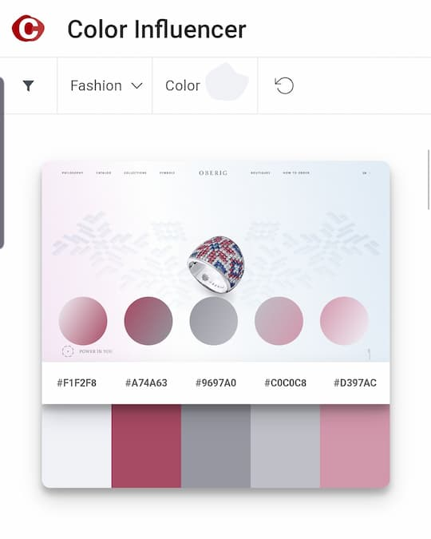
    </td>
    <td>
      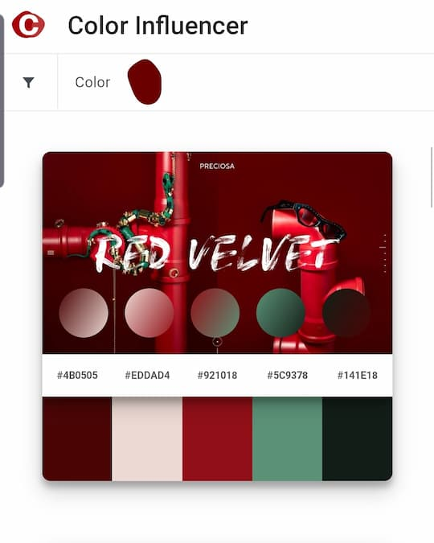
    </td>
    <td>
      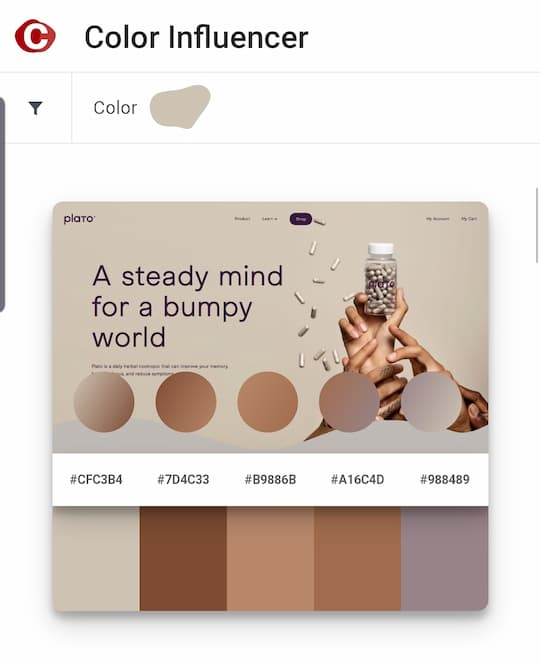
    </td>
  </tr>
</table>

[![typeorm](https://img.shields.io/badge/typeorm-black?style=for-the-badge&logo=data:image/svg%2bxml;base64,PHN2ZyB4bWxucz0iaHR0cDovL3d3dy53My5vcmcvMjAwMC9zdmciIHZpZXdCb3g9IjAgMCA1MTAgNDc2LjA1Ij4KICAgICAgPGRlZnM+PHN0eWxlPi5jbHMtMXtmaWxsOiM5OTk7fS5jbHMtMntmaWxsOnJlZDt9LmNscy0ze2ZpbGw6I2ZmYjYwMDt9PC9zdHlsZT48L2RlZnM+CiAgICAgIDxwYXRoIGNsYXNzPSJjbHMtMiIgZD0iTTYzLjY0LDQxMC40NHExLjU2LTEuMTEsMy4xOC0yLjFjLS4wOC0yOC4yOC0uMzMtODAuNzUtMS4yMS0xMDcuMTJoMGMwLTE3LjMxLDAtNDAuNTktMzYuNDYtNDguMTYsMzYuNDItNy41NywzNi40Ni0zMC44NCwzNi40Ni00OC4xNWgwYzEtMjksMS4xOC04OS42MywxLjIzLTExNC44NS0uNjQtLjQxLTEuMjktLjgxLTEuOTEtMS4yNkM1MS4xOCw3OSw0My4xMiw2My40MSw0MC42Niw0NS4xM2MtNC4zOCw3LjE4LTcuMTUsMTYuMDctNy4zOCwyNy4wOEMzMi4xLDEyOC44MiwyOS44NCwxOTQsMjkuNDYsMjA0LjkxYy0uOTEsMjQuNTEtMTUuOTEsMjkuMTgtMjMuNzYsMjkuOTQtMS40OC4wOC0zLC4xMS00LjcuMDV2MzYuMzNjMS42Ny0uMDYsMy4yMiwwLDQuNywwLDcuODUuNzYsMjIuODUsNS40MywyMy43NiwyOS45NC4zOCwxMC44OCwyLjY0LDc2LjA5LDMuODIsMTMyLjY5YTU0LjQ5LDU0LjQ5LDAsMCwwLDUuNjYsMjRDNDAuNzQsNDM4LDQ4Ljk0LDQyMSw2My42NCw0MTAuNDRaIiB0cmFuc2Zvcm09InRyYW5zbGF0ZSgtMSAtMTQuNzgpIi8+CiAgICAgIDxwYXRoIGNsYXNzPSJjbHMtMyIgZD0iTTY0LjkzLDg4LjhjLjYyLjQ1LDEuMjcuODUsMS45MSwxLjI2LDAtNy4wOSwwLTExLjM5LDAtMTEuMzlzLTUuMTctMzcuNDQsNDkuMDYtMzIuMjh2LTMxcy01NS0zLjQ4LTc1LjI1LDI5LjczQzQzLjEyLDYzLjQxLDUxLjE4LDc5LDY0LjkzLDg4LjhaIiB0cmFuc2Zvcm09InRyYW5zbGF0ZSgtMSAtMTQuNzgpIi8+CiAgICAgIDxwYXRoIGNsYXNzPSJjbHMtMyIgZD0iTTExNS45MSw0OTAuNzJ2LTMxYy01NC4yMyw1LjE2LTQ5LjA2LTMyLjI4LTQ5LjA2LTMyLjI4czAtNy41MywwLTE5LjEycS0xLjYyLDEtMy4xOCwyLjFDNDguOTQsNDIxLDQwLjc0LDQzOCwzOC45NCw0NTcuOTQsNTcuNjEsNDk0LjQyLDExNS45MSw0OTAuNzIsMTE1LjkxLDQ5MC43MloiIHRyYW5zZm9ybT0idHJhbnNsYXRlKC0xIC0xNC43OCkiLz4KICAgICAgPHBhdGggY2xhc3M9ImNscy0yIiBkPSJNNTA2LjMsMjM0LjMzYy03Ljg1LS43Ny0yMi44NS01LjQzLTIzLjc2LTI5Ljk0LS4zOC0xMC44OC0yLjY0LTc2LjA5LTMuODItMTMyLjdhNTUuNyw1NS43LDAsMCwwLTQuNDItMjEuMzdjLTIuNzIsMTcuNTEtMTAuNywzMi40LTI0LDQxLjkzYTU2LDU2LDAsMCwxLTUuMTIsMy4yYy4wNywyNy43OS4zMSw4MiwxLjIxLDEwOC45NGgwYzAsMTcuMzEsMCw0MC41OCwzNi40Niw0OC4xNS0zNi40Miw3LjU3LTM2LjQ2LDMwLjg1LTM2LjQ2LDQ4LjE2aDBjLS45LDI3LjA1LTEuMTUsODEuNTYtMS4yMSwxMDkuMjVhNTUuMDUsNTUuMDUsMCwwLDEsNi40MSwzLjkzYzEyLjU1LDksMjAuMzYsMjIuNzUsMjMuNSwzOWE1Ni44LDU2LjgsMCwwLDAsMy42My0xOS40OGMxLjE4LTU2LjYsMy40NC0xMjEuODEsMy44Mi0xMzIuNjkuOTEtMjQuNTEsMTUuOTEtMjkuMTgsMjMuNzYtMjkuOTQsMS40OC0uMDgsMy0uMTEsNC43LS4wNVYyMzQuMzhDNTA5LjMzLDIzNC40NCw1MDcuNzgsMjM0LjQxLDUwNi4zLDIzNC4zM1oiIHRyYW5zZm9ybT0idHJhbnNsYXRlKC0xIC0xNC43OCkiLz4KICAgICAgPHBhdGggY2xhc3M9ImNscy0zIiBkPSJNNDc0LjMsNTAuMzJDNDU3LjE3LDExLDM5Ni4wOSwxNC44OCwzOTYuMDksMTQuODh2MzFjNTQuMjMtNS4xNiw0OS4wNiwzMi4yOCw0OS4wNiwzMi4yOHMwLDYuNzUsMCwxNy4zYTU2LDU2LDAsMCwwLDUuMTItMy4yQzQ2My42LDgyLjcyLDQ3MS41OCw2Ny44Myw0NzQuMyw1MC4zMloiIHRyYW5zZm9ybT0idHJhbnNsYXRlKC0xIC0xNC43OCkiLz4KICAgICAgPHBhdGggY2xhc3M9ImNscy0zIiBkPSJNNDUxLjU5LDQxMy44OGE1NS4wNSw1NS4wNSwwLDAsMC02LjQxLTMuOTNjMCwxMC4zNywwLDE3LDAsMTdzNS4xNywzNy40NC00OS4wNiwzMi4yOHYzMXM2Myw0LDc5LTM3LjMzQzQ3Miw0MzYuNjMsNDY0LjE0LDQyMi44Nyw0NTEuNTksNDEzLjg4WiIgdHJhbnNmb3JtPSJ0cmFuc2xhdGUoLTEgLTE0Ljc4KSIvPgogIDwvc3ZnPg==)](https://github.com/typeorm/typeorm)
[![aws-s3](https://img.shields.io/badge/aws--s3-black?style=for-the-badge&logo=data:image/svg%2bxml;base64,PHN2ZyB4bWxucz0iaHR0cDovL3d3dy53My5vcmcvMjAwMC9zdmciIHhtbG5zOnhsaW5rPSJodHRwOi8vd3d3LnczLm9yZy8xOTk5L3hsaW5rIiB2aWV3Qm94PSIwIDAgNzQuMzc1IDg1IiBmaWxsPSIjZmZmIiBmaWxsLXJ1bGU9ImV2ZW5vZGQiIHN0cm9rZT0iIzAwMCIgc3Ryb2tlLWxpbmVjYXA9InJvdW5kIiBzdHJva2UtbGluZWpvaW49InJvdW5kIj48dXNlIHhsaW5rOmhyZWY9IiNBIiB4PSIyLjE4OCIgeT0iMi41Ii8+PHN5bWJvbCBpZD0iQSIgb3ZlcmZsb3c9InZpc2libGUiPjxnIHN0cm9rZT0ibm9uZSI+PHBhdGggZD0iTTUuNjM0IDEzLjg4M0wwIDE2LjU0NnY0Ni44bDUuNjM0IDIuNjYzIDEzLjgyNy0yNi4wNjhMNS42MzQgMTMuODgzeiIgZmlsbD0iIzhjMzEyMyIvPjxwYXRoIGQ9Ik0zNSA1OS4yNzhMNS42MzQgNjZWMTMuODgzTDM1IDIwLjYwNSA0OC44NzggNDAuMDIgMzUgNTkuMjc4eiIgZmlsbD0iI2UwNTI0MyIvPjxwYXRoIGQ9Ik0zNSA1OS4yNzhMNjQuMzU2IDY2bDUuMDc3LTI1LjM5NS01LjA3Ny0yNi43MjJMMzUgMjAuNjA1djM4LjY3M3oiIGZpbGw9IiM4YzMxMjMiLz48cGF0aCBkPSJNNjQuMzU2IDEzLjg4M0w3MCAxNi41NDZ2NDYuOGwtNS42NDQgMi42NjNWMTMuODgzeiIgZmlsbD0iI2UwNTI0MyIvPjxwYXRoIGQ9Ik0yMi4xOTUgNDguNTY2TDM1IDUwLjExNyA0NS4xNTMgNDAuMDIgMzUgMjkuOTMybC0xMi44MDUgMS41MjJ2MTcuMTEyeiIgZmlsbD0iIzhjMzEyMyIvPjxwYXRoIGQ9Ik00Ny44MDUgMjMuMTcxTDM1IDI1LjM3NmwtMTIuODA1LTIuMjA1TDM1IDBsMTIuODA1IDIzLjE3MXoiIGZpbGw9IiM1ZTFmMTgiLz48cGF0aCBkPSJNNDcuODA1IDU2LjgyOUwzNSA1NC42MDVsLTEyLjgwNSAyLjIyNEwzNSA4MGwxMi44MDUtMjMuMTcxeiIgZmlsbD0iI2YyYjBhOSIvPjxwYXRoIGQ9Ik00Ny44MDUgMjMuMTcxTDM1IDIwLjE3NlYwbDEyLjgwNSA2LjA0OXYxNy4xMjJ6IiBmaWxsPSIjZTA1MjQzIi8+PHBhdGggZD0iTTIyLjE5NSAyMy4xNzFMMzUgMjAuMTc2VjBMMjIuMTk1IDYuMDQ5djE3LjEyMnoiIGZpbGw9IiM4YzMxMjMiLz48cGF0aCBkPSJNMzUgODBsMTIuODA1LTYuMDQ5VjU2LjgyOUwzNSA1OS44MjRWODB6IiBmaWxsPSIjZTA1MjQzIi8+PHBhdGggZD0iTTM1IDgwbC0xMi44MDUtNi4wNDlWNTYuODI5TDM1IDU5LjgyNFY4MHoiIGZpbGw9IiM4YzMxMjMiLz48cGF0aCBkPSJNNDcuODA1IDQ4LjU2NkwzNSA1MC4xMTdWMjkuOTMybDEyLjgwNSAxLjUyMnYxNy4xMTJ6IiBmaWxsPSIjZTA1MjQzIi8+PC9nPjwvc3ltYm9sPjwvc3ZnPg==)](https://aws.amazon.com/s3/)

---

### 🔥 Voom - Real-time conference call based on WebRTC

Website : [Voom](https://voom.cf)

 

<table>
  <tr>
    <td>
      <a href="https://github.com/LookLukeLemon/Voom" target="_blank">
        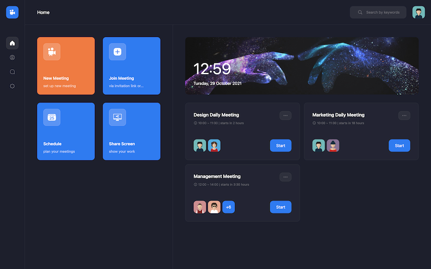
      </a>
    </td>
      <td>
        
    </td>
  </tr>
</table>

[![webrtc](https://img.shields.io/badge/webrtc-black?style=for-the-badge&logo=data:image/svg%2bxml;base64,PHN2ZyB3aWR0aD0iMjUwMCIgaGVpZ2h0PSIyNDMyIiB2aWV3Qm94PSIwIDAgMjU2IDI0OSIgeG1sbnM9Imh0dHA6Ly93d3cudzMub3JnLzIwMDAvc3ZnIiBwcmVzZXJ2ZUFzcGVjdFJhdGlvPSJ4TWlkWU1pZCI+PHBhdGggZD0iTTE0Mi4wNzcgMTkxLjA4N2MwIDMxLjgwNi0yNS43ODIgNTcuNTkyLTU3LjU4OCA1Ny41OTItMzEuODEgMC01Ny41OTMtMjUuNzg2LTU3LjU5My01Ny41OTIgMC0zMS44MDYgMjUuNzgyLTU3LjU5MiA1Ny41OTMtNTcuNTkyIDMxLjgwNiAwIDU3LjU4OCAyNS43ODYgNTcuNTg4IDU3LjU5MiIgZmlsbD0iI0Y2MCIvPjxwYXRoIGQ9Ik0yNTUuOTggMTEwLjQ1OWMwIDMxLjgwMi0yNS43ODIgNTcuNTkyLTU3LjU4OCA1Ny41OTItMzEuODEgMC01Ny41OTItMjUuNzktNTcuNTkyLTU3LjU5MiAwLTMxLjgwNyAyNS43ODEtNTcuNTk3IDU3LjU5Mi01Ny41OTcgMzEuODA2IDAgNTcuNTg4IDI1Ljc5IDU3LjU4OCA1Ny41OTciIGZpbGw9IiNGQzAiLz48cGF0aCBkPSJNMTE1LjIgMTA5LjE4YzAgMzEuODAzLTI1Ljc4MSA1Ny41OTMtNTcuNTkyIDU3LjU5My0zMS44MDIgMC01Ny41ODgtMjUuNzktNTcuNTg4LTU3LjU5MiAwLTMxLjgwNiAyNS43ODYtNTcuNTk3IDU3LjU4OC01Ny41OTcgMzEuODEgMCA1Ny41OTIgMjUuNzkgNTcuNTkyIDU3LjU5NyIgZmlsbD0iIzAwODlDQyIvPjxwYXRoIGQ9Ik0yMzAuMzg2IDE5MS4wODdjMCAzMS44MDYtMjUuNzgyIDU3LjU5Mi01Ny41OTcgNTcuNTkyLTMxLjgwMiAwLTU3LjU4OC0yNS43ODYtNTcuNTg4LTU3LjU5MiAwLTMxLjgwNiAyNS43ODYtNTcuNTkyIDU3LjU4OC01Ny41OTIgMzEuODE1IDAgNTcuNTk3IDI1Ljc4NiA1Ny41OTcgNTcuNTkyIiBmaWxsPSIjMDA5OTM5Ii8+PHBhdGggZD0iTTE4NS41OTIgNTcuOTg0YzAgMzEuODA2LTI1Ljc4NiA1Ny41OTMtNTcuNTkyIDU3LjU5My0zMS44MDYgMC01Ny41OTItMjUuNzg3LTU3LjU5Mi01Ny41OTNDNzAuNDA4IDI2LjE3OCA5Ni4xOTQuMzkyIDEyOCAuMzkyYzMxLjgwNiAwIDU3LjU5MiAyNS43ODYgNTcuNTkyIDU3LjU5MiIgZmlsbD0iI0JGMDAwMCIvPjxwYXRoIGQ9Ik0xNDAuNzk5IDExMC40NTljMCAxLjIxMS4xMDUgMi4zOTcuMTgxIDMuNTkyIDI1LjU0Ni01Ljg5MyA0NC42MS0yOC43MzMgNDQuNjEtNTYuMDY4IDAtMS4yMTItLjEwNS0yLjQwMi0uMTgtMy41OTctMjUuNTQ2IDUuODk4LTQ0LjYxMSAyOC43MzctNDQuNjExIDU2LjA3MyIgZmlsbD0iI0ZDMDAwNyIvPjxwYXRoIGQ9Ik0xNDguMzk3IDEzOC45NzZjOS45MjUgMTcuMzUgMjguNTc2IDI5LjA3NCA0OS45OTcgMjkuMDc0IDguNzMgMCAxNi45NzYtMiAyNC4zOTMtNS40OC05LjkyLTE3LjM1LTI4LjU3Mi0yOS4wNzQtNDkuOTk3LTI5LjA3NC04LjczIDAtMTYuOTc2IDIuMDAxLTI0LjM5MyA1LjQ4IiBmaWxsPSIjMUNEMzA2Ii8+PHBhdGggZD0iTTExNS4yIDE5MS4wODdjMCAxNC4wNyA1LjA1OCAyNi45NDcgMTMuNDQyIDM2Ljk0OCA4LjM3Ni0xMC4wMDEgMTMuNDM0LTIyLjg3NyAxMy40MzQtMzYuOTQ4IDAtMTQuMDcxLTUuMDU4LTI2Ljk0Ny0xMy40MzQtMzYuOTQ4LTguMzg0IDEwLTEzLjQ0MiAyMi44NzctMTMuNDQyIDM2Ljk0OCIgZmlsbD0iIzBGNzUwNCIvPjxwYXRoIGQ9Ik0zNC44MDcgMTYyLjA1N2E1Ny4zMjQgNTcuMzI0IDAgMCAwIDIyLjgwMSA0LjcxNWMyMS4yMSAwIDM5LjY4OC0xMS40OTUgNDkuNjg1LTI4LjU2M2E1Ny4zMzYgNTcuMzM2IDAgMCAwLTIyLjgwMS00LjcxMmMtMjEuMjEgMC0zOS42OTIgMTEuNDk2LTQ5LjY4NSAyOC41NiIgZmlsbD0iIzBDNUU4NyIvPjxwYXRoIGQ9Ik03MC42NTUgNTMuMTI2Yy0uMTM2IDEuNjA0LS4yNSAzLjIxNy0uMjUgNC44NTkgMCAyNy4zMTQgMTkuMDM2IDUwLjEzMiA0NC41NTIgNTYuMDUxLjEzLTEuNjA0LjI0NS0zLjIxNy4yNDUtNC44NTUgMC0yNy4zMTQtMTkuMDMyLTUwLjE0LTQ0LjU0Ny01Ni4wNTUiIGZpbGw9IiM2QjAwMDEiLz48cGF0aCBkPSJNNzYuMDMgMTgzLjk2aC05LjAwOWMtNy45NTMgMC0xNC40Mi02LjQ0Ni0xNC40Mi0xNC4zNzhWODguMDM2YzAtNy45MzMgNi40NjctMTQuMzg0IDE0LjQyLTE0LjM4NEgxNzkuOTljNy45NTQgMCAxNC40MTcgNi40NTEgMTQuNDE3IDE0LjM4NHY4MS41NDZjMCA3LjkzMi02LjQ2MyAxNC4zNzktMTQuNDE3IDE0LjM3OWgtMzguNDg0TDY0LjI5IDIyMS44MTJsMTEuNzQtMzcuODUxeiIgZmlsbD0iI0ZGRiIvPjwvc3ZnPg==)](https://webrtc.org/)
[![jotai](https://img.shields.io/badge/Jotai-black?style=for-the-badge&logo=data:image/svg%2bxml;base64,PHN2ZyB4bWxucz0iaHR0cDovL3d3dy53My5vcmcvMjAwMC9zdmciIHZpZXdCb3g9IjAgMCAyODkuMTkgOTkuNzciIGNsYXNzPSJ0ZXh0LWJsYWNrIGRhcms6dGV4dC13aGl0ZSB3LWZ1bGwgbWF4LXctWzEycmVtXSBsZzptYXgtdy1bMTZyZW1dIDJ4bDptYXgtdy1bMThyZW1dIj48dGl0bGU+Sm90YWk8L3RpdGxlPjxwYXRoIGQ9Ik00Mi4zNiw1LjMySDYxLjgyVjcwLjIzYTI5LjQ2LDI5LjQ2LDAsMCwxLTQsMTUuNjFBMjcuMTksMjcuMTksMCwwLDEsNDYuNjQsOTYuMDdhMzYuMjYsMzYuMjYsMCwwLDEtMTYuNTksMy42MSwzNy41NiwzNy41NiwwLDAsMS0xNS4yNS0zQTI0LjMsMjQuMywwLDAsMSw0LDg3LjU5UTAsODEuNSwwLDcyLjIzSDE5LjU5Yy4wNiwzLjY5LDEuMTMsNi41NywzLjIxLDguNjFhMTEuMjEsMTEuMjEsMCwwLDAsOC4yNSwzLjA3cTExLjIyLDAsMTEuMzEtMTMuNjhaIiBmaWxsPSIjZmZmZmZmIj48L3BhdGg+PHBhdGggZD0iTTEwNSw5OS43N3EtMTAuNTksMC0xOC4yOS00LjUyQTMwLjU0LDMwLjU0LDAsMCwxLDc0LjgyLDgyLjYxYTQwLjUyLDQwLjUyLDAsMCwxLTQuMTgtMTguODQsNDAuNzUsNDAuNzUsMCwwLDEsNC4xOC0xOC45M0EzMC42LDMwLjYsMCwwLDEsODYuNzEsMzIuMiwzNS41MiwzNS41MiwwLDAsMSwxMDUsMjcuNjhhMzUuNTgsMzUuNTgsMCwwLDEsMTguMyw0LjUyLDMwLjU3LDMwLjU3LDAsMCwxLDExLjg4LDEyLjY0LDQwLjc2LDQwLjc2LDAsMCwxLDQuMTksMTguOTMsNDAuNTIsNDAuNTIsMCwwLDEtNC4xOSwxOC44NEEzMC41MSwzMC41MSwwLDAsMSwxMjMuMyw5NS4yNVExMTUuNTksOTkuNzgsMTA1LDk5Ljc3Wk0xMjcuMTQsNS4zMnYxMC41SDgyLjg3VjUuMzJabS0yMiw3OS40NWExMiwxMiwwLDAsMCwxMC44OS02cTMuNy02LDMuNy0xNS4xM1QxMTYsNDguNDhhMTIsMTIsMCwwLDAtMTAuODktNiwxMi4xNSwxMi4xNSwwLDAsMC0xMSw2cS0zLjczLDYtMy43MywxNS4xNnQzLjczLDE1LjEzQTEyLjE2LDEyLjE2LDAsMCwwLDEwNS4wOSw4NC43N1oiIGZpbGw9IiNmZmZmZmYiPjwvcGF0aD48cGF0aCBkPSJNMTg2LjMsMjguNTlWNDMuMTRIMTczLjE2Vjc3cTAsNCwxLjgyLDUuNGE3LjUsNy41LDAsMCwwLDQuNzMsMS40MSwxNC43MiwxNC43MiwwLDAsMCwyLjcyLS4yNWwyLjA5LS4zOCwzLDE0LjQxYy0xLC4zLTIuMzMuNjYtNC4wOSwxLjA2YTM0LjEzLDM0LjEzLDAsMCwxLTYuNDEuNzVxLTEwLjU1LjQ3LTE2LjkzLTQuNTZUMTUzLjgsNzkuNVY0My4xNGgtOS41NVYyOC41OWg5LjU1VjExLjg2aDE5LjM2VjI4LjU5WiIgZmlsbD0iI2ZmZmZmZiI+PC9wYXRoPjxwYXRoIGQ9Ik0yMTYsOTkuNzNxLTEwLDAtMTYuNTktNS4yM3QtNi41OS0xNS41OXEwLTcuODEsMy42OC0xMi4yN2EyMS4xOSwyMS4xOSwwLDAsMSw5LjY2LTYuNTNBNTQuNzgsNTQuNzgsMCwwLDEsMjE5LDU3LjQxYTk4LjU3LDk4LjU3LDAsMCwwLDEzLTEuOTFxMy45Mi0xLDMuOTEtNC4zNnYtLjI4YTguNDIsOC40MiwwLDAsMC0yLjctNi42OHEtMi43Mi0yLjM1LTcuNjYtMi4zNmExMy43NywxMy43NywwLDAsMC04LjMyLDIuMjcsMTAuNywxMC43LDAsMCwwLTQuMDksNS43N2wtMTcuOTEtMS40NWEyMy44OCwyMy44OCwwLDAsMSw5LjkzLTE1LjE0cTcuOTQtNS41OCwyMC40OC01LjU5YTQyLjI0LDQyLjI0LDAsMCwxLDE0LjU0LDIuNDYsMjQuMTksMjQuMTksMCwwLDEsMTAuOTQsNy42NnE0LjE2LDUuMjEsNC4xNiwxMy41MlY5OC40MUgyMzYuOTJWODguNzNoLS41NGEyMC4xOCwyMC4xOCwwLDAsMS03LjYyLDcuOTNRMjIzLjY5LDk5LjczLDIxNiw5OS43M1ptNS41NC0xMy4zN0ExNSwxNSwwLDAsMCwyMzIsODIuNjZhMTEuOTQsMTEuOTQsMCwwLDAsNC4wOS05LjJWNjYuMDVhMTEuMzgsMTEuMzgsMCwwLDEtMy41MiwxLjM2Yy0xLjYuMzktMy4yOS43My01LjEsMXMtMy40MS41NC00Ljg0Ljc1YTE5LjE5LDE5LjE5LDAsMCwwLTguMiwyLjg3LDcuMDYsNy4wNiwwLDAsMC0zLjExLDYuMjIsNi45NCw2Ljk0LDAsMCwwLDIuODgsNkExMi40MywxMi40MywwLDAsMCwyMjEuNTEsODYuMzZaIiBmaWxsPSIjZmZmZmZmIj48L3BhdGg+PHBhdGggZD0iTTI3OC42OSwxOS41OWExMC40MSwxMC40MSwwLDAsMS03LjM3LTIuODksOS4xNCw5LjE0LDAsMCwxLTMuMDktNi45Myw5LjEsOS4xLDAsMCwxLDMuMDktNi45MSwxMSwxMSwwLDAsMSwxNC43OCwwLDkuMSw5LjEsMCwwLDEsMy4wOSw2LjkxLDkuMTQsOS4xNCwwLDAsMS0zLjA5LDYuOTNBMTAuNDUsMTAuNDUsMCwwLDEsMjc4LjY5LDE5LjU5Wk0yNjksOTguNDFWMjguNTloMTkuMzZWOTguNDFaIiBmaWxsPSIjZmZmZmZmIj48L3BhdGg+PC9zdmc+)](https://jotai.org/)

[![mongoose](https://img.shields.io/badge/mongoose-black?style=for-the-badge&logo=data:image/png;base64,iVBORw0KGgoAAAANSUhEUgAAAD4AAAAeCAYAAAB0ba1yAAAABmJLR0QA/wD/AP+gvaeTAAAACXBIWXMAAAsTAAALEwEAmpwYAAAAB3RJTUUH4gEKExcne2z1KQAABEVJREFUWEft12uIFWUYB/Dfemk3tc1SiiS7kFFZGpbRBUwqhD50I5IoIiIrouhrTReCSmQiCKMLhBBURhEUaQYlGgRdhMDMyhbMohtbWVFauq176cMzc5ydnXP26gnCPwyz887zntn//7m+HMRBHMT/GS1DGYwH0uyelJ6La83GASeeakwuZTLaxR32YU/C3jr2GLtg40q8EcmUG3EVJuAnbMUmnI2bcCh6ZMSxG7/hB+xAB7Yl8a74u6MSYVyJ50g5FbOEJ3sFgcdwQcGsO7v+EgKcheMMRq8QY58Q5me8i3ewPqGrYs+QGBHxsrppeGkazsPVuASzK7a+hqNxJFZjGY5Fa8GmT0TDSNGB17Pra+wtilEvIoZFvKI4nSS8dyUuM5BAFdaKb81JmAtpCHU7ljTaiH78ip1CvBkNbDuxUUTEVnyRi1DmMCTxomIpZ+AOXIxT6m4ajC1Yj7txXcIrkDIRj+MGEQ1V6McfWINnBPk5WICFMiEr0IltIiVeTKKu1Pg0JJ4bpZGrK4WX2ofaVwc342EcgnMSvsu8Phf3YkqjzRmew9P4Soh2lHDASpxYZ08PduFtLMsjYBCBkofbRDivwmFl2xGiA4/gJXyIK4SIW7L7gcaPQoB9WDCgmJRIn4s3RFiOlTRR6S/FclEfXhUF7qNGm8YRvTgNx2DyxHy1RPpBPIl5g7aPDWcK1dfgeiwWffmEBnvGC3mKPpGwvoUBuTxVFKHzjS6Ph4sOvIw7RZ42C12YmtBXI5dGlVwnqmuXCI1dwiPtQpRJYrRsUy1MT8XapIq1vGevFmm0GNMr7Oohn/AmiOFopiia9Wy7RVVfmrA5lf3zWV++B9vxMXYkfF/cncZH5mA+LsRFor3l6MMKA0fKHtyKkwtrn+IF0ftbhcCtwvtDkd8pxtc+MdJOFS2trWCzW7Sy/NqCDxLep9DOssY+TRwM+pRQzP3S+mwxez+EIwTJ6Ql/l+yWiPTJMT/hs5LNPNFuZqmPDcIZ84SQh2frv2CzEPRzMdt3ojOJiK2hyGXEeVwqgi1ivl4nvD8zidAr2k8RneFyrEq4TQlpHFTWqk98F54Vs8AMvCe+uQHfiLDvTipSrZ7jqvKvIUo/0p/wbcpSMStX2e9JY+JahAeqbIaBdpwuUuH+JFIK9YnlqPduNIeCGrJOIIkqfZeKI2OGTcLjv1e8Gy4WiXowoMU2It0II/Z4FTLyG8vrmTBtSczateKC1oR/yvYFbBWh/KWoGT32H0+7G+wbNsZMPPd6AzyFWwohuRyPGky8RRxIrsWb6KnKWfZ/b7TebgpSOlOuyf5enNKVlgRPWZhGrViQPR9wjNnjw0Ab7ksjbJ8XoVvuJn+Ks/knQxWr8UIziPeJGf0t0fpqBY5afdgurqZhTFV9BJiA4w3j/N8sNMPjvcLrfYXn/vxlMaybEeI5mkF8hZjecrJ7BPn/FP8CFMQfknFKffkAAAAASUVORK5CYII=)](https://mongoosejs.com/)

---

### 🔥 Streeticon - Let's explore and share the upcoming, trendy, and hot places around me.

Website : [Streeticon](https://streeticon-web.netlify.app/)

 

<table>
  <tr>
    <td>
        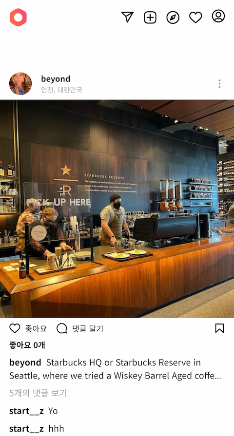
    </td>
    <td>
        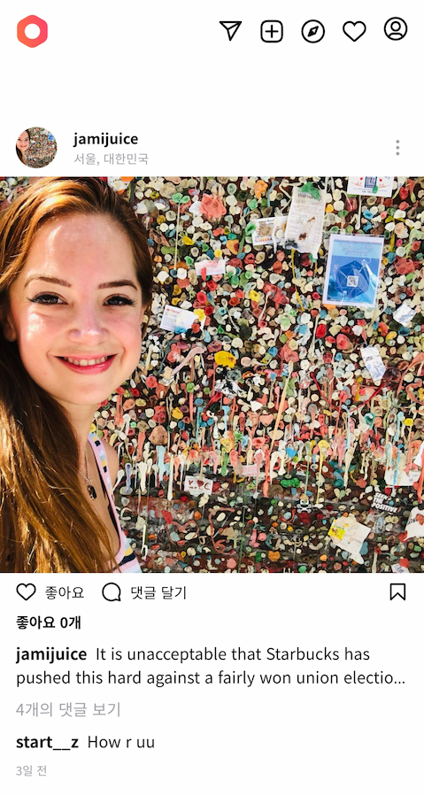
    </td>
    <td>
        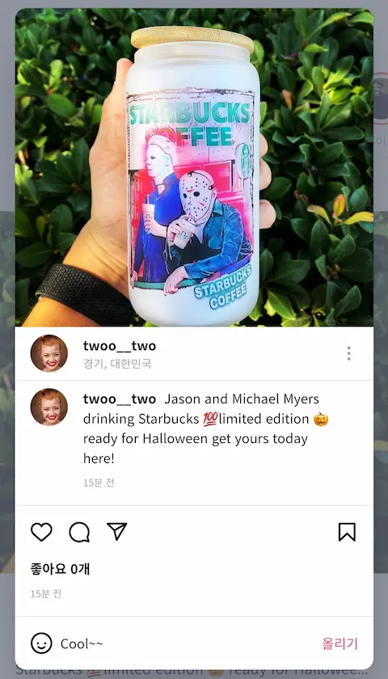
    </td>
  </tr>
</table>

[![react-query](https://img.shields.io/badge/React--query-black?style=for-the-badge&logo=data:image/webp;base64,UklGRooGAABXRUJQVlA4WAoAAAAQAAAAPgAAPgAAQUxQSKkBAAABoAPbtmnbGs+2zdC2bdu2bdu2bds2I9u2ovmwz1pjzfXe/2lETAD+X2Zrs3h5l5KUjE0WL26T3dno7/LnhqI2yabdk8C56d3MltBLchq1viuhdzkZIsbdQhXYLsZDXFwxk0VxAzqI5RMHRcT2XCEAk8S6FW+mlXxth41iP5b30k7ksBBn8b4wqMt5L5Rs5t1WcoB3Wcky3jEl/XmzlVTnNVWSgZdBSQQedNyBw+cqDtNS9HssSucUYVRaKZrvTM1gMeSaaP88MqFB7jPi493OIYaIr4sDtoq/QwC0EJ9bIa/4nXedZ+vkv/1cz+Zm9yw7GnnVAkB7j4bgz/6+nC6B4IIbvBgfBYbVj2n7vLgcLOuv+KHoXM/UIMZttFvJ4nJgR3mi4h74mUWng5pKsvP6K2nFW6pkLu+UkmO810ou8z4quc27oeQF77CSL7xVjCGMl7wJhLZo99VuJq+u1ZtqAAqdsyrCi/HR4noB/Bl3kcUVOBxl9GN8coTsZjbEBW4bLM0G05xLDGbD7baAy3PLwLbohoDvo+G6eP0+VZKAWrLL8sVtsuH/JQBWUDggugQAABAWAJ0BKj8APwA+jTaXR6UioiE19dmYoBGJbDbAAODb9zXKCmcf2f8G8HKVau96gPE26QHmA/Yr9RveY9Fn+j9QD+ydQB+zPsAeWz7Hf7h/th7Uf//uwFehvxyymC2lTZo3h7UcQJ3bGCXVlo8YauNsU0uWGLowfJlVibqtaaiOikdZQplbXGmCzSYSq0y6M9DJbLLXmoFIEqv5ukLekafOBDtvYA4CaSIa9b9qONNw8/uGq3UHuFAAAP79JB//zEvUb/+0vX/+rNxP8zhif+x5vD//pc9LCGi6x8uuA8klf5W/H/U3vKtGkgHX1sCT/XFMta1uUbhlkamajsmnEpsB67HpMVxy8/rR9/wb/wELKOc2qn5FQ4f0NisaQo8+c409/srP85xyx0G2Crr5E+L6EzYwfYkaNhIzGO5OLXfWI+tHH4CvwczJv6xBhi/7Nrlyc1CjTjFWbAEh67flq5f9/Z7Z6Gi9nsWv4cF/qpYsploptBiqXKDcyN2TSZJXgv+HxP2/OZOtfHJA9+0AOia0IT2Xc9zvpsdSAyRLpYTVLgBQLoDQ9Zy9oylOrj6i/sHwOPyIpnL7D9BtDzYY6d64UEec/4NqeWxZgt+3n8ydb7uzPPbNV1n/BAY+8vQXyLw7WxUsrWawwKHwmpKzKYn3go+cYexK9a3VPtJDQfaLkkm44/kcuT74KuC8t4jPxDObU436+jQSjB88s3ZgOkNffShlDK3hp6mWB46Ec4wXfjHeTYAUOgaOu8h22CiAgKDmN9dVQDzs5ybIC5Wl+8K/169b2yTzNkiGD8dZBNx6eYj5Cr3JjuE5vw6KOOoR7op/TbC0FQ2R3mnqXASuDMEjG6T9T0Q9qi09yJ3hMt56/m5q1mp5hz9bM6YvkNyhewfOfXhVat2qCPynSVyzBl05I6zl7Xv3MODitbVPj2PVJNvmXWE35hfdtH+mGvyC2d1goT66Vt9ZdreVaVbtIJxDSYaquIIi2Z2sav7vWvJXT3nVeY2K383zTfIsot91s5BCL5yPGY85HJ/pS80NUCV6tG4460amkKzb4XrMQKF/VZ++ehDIeQrKF7lDkPTMa0inbDyQpk4dXjFnwZ6/2Zoqi3x4/XlHK4czdafz7WC9NV2DM5iT0/rVmS1Km/kroV/JqCupyAriXneKpuDrqdgVaAxTnT1k45ID2LL545pY5bPS7Fdl3Ihd5kE4ZfS+ovMF+D42TJ/m+ZNhUzJVrv9w8C+13UqBSRTd74UDr8jcYhkgWSycDVOyUMB9D3U84LLKNBgBWTb91IufqliQbntuyxIlYvfWGn83wcGe2XlQYD2OhGu2SUTNTDJW07kS4W4O0caJ7P5xRVxC+wLF1K+lCWFF7OIHhCz3XaRAijQO8H//zb/f1P9mt/jo2tx/Fbf8zi6wP//v/z7+VH8o9F2PYq9OUnT/rsKa38Wiiuo3i/TzjbG01LO9G4ain4/cQdOD0r3ln0UdewheRc4D2tuG2WOd/+LJ1rWBuzUvyts4wj/DFgIzAYzDePbhj0VA06owlyQ9XDzNP1pAvgvCIAMOtH/OXBa5rG2pLLUoOC0oAsWyNjQmvksYpUfr1BDfMaIrhgJz/LapAAA=)](https://tanstack.com/query/)
[![jotai](https://img.shields.io/badge/Jotai-black?style=for-the-badge&logo=data:image/svg%2bxml;base64,PHN2ZyB4bWxucz0iaHR0cDovL3d3dy53My5vcmcvMjAwMC9zdmciIHZpZXdCb3g9IjAgMCAyODkuMTkgOTkuNzciIGNsYXNzPSJ0ZXh0LWJsYWNrIGRhcms6dGV4dC13aGl0ZSB3LWZ1bGwgbWF4LXctWzEycmVtXSBsZzptYXgtdy1bMTZyZW1dIDJ4bDptYXgtdy1bMThyZW1dIj48dGl0bGU+Sm90YWk8L3RpdGxlPjxwYXRoIGQ9Ik00Mi4zNiw1LjMySDYxLjgyVjcwLjIzYTI5LjQ2LDI5LjQ2LDAsMCwxLTQsMTUuNjFBMjcuMTksMjcuMTksMCwwLDEsNDYuNjQsOTYuMDdhMzYuMjYsMzYuMjYsMCwwLDEtMTYuNTksMy42MSwzNy41NiwzNy41NiwwLDAsMS0xNS4yNS0zQTI0LjMsMjQuMywwLDAsMSw0LDg3LjU5UTAsODEuNSwwLDcyLjIzSDE5LjU5Yy4wNiwzLjY5LDEuMTMsNi41NywzLjIxLDguNjFhMTEuMjEsMTEuMjEsMCwwLDAsOC4yNSwzLjA3cTExLjIyLDAsMTEuMzEtMTMuNjhaIiBmaWxsPSIjZmZmZmZmIj48L3BhdGg+PHBhdGggZD0iTTEwNSw5OS43N3EtMTAuNTksMC0xOC4yOS00LjUyQTMwLjU0LDMwLjU0LDAsMCwxLDc0LjgyLDgyLjYxYTQwLjUyLDQwLjUyLDAsMCwxLTQuMTgtMTguODQsNDAuNzUsNDAuNzUsMCwwLDEsNC4xOC0xOC45M0EzMC42LDMwLjYsMCwwLDEsODYuNzEsMzIuMiwzNS41MiwzNS41MiwwLDAsMSwxMDUsMjcuNjhhMzUuNTgsMzUuNTgsMCwwLDEsMTguMyw0LjUyLDMwLjU3LDMwLjU3LDAsMCwxLDExLjg4LDEyLjY0LDQwLjc2LDQwLjc2LDAsMCwxLDQuMTksMTguOTMsNDAuNTIsNDAuNTIsMCwwLDEtNC4xOSwxOC44NEEzMC41MSwzMC41MSwwLDAsMSwxMjMuMyw5NS4yNVExMTUuNTksOTkuNzgsMTA1LDk5Ljc3Wk0xMjcuMTQsNS4zMnYxMC41SDgyLjg3VjUuMzJabS0yMiw3OS40NWExMiwxMiwwLDAsMCwxMC44OS02cTMuNy02LDMuNy0xNS4xM1QxMTYsNDguNDhhMTIsMTIsMCwwLDAtMTAuODktNiwxMi4xNSwxMi4xNSwwLDAsMC0xMSw2cS0zLjczLDYtMy43MywxNS4xNnQzLjczLDE1LjEzQTEyLjE2LDEyLjE2LDAsMCwwLDEwNS4wOSw4NC43N1oiIGZpbGw9IiNmZmZmZmYiPjwvcGF0aD48cGF0aCBkPSJNMTg2LjMsMjguNTlWNDMuMTRIMTczLjE2Vjc3cTAsNCwxLjgyLDUuNGE3LjUsNy41LDAsMCwwLDQuNzMsMS40MSwxNC43MiwxNC43MiwwLDAsMCwyLjcyLS4yNWwyLjA5LS4zOCwzLDE0LjQxYy0xLC4zLTIuMzMuNjYtNC4wOSwxLjA2YTM0LjEzLDM0LjEzLDAsMCwxLTYuNDEuNzVxLTEwLjU1LjQ3LTE2LjkzLTQuNTZUMTUzLjgsNzkuNVY0My4xNGgtOS41NVYyOC41OWg5LjU1VjExLjg2aDE5LjM2VjI4LjU5WiIgZmlsbD0iI2ZmZmZmZiI+PC9wYXRoPjxwYXRoIGQ9Ik0yMTYsOTkuNzNxLTEwLDAtMTYuNTktNS4yM3QtNi41OS0xNS41OXEwLTcuODEsMy42OC0xMi4yN2EyMS4xOSwyMS4xOSwwLDAsMSw5LjY2LTYuNTNBNTQuNzgsNTQuNzgsMCwwLDEsMjE5LDU3LjQxYTk4LjU3LDk4LjU3LDAsMCwwLDEzLTEuOTFxMy45Mi0xLDMuOTEtNC4zNnYtLjI4YTguNDIsOC40MiwwLDAsMC0yLjctNi42OHEtMi43Mi0yLjM1LTcuNjYtMi4zNmExMy43NywxMy43NywwLDAsMC04LjMyLDIuMjcsMTAuNywxMC43LDAsMCwwLTQuMDksNS43N2wtMTcuOTEtMS40NWEyMy44OCwyMy44OCwwLDAsMSw5LjkzLTE1LjE0cTcuOTQtNS41OCwyMC40OC01LjU5YTQyLjI0LDQyLjI0LDAsMCwxLDE0LjU0LDIuNDYsMjQuMTksMjQuMTksMCwwLDEsMTAuOTQsNy42NnE0LjE2LDUuMjEsNC4xNiwxMy41MlY5OC40MUgyMzYuOTJWODguNzNoLS41NGEyMC4xOCwyMC4xOCwwLDAsMS03LjYyLDcuOTNRMjIzLjY5LDk5LjczLDIxNiw5OS43M1ptNS41NC0xMy4zN0ExNSwxNSwwLDAsMCwyMzIsODIuNjZhMTEuOTQsMTEuOTQsMCwwLDAsNC4wOS05LjJWNjYuMDVhMTEuMzgsMTEuMzgsMCwwLDEtMy41MiwxLjM2Yy0xLjYuMzktMy4yOS43My01LjEsMXMtMy40MS41NC00Ljg0Ljc1YTE5LjE5LDE5LjE5LDAsMCwwLTguMiwyLjg3LDcuMDYsNy4wNiwwLDAsMC0zLjExLDYuMjIsNi45NCw2Ljk0LDAsMCwwLDIuODgsNkExMi40MywxMi40MywwLDAsMCwyMjEuNTEsODYuMzZaIiBmaWxsPSIjZmZmZmZmIj48L3BhdGg+PHBhdGggZD0iTTI3OC42OSwxOS41OWExMC40MSwxMC40MSwwLDAsMS03LjM3LTIuODksOS4xNCw5LjE0LDAsMCwxLTMuMDktNi45Myw5LjEsOS4xLDAsMCwxLDMuMDktNi45MSwxMSwxMSwwLDAsMSwxNC43OCwwLDkuMSw5LjEsMCwwLDEsMy4wOSw2LjkxLDkuMTQsOS4xNCwwLDAsMS0zLjA5LDYuOTNBMTAuNDUsMTAuNDUsMCwwLDEsMjc4LjY5LDE5LjU5Wk0yNjksOTguNDFWMjguNTloMTkuMzZWOTguNDFaIiBmaWxsPSIjZmZmZmZmIj48L3BhdGg+PC9zdmc+)](https://jotai.org/)

[![mongoose](https://img.shields.io/badge/mongoose-black?style=for-the-badge&logo=data:image/png;base64,iVBORw0KGgoAAAANSUhEUgAAAD4AAAAeCAYAAAB0ba1yAAAABmJLR0QA/wD/AP+gvaeTAAAACXBIWXMAAAsTAAALEwEAmpwYAAAAB3RJTUUH4gEKExcne2z1KQAABEVJREFUWEft12uIFWUYB/Dfemk3tc1SiiS7kFFZGpbRBUwqhD50I5IoIiIrouhrTReCSmQiCKMLhBBURhEUaQYlGgRdhMDMyhbMohtbWVFauq176cMzc5ydnXP26gnCPwyz887zntn//7m+HMRBHMT/GS1DGYwH0uyelJ6La83GASeeakwuZTLaxR32YU/C3jr2GLtg40q8EcmUG3EVJuAnbMUmnI2bcCh6ZMSxG7/hB+xAB7Yl8a74u6MSYVyJ50g5FbOEJ3sFgcdwQcGsO7v+EgKcheMMRq8QY58Q5me8i3ewPqGrYs+QGBHxsrppeGkazsPVuASzK7a+hqNxJFZjGY5Fa8GmT0TDSNGB17Pra+wtilEvIoZFvKI4nSS8dyUuM5BAFdaKb81JmAtpCHU7ljTaiH78ip1CvBkNbDuxUUTEVnyRi1DmMCTxomIpZ+AOXIxT6m4ajC1Yj7txXcIrkDIRj+MGEQ1V6McfWINnBPk5WICFMiEr0IltIiVeTKKu1Pg0JJ4bpZGrK4WX2ofaVwc342EcgnMSvsu8Phf3YkqjzRmew9P4Soh2lHDASpxYZ08PduFtLMsjYBCBkofbRDivwmFl2xGiA4/gJXyIK4SIW7L7gcaPQoB9WDCgmJRIn4s3RFiOlTRR6S/FclEfXhUF7qNGm8YRvTgNx2DyxHy1RPpBPIl5g7aPDWcK1dfgeiwWffmEBnvGC3mKPpGwvoUBuTxVFKHzjS6Ph4sOvIw7RZ42C12YmtBXI5dGlVwnqmuXCI1dwiPtQpRJYrRsUy1MT8XapIq1vGevFmm0GNMr7Oohn/AmiOFopiia9Wy7RVVfmrA5lf3zWV++B9vxMXYkfF/cncZH5mA+LsRFor3l6MMKA0fKHtyKkwtrn+IF0ftbhcCtwvtDkd8pxtc+MdJOFS2trWCzW7Sy/NqCDxLep9DOssY+TRwM+pRQzP3S+mwxez+EIwTJ6Ql/l+yWiPTJMT/hs5LNPNFuZqmPDcIZ84SQh2frv2CzEPRzMdt3ojOJiK2hyGXEeVwqgi1ivl4nvD8zidAr2k8RneFyrEq4TQlpHFTWqk98F54Vs8AMvCe+uQHfiLDvTipSrZ7jqvKvIUo/0p/wbcpSMStX2e9JY+JahAeqbIaBdpwuUuH+JFIK9YnlqPduNIeCGrJOIIkqfZeKI2OGTcLjv1e8Gy4WiXowoMU2It0II/Z4FTLyG8vrmTBtSczateKC1oR/yvYFbBWh/KWoGT32H0+7G+wbNsZMPPd6AzyFWwohuRyPGky8RRxIrsWb6KnKWfZ/b7TebgpSOlOuyf5enNKVlgRPWZhGrViQPR9wjNnjw0Ab7ksjbJ8XoVvuJn+Ks/knQxWr8UIziPeJGf0t0fpqBY5afdgurqZhTFV9BJiA4w3j/N8sNMPjvcLrfYXn/vxlMaybEeI5mkF8hZjecrJ7BPn/FP8CFMQfknFKffkAAAAASUVORK5CYII=)](https://mongoosejs.com/)

---

### My Full Tech stack ⚡

[![react-query](https://img.shields.io/badge/React--query-black?style=for-the-badge&logo=data:image/webp;base64,UklGRooGAABXRUJQVlA4WAoAAAAQAAAAPgAAPgAAQUxQSKkBAAABoAPbtmnbGs+2zdC2bdu2bdu2bds2I9u2ovmwz1pjzfXe/2lETAD+X2Zrs3h5l5KUjE0WL26T3dno7/LnhqI2yabdk8C56d3MltBLchq1viuhdzkZIsbdQhXYLsZDXFwxk0VxAzqI5RMHRcT2XCEAk8S6FW+mlXxth41iP5b30k7ksBBn8b4wqMt5L5Rs5t1WcoB3Wcky3jEl/XmzlVTnNVWSgZdBSQQedNyBw+cqDtNS9HssSucUYVRaKZrvTM1gMeSaaP88MqFB7jPi493OIYaIr4sDtoq/QwC0EJ9bIa/4nXedZ+vkv/1cz+Zm9yw7GnnVAkB7j4bgz/6+nC6B4IIbvBgfBYbVj2n7vLgcLOuv+KHoXM/UIMZttFvJ4nJgR3mi4h74mUWng5pKsvP6K2nFW6pkLu+UkmO810ou8z4quc27oeQF77CSL7xVjCGMl7wJhLZo99VuJq+u1ZtqAAqdsyrCi/HR4noB/Bl3kcUVOBxl9GN8coTsZjbEBW4bLM0G05xLDGbD7baAy3PLwLbohoDvo+G6eP0+VZKAWrLL8sVtsuH/JQBWUDggugQAABAWAJ0BKj8APwA+jTaXR6UioiE19dmYoBGJbDbAAODb9zXKCmcf2f8G8HKVau96gPE26QHmA/Yr9RveY9Fn+j9QD+ydQB+zPsAeWz7Hf7h/th7Uf//uwFehvxyymC2lTZo3h7UcQJ3bGCXVlo8YauNsU0uWGLowfJlVibqtaaiOikdZQplbXGmCzSYSq0y6M9DJbLLXmoFIEqv5ukLekafOBDtvYA4CaSIa9b9qONNw8/uGq3UHuFAAAP79JB//zEvUb/+0vX/+rNxP8zhif+x5vD//pc9LCGi6x8uuA8klf5W/H/U3vKtGkgHX1sCT/XFMta1uUbhlkamajsmnEpsB67HpMVxy8/rR9/wb/wELKOc2qn5FQ4f0NisaQo8+c409/srP85xyx0G2Crr5E+L6EzYwfYkaNhIzGO5OLXfWI+tHH4CvwczJv6xBhi/7Nrlyc1CjTjFWbAEh67flq5f9/Z7Z6Gi9nsWv4cF/qpYsploptBiqXKDcyN2TSZJXgv+HxP2/OZOtfHJA9+0AOia0IT2Xc9zvpsdSAyRLpYTVLgBQLoDQ9Zy9oylOrj6i/sHwOPyIpnL7D9BtDzYY6d64UEec/4NqeWxZgt+3n8ydb7uzPPbNV1n/BAY+8vQXyLw7WxUsrWawwKHwmpKzKYn3go+cYexK9a3VPtJDQfaLkkm44/kcuT74KuC8t4jPxDObU436+jQSjB88s3ZgOkNffShlDK3hp6mWB46Ec4wXfjHeTYAUOgaOu8h22CiAgKDmN9dVQDzs5ybIC5Wl+8K/169b2yTzNkiGD8dZBNx6eYj5Cr3JjuE5vw6KOOoR7op/TbC0FQ2R3mnqXASuDMEjG6T9T0Q9qi09yJ3hMt56/m5q1mp5hz9bM6YvkNyhewfOfXhVat2qCPynSVyzBl05I6zl7Xv3MODitbVPj2PVJNvmXWE35hfdtH+mGvyC2d1goT66Vt9ZdreVaVbtIJxDSYaquIIi2Z2sav7vWvJXT3nVeY2K383zTfIsot91s5BCL5yPGY85HJ/pS80NUCV6tG4460amkKzb4XrMQKF/VZ++ehDIeQrKF7lDkPTMa0inbDyQpk4dXjFnwZ6/2Zoqi3x4/XlHK4czdafz7WC9NV2DM5iT0/rVmS1Km/kroV/JqCupyAriXneKpuDrqdgVaAxTnT1k45ID2LL545pY5bPS7Fdl3Ihd5kE4ZfS+ovMF+D42TJ/m+ZNhUzJVrv9w8C+13UqBSRTd74UDr8jcYhkgWSycDVOyUMB9D3U84LLKNBgBWTb91IufqliQbntuyxIlYvfWGn83wcGe2XlQYD2OhGu2SUTNTDJW07kS4W4O0caJ7P5xRVxC+wLF1K+lCWFF7OIHhCz3XaRAijQO8H//zb/f1P9mt/jo2tx/Fbf8zi6wP//v/z7+VH8o9F2PYq9OUnT/rsKa38Wiiuo3i/TzjbG01LO9G4ain4/cQdOD0r3ln0UdewheRc4D2tuG2WOd/+LJ1rWBuzUvyts4wj/DFgIzAYzDePbhj0VA06owlyQ9XDzNP1pAvgvCIAMOtH/OXBa5rG2pLLUoOC0oAsWyNjQmvksYpUfr1BDfMaIrhgJz/LapAAA=)](https://tanstack.com/query/)
[![jotai](https://img.shields.io/badge/Jotai-black?style=for-the-badge&logo=data:image/svg%2bxml;base64,PHN2ZyB4bWxucz0iaHR0cDovL3d3dy53My5vcmcvMjAwMC9zdmciIHZpZXdCb3g9IjAgMCAyODkuMTkgOTkuNzciIGNsYXNzPSJ0ZXh0LWJsYWNrIGRhcms6dGV4dC13aGl0ZSB3LWZ1bGwgbWF4LXctWzEycmVtXSBsZzptYXgtdy1bMTZyZW1dIDJ4bDptYXgtdy1bMThyZW1dIj48dGl0bGU+Sm90YWk8L3RpdGxlPjxwYXRoIGQ9Ik00Mi4zNiw1LjMySDYxLjgyVjcwLjIzYTI5LjQ2LDI5LjQ2LDAsMCwxLTQsMTUuNjFBMjcuMTksMjcuMTksMCwwLDEsNDYuNjQsOTYuMDdhMzYuMjYsMzYuMjYsMCwwLDEtMTYuNTksMy42MSwzNy41NiwzNy41NiwwLDAsMS0xNS4yNS0zQTI0LjMsMjQuMywwLDAsMSw0LDg3LjU5UTAsODEuNSwwLDcyLjIzSDE5LjU5Yy4wNiwzLjY5LDEuMTMsNi41NywzLjIxLDguNjFhMTEuMjEsMTEuMjEsMCwwLDAsOC4yNSwzLjA3cTExLjIyLDAsMTEuMzEtMTMuNjhaIiBmaWxsPSIjZmZmZmZmIj48L3BhdGg+PHBhdGggZD0iTTEwNSw5OS43N3EtMTAuNTksMC0xOC4yOS00LjUyQTMwLjU0LDMwLjU0LDAsMCwxLDc0LjgyLDgyLjYxYTQwLjUyLDQwLjUyLDAsMCwxLTQuMTgtMTguODQsNDAuNzUsNDAuNzUsMCwwLDEsNC4xOC0xOC45M0EzMC42LDMwLjYsMCwwLDEsODYuNzEsMzIuMiwzNS41MiwzNS41MiwwLDAsMSwxMDUsMjcuNjhhMzUuNTgsMzUuNTgsMCwwLDEsMTguMyw0LjUyLDMwLjU3LDMwLjU3LDAsMCwxLDExLjg4LDEyLjY0LDQwLjc2LDQwLjc2LDAsMCwxLDQuMTksMTguOTMsNDAuNTIsNDAuNTIsMCwwLDEtNC4xOSwxOC44NEEzMC41MSwzMC41MSwwLDAsMSwxMjMuMyw5NS4yNVExMTUuNTksOTkuNzgsMTA1LDk5Ljc3Wk0xMjcuMTQsNS4zMnYxMC41SDgyLjg3VjUuMzJabS0yMiw3OS40NWExMiwxMiwwLDAsMCwxMC44OS02cTMuNy02LDMuNy0xNS4xM1QxMTYsNDguNDhhMTIsMTIsMCwwLDAtMTAuODktNiwxMi4xNSwxMi4xNSwwLDAsMC0xMSw2cS0zLjczLDYtMy43MywxNS4xNnQzLjczLDE1LjEzQTEyLjE2LDEyLjE2LDAsMCwwLDEwNS4wOSw4NC43N1oiIGZpbGw9IiNmZmZmZmYiPjwvcGF0aD48cGF0aCBkPSJNMTg2LjMsMjguNTlWNDMuMTRIMTczLjE2Vjc3cTAsNCwxLjgyLDUuNGE3LjUsNy41LDAsMCwwLDQuNzMsMS40MSwxNC43MiwxNC43MiwwLDAsMCwyLjcyLS4yNWwyLjA5LS4zOCwzLDE0LjQxYy0xLC4zLTIuMzMuNjYtNC4wOSwxLjA2YTM0LjEzLDM0LjEzLDAsMCwxLTYuNDEuNzVxLTEwLjU1LjQ3LTE2LjkzLTQuNTZUMTUzLjgsNzkuNVY0My4xNGgtOS41NVYyOC41OWg5LjU1VjExLjg2aDE5LjM2VjI4LjU5WiIgZmlsbD0iI2ZmZmZmZiI+PC9wYXRoPjxwYXRoIGQ9Ik0yMTYsOTkuNzNxLTEwLDAtMTYuNTktNS4yM3QtNi41OS0xNS41OXEwLTcuODEsMy42OC0xMi4yN2EyMS4xOSwyMS4xOSwwLDAsMSw5LjY2LTYuNTNBNTQuNzgsNTQuNzgsMCwwLDEsMjE5LDU3LjQxYTk4LjU3LDk4LjU3LDAsMCwwLDEzLTEuOTFxMy45Mi0xLDMuOTEtNC4zNnYtLjI4YTguNDIsOC40MiwwLDAsMC0yLjctNi42OHEtMi43Mi0yLjM1LTcuNjYtMi4zNmExMy43NywxMy43NywwLDAsMC04LjMyLDIuMjcsMTAuNywxMC43LDAsMCwwLTQuMDksNS43N2wtMTcuOTEtMS40NWEyMy44OCwyMy44OCwwLDAsMSw5LjkzLTE1LjE0cTcuOTQtNS41OCwyMC40OC01LjU5YTQyLjI0LDQyLjI0LDAsMCwxLDE0LjU0LDIuNDYsMjQuMTksMjQuMTksMCwwLDEsMTAuOTQsNy42NnE0LjE2LDUuMjEsNC4xNiwxMy41MlY5OC40MUgyMzYuOTJWODguNzNoLS41NGEyMC4xOCwyMC4xOCwwLDAsMS03LjYyLDcuOTNRMjIzLjY5LDk5LjczLDIxNiw5OS43M1ptNS41NC0xMy4zN0ExNSwxNSwwLDAsMCwyMzIsODIuNjZhMTEuOTQsMTEuOTQsMCwwLDAsNC4wOS05LjJWNjYuMDVhMTEuMzgsMTEuMzgsMCwwLDEtMy41MiwxLjM2Yy0xLjYuMzktMy4yOS43My01LjEsMXMtMy40MS41NC00Ljg0Ljc1YTE5LjE5LDE5LjE5LDAsMCwwLTguMiwyLjg3LDcuMDYsNy4wNiwwLDAsMC0zLjExLDYuMjIsNi45NCw2Ljk0LDAsMCwwLDIuODgsNkExMi40MywxMi40MywwLDAsMCwyMjEuNTEsODYuMzZaIiBmaWxsPSIjZmZmZmZmIj48L3BhdGg+PHBhdGggZD0iTTI3OC42OSwxOS41OWExMC40MSwxMC40MSwwLDAsMS03LjM3LTIuODksOS4xNCw5LjE0LDAsMCwxLTMuMDktNi45Myw5LjEsOS4xLDAsMCwxLDMuMDktNi45MSwxMSwxMSwwLDAsMSwxNC43OCwwLDkuMSw5LjEsMCwwLDEsMy4wOSw2LjkxLDkuMTQsOS4xNCwwLDAsMS0zLjA5LDYuOTNBMTAuNDUsMTAuNDUsMCwwLDEsMjc4LjY5LDE5LjU5Wk0yNjksOTguNDFWMjguNTloMTkuMzZWOTguNDFaIiBmaWxsPSIjZmZmZmZmIj48L3BhdGg+PC9zdmc+)](https://jotai.org/)
[![react-virtualized](https://img.shields.io/badge/react--virtualized-black?style=for-the-badge&logo=data:image/webp;base64,UklGRs4FAABXRUJQVlA4WAoAAAAQAAAAQgAAQgAAQUxQSMgCAAABoKztn2Hb+VXX/5zYzuxwFuceNLJt27ZuwMkwGdq2NTu2bfa/qr5g7b17dZ0LiIgJUJfBGkkHnXTbKz/MXbfDd6yf99Prd55yiKTGgnoZTNLEWz9YylhXfHLXFEkWemCSnfOJAyWlXApQSk6pAPnrC3eTbFhNVLxuBuCpMNaSHJh7+25qmqGYdMYMSKnQbUkO8y6QrLtgOvJt8Mwws8NnExRDR4105gZSZtjZ2X6J1HQSpefB6aPDC1LsIEpvkTL9zIlPTHFMUfFL2kJvW37dQ3EMjfQlLX1u+W2cmlGFoLdo6XfLZ1IYjel5Wvre8rLiKExnkErvcK6UjdDoiI1k+p9ppygOinobp0bnG4UBptNJ1OlcLpMU1MwkV5JZsqeCZLoOp1bnfpmC4kxyNZml+yiYzsap17lK1uhTUkWJ3xQ0wSkVAUdLt+LU7DwmfUCqKvG1DlxKqaqwaeJJFOrOnHYbqbLEI69Ul3nvB3JlhelzKdWtWVcdbN1B/Tt9F+A7dgHtekp1W+dVV1j7E7m6Ga+TKst8eEd1iSdOpVSWOeOQ5ZSqClum6GNSVYnvpLvwqpynpSmFUlPhBDX6hlRR5m/JdCFekXODLGi3eeRqCqsOVJDpdrwa5wmZFDR+PrmSzOr9FSSZLsArcW6U6f+NPsercH6VwggTtpMrKHCUogabLiFV4Nwq08hRL9D2ruUNNRplkD6l7VnLTxqdGtmvtL1qmbmPokYftcdvtD1qmXGwTGONGvcZKfekOD/uI9PYo/QyeC8c3pRMXTbSlTvxPLTslFukqG5D1JSvwfNQisPPR6lp1LlJly8BT51lh9U3SqZhxqC9HlgCeCpjKsmBVY8fIEUN2aR9rvwVIKecy4BScsoAf91woGRBQw8m6ehHv97EWLd899SJkiyol8GCpImnPfretDVbd3q7de2MD544Y6okWVCXVlA4IOACAADwEACdASpDAEMAPpFGnEqlo6Kho/VbQLASCWIA1LvEzhpkrAHqY20XmA6DG8n8sB8NX7MsMFaDLA0rLP+7V9CBjfMeUfPmNu9S/gifQgsyjHUfMJhL+upsXlE/indVoMXmTk/v00zPiH+PJ+0gdbvoAnGZ9L96rQ4E3sqEsDA5ZL3ZK8khCF+uzwtoi0dY6sAA/u9yP/8/7//n5j//z4glVf3ptaQHdi4B95sNcruFkbzb3F8WYBoJ++2NfXevc1b9vdBfBdyqCFlJUhhgcK7T/2bpi7hPRf5/pz5Lfo+KfdYXY/yLj/KQ/9Dzmdk5PynD9B92wEqZJjiUxEZCiaQEd6hSW3sf9yuoSzvgLNvH/adrlYHryhOt0r/a2DdvvjDAV+6EM3bYOUgtneKfvR7CIge9lVoTbLngKk0tBfXIBjXEpM3/iDWcURVFm1FVkiqbsFsjvXhXIqXM3eXljMek8eyHIy7KHz/bFU6WQaZzM/FLGnTs+/69/3PgMz+fuM5MPDxE86Ynt/eM4hv1eDfTzQqDDz1Q41SeUsUJgGNYqqVHgE7hyIZZs2EwHfZbp8WvgwXTgqOLiZRm3fUuvwzlRWSLr+f8RfOawc3gwOEeiqnStdvhfDrpEoHihqsNNXkgcbU2xCd0r+pOKpXkeVOFx4SHvC8K8RqPYhraPG3mLhTKl6cdncl3p6kVe8TJDWqRaaU3ImPb8nf0PIh3p/14q+3v/JQroeOiwCJfoj44fXKdLI3DlDlunSupolxXUR09BXlW1q+PmzaiOFL1zx9ju1H/m2f1NrCdebNycNv4+3Zvioc5KrzWg8kEfQN2f4lc3sNZ4/46W28mjI+2nzjALMP9sBVe2APnAAGpEO2NqscxseZtC+Z38djDVl1BmbBgv5qG47cENXc1dtFKMTqgo3NWSNf/taz//+rN8f/OfR8wTSpoZXvjC34euJ8F+auAgHN0L7Qf/Pu//+rNAAAA)](https://github.com/bvaughn/react-virtualized)
[![swr](https://img.shields.io/badge/swr-black.svg?style=for-the-badge&logo=data:image/svg%2bxml;base64,DQo8c3ZnIHhtbG5zPSJodHRwOi8vd3d3LnczLm9yZy8yMDAwL3N2ZyIgaGVpZ2h0PSIxMiIgdmlld0JveD0iMCAwIDI5MSA2OSI+PHBhdGggZD0iTTAgMzYuNTNjLjA3IDE3LjYgMTQuNCAzMi4wMSAzMi4wMSAzMi4wMWEzMi4wNSAzMi4wNSAwIDAwMzIuMDEtMzJWMzJhMTMuMiAxMy4yIDAgMDEyMy40LTguMzFoMjAuN0EzMi4wNyAzMi4wNyAwIDAwNzcuMiAwYTMyLjA1IDMyLjA1IDAgMDAtMzIgMzIuMDF2NC41MkExMy4yIDEzLjIgMCAwMTMyIDQ5LjcxYTEzLjIgMTMuMiAwIDAxLTEzLjE4LTEzLjE4IDMuNzcgMy43NyAwIDAwLTMuNzctMy43N0gzLjc2QTMuNzcgMy43NyAwIDAwMCAzNi41M3pNMTIyLjQ5IDY4LjU0YTMyLjE0IDMyLjE0IDAgMDEtMzAuODktMjMuN2gyMC42N2ExMy4xNiAxMy4xNiAwIDAwMjMuNC04LjNWMzJBMzIuMDUgMzIuMDUgMCAwMTE2Ny42OCAwYzE3LjQzIDAgMzEuNjQgMTQgMzIgMzEuMzNsLjEgNS4yYTEzLjIgMTMuMiAwIDAwMjMuNCA4LjMxaDIwLjdhMzIuMDcgMzIuMDcgMCAwMS0zMC45MSAyMy43Yy0xNy42MSAwLTMxLjk0LTE0LjQyLTMyLjAxLTMybC0uMS00Ljd2LS4yYTEzLjIgMTMuMiAwIDAwLTEzLjE4LTEyLjgxIDEzLjIgMTMuMiAwIDAwLTEzLjE4IDEzLjE4djQuNTJhMzIuMDUgMzIuMDUgMCAwMS0zMi4wMSAzMi4wMXpNMjQ3Ljk0IDIzLjdhMTMuMTYgMTMuMTYgMCAwMTIzLjQgOC4zMSAzLjc3IDMuNzcgMCAwMDMuNzcgMy43N2gxMS4zYTMuNzcgMy43NyAwIDAwMy43Ni0zLjc3QTMyLjA1IDMyLjA1IDAgMDAyNTguMTYgMGEzMi4wNyAzMi4wNyAwIDAwLTMwLjkyIDIzLjdoMjAuN3oiIGZpbGw9IiNmZmZmZmYiPjwvcGF0aD48L3N2Zz4=)](https://swr.vercel.app/ko)

[![typeorm](https://img.shields.io/badge/typeorm-black?style=for-the-badge&logo=data:image/svg%2bxml;base64,PHN2ZyB4bWxucz0iaHR0cDovL3d3dy53My5vcmcvMjAwMC9zdmciIHZpZXdCb3g9IjAgMCA1MTAgNDc2LjA1Ij4KICAgICAgPGRlZnM+PHN0eWxlPi5jbHMtMXtmaWxsOiM5OTk7fS5jbHMtMntmaWxsOnJlZDt9LmNscy0ze2ZpbGw6I2ZmYjYwMDt9PC9zdHlsZT48L2RlZnM+CiAgICAgIDxwYXRoIGNsYXNzPSJjbHMtMiIgZD0iTTYzLjY0LDQxMC40NHExLjU2LTEuMTEsMy4xOC0yLjFjLS4wOC0yOC4yOC0uMzMtODAuNzUtMS4yMS0xMDcuMTJoMGMwLTE3LjMxLDAtNDAuNTktMzYuNDYtNDguMTYsMzYuNDItNy41NywzNi40Ni0zMC44NCwzNi40Ni00OC4xNWgwYzEtMjksMS4xOC04OS42MywxLjIzLTExNC44NS0uNjQtLjQxLTEuMjktLjgxLTEuOTEtMS4yNkM1MS4xOCw3OSw0My4xMiw2My40MSw0MC42Niw0NS4xM2MtNC4zOCw3LjE4LTcuMTUsMTYuMDctNy4zOCwyNy4wOEMzMi4xLDEyOC44MiwyOS44NCwxOTQsMjkuNDYsMjA0LjkxYy0uOTEsMjQuNTEtMTUuOTEsMjkuMTgtMjMuNzYsMjkuOTQtMS40OC4wOC0zLC4xMS00LjcuMDV2MzYuMzNjMS42Ny0uMDYsMy4yMiwwLDQuNywwLDcuODUuNzYsMjIuODUsNS40MywyMy43NiwyOS45NC4zOCwxMC44OCwyLjY0LDc2LjA5LDMuODIsMTMyLjY5YTU0LjQ5LDU0LjQ5LDAsMCwwLDUuNjYsMjRDNDAuNzQsNDM4LDQ4Ljk0LDQyMSw2My42NCw0MTAuNDRaIiB0cmFuc2Zvcm09InRyYW5zbGF0ZSgtMSAtMTQuNzgpIi8+CiAgICAgIDxwYXRoIGNsYXNzPSJjbHMtMyIgZD0iTTY0LjkzLDg4LjhjLjYyLjQ1LDEuMjcuODUsMS45MSwxLjI2LDAtNy4wOSwwLTExLjM5LDAtMTEuMzlzLTUuMTctMzcuNDQsNDkuMDYtMzIuMjh2LTMxcy01NS0zLjQ4LTc1LjI1LDI5LjczQzQzLjEyLDYzLjQxLDUxLjE4LDc5LDY0LjkzLDg4LjhaIiB0cmFuc2Zvcm09InRyYW5zbGF0ZSgtMSAtMTQuNzgpIi8+CiAgICAgIDxwYXRoIGNsYXNzPSJjbHMtMyIgZD0iTTExNS45MSw0OTAuNzJ2LTMxYy01NC4yMyw1LjE2LTQ5LjA2LTMyLjI4LTQ5LjA2LTMyLjI4czAtNy41MywwLTE5LjEycS0xLjYyLDEtMy4xOCwyLjFDNDguOTQsNDIxLDQwLjc0LDQzOCwzOC45NCw0NTcuOTQsNTcuNjEsNDk0LjQyLDExNS45MSw0OTAuNzIsMTE1LjkxLDQ5MC43MloiIHRyYW5zZm9ybT0idHJhbnNsYXRlKC0xIC0xNC43OCkiLz4KICAgICAgPHBhdGggY2xhc3M9ImNscy0yIiBkPSJNNTA2LjMsMjM0LjMzYy03Ljg1LS43Ny0yMi44NS01LjQzLTIzLjc2LTI5Ljk0LS4zOC0xMC44OC0yLjY0LTc2LjA5LTMuODItMTMyLjdhNTUuNyw1NS43LDAsMCwwLTQuNDItMjEuMzdjLTIuNzIsMTcuNTEtMTAuNywzMi40LTI0LDQxLjkzYTU2LDU2LDAsMCwxLTUuMTIsMy4yYy4wNywyNy43OS4zMSw4MiwxLjIxLDEwOC45NGgwYzAsMTcuMzEsMCw0MC41OCwzNi40Niw0OC4xNS0zNi40Miw3LjU3LTM2LjQ2LDMwLjg1LTM2LjQ2LDQ4LjE2aDBjLS45LDI3LjA1LTEuMTUsODEuNTYtMS4yMSwxMDkuMjVhNTUuMDUsNTUuMDUsMCwwLDEsNi40MSwzLjkzYzEyLjU1LDksMjAuMzYsMjIuNzUsMjMuNSwzOWE1Ni44LDU2LjgsMCwwLDAsMy42My0xOS40OGMxLjE4LTU2LjYsMy40NC0xMjEuODEsMy44Mi0xMzIuNjkuOTEtMjQuNTEsMTUuOTEtMjkuMTgsMjMuNzYtMjkuOTQsMS40OC0uMDgsMy0uMTEsNC43LS4wNVYyMzQuMzhDNTA5LjMzLDIzNC40NCw1MDcuNzgsMjM0LjQxLDUwNi4zLDIzNC4zM1oiIHRyYW5zZm9ybT0idHJhbnNsYXRlKC0xIC0xNC43OCkiLz4KICAgICAgPHBhdGggY2xhc3M9ImNscy0zIiBkPSJNNDc0LjMsNTAuMzJDNDU3LjE3LDExLDM5Ni4wOSwxNC44OCwzOTYuMDksMTQuODh2MzFjNTQuMjMtNS4xNiw0OS4wNiwzMi4yOCw0OS4wNiwzMi4yOHMwLDYuNzUsMCwxNy4zYTU2LDU2LDAsMCwwLDUuMTItMy4yQzQ2My42LDgyLjcyLDQ3MS41OCw2Ny44Myw0NzQuMyw1MC4zMloiIHRyYW5zZm9ybT0idHJhbnNsYXRlKC0xIC0xNC43OCkiLz4KICAgICAgPHBhdGggY2xhc3M9ImNscy0zIiBkPSJNNDUxLjU5LDQxMy44OGE1NS4wNSw1NS4wNSwwLDAsMC02LjQxLTMuOTNjMCwxMC4zNywwLDE3LDAsMTdzNS4xNywzNy40NC00OS4wNiwzMi4yOHYzMXM2Myw0LDc5LTM3LjMzQzQ3Miw0MzYuNjMsNDY0LjE0LDQyMi44Nyw0NTEuNTksNDEzLjg4WiIgdHJhbnNmb3JtPSJ0cmFuc2xhdGUoLTEgLTE0Ljc4KSIvPgogIDwvc3ZnPg==)](https://github.com/typeorm/typeorm)
[![mongoose](https://img.shields.io/badge/mongoose-black?style=for-the-badge&logo=data:image/png;base64,iVBORw0KGgoAAAANSUhEUgAAAD4AAAAeCAYAAAB0ba1yAAAABmJLR0QA/wD/AP+gvaeTAAAACXBIWXMAAAsTAAALEwEAmpwYAAAAB3RJTUUH4gEKExcne2z1KQAABEVJREFUWEft12uIFWUYB/Dfemk3tc1SiiS7kFFZGpbRBUwqhD50I5IoIiIrouhrTReCSmQiCKMLhBBURhEUaQYlGgRdhMDMyhbMohtbWVFauq176cMzc5ydnXP26gnCPwyz887zntn//7m+HMRBHMT/GS1DGYwH0uyelJ6La83GASeeakwuZTLaxR32YU/C3jr2GLtg40q8EcmUG3EVJuAnbMUmnI2bcCh6ZMSxG7/hB+xAB7Yl8a74u6MSYVyJ50g5FbOEJ3sFgcdwQcGsO7v+EgKcheMMRq8QY58Q5me8i3ewPqGrYs+QGBHxsrppeGkazsPVuASzK7a+hqNxJFZjGY5Fa8GmT0TDSNGB17Pra+wtilEvIoZFvKI4nSS8dyUuM5BAFdaKb81JmAtpCHU7ljTaiH78ip1CvBkNbDuxUUTEVnyRi1DmMCTxomIpZ+AOXIxT6m4ajC1Yj7txXcIrkDIRj+MGEQ1V6McfWINnBPk5WICFMiEr0IltIiVeTKKu1Pg0JJ4bpZGrK4WX2ofaVwc342EcgnMSvsu8Phf3YkqjzRmew9P4Soh2lHDASpxYZ08PduFtLMsjYBCBkofbRDivwmFl2xGiA4/gJXyIK4SIW7L7gcaPQoB9WDCgmJRIn4s3RFiOlTRR6S/FclEfXhUF7qNGm8YRvTgNx2DyxHy1RPpBPIl5g7aPDWcK1dfgeiwWffmEBnvGC3mKPpGwvoUBuTxVFKHzjS6Ph4sOvIw7RZ42C12YmtBXI5dGlVwnqmuXCI1dwiPtQpRJYrRsUy1MT8XapIq1vGevFmm0GNMr7Oohn/AmiOFopiia9Wy7RVVfmrA5lf3zWV++B9vxMXYkfF/cncZH5mA+LsRFor3l6MMKA0fKHtyKkwtrn+IF0ftbhcCtwvtDkd8pxtc+MdJOFS2trWCzW7Sy/NqCDxLep9DOssY+TRwM+pRQzP3S+mwxez+EIwTJ6Ql/l+yWiPTJMT/hs5LNPNFuZqmPDcIZ84SQh2frv2CzEPRzMdt3ojOJiK2hyGXEeVwqgi1ivl4nvD8zidAr2k8RneFyrEq4TQlpHFTWqk98F54Vs8AMvCe+uQHfiLDvTipSrZ7jqvKvIUo/0p/wbcpSMStX2e9JY+JahAeqbIaBdpwuUuH+JFIK9YnlqPduNIeCGrJOIIkqfZeKI2OGTcLjv1e8Gy4WiXowoMU2It0II/Z4FTLyG8vrmTBtSczateKC1oR/yvYFbBWh/KWoGT32H0+7G+wbNsZMPPd6AzyFWwohuRyPGky8RRxIrsWb6KnKWfZ/b7TebgpSOlOuyf5enNKVlgRPWZhGrViQPR9wjNnjw0Ab7ksjbJ8XoVvuJn+Ks/knQxWr8UIziPeJGf0t0fpqBY5afdgurqZhTFV9BJiA4w3j/N8sNMPjvcLrfYXn/vxlMaybEeI5mkF8hZjecrJ7BPn/FP8CFMQfknFKffkAAAAASUVORK5CYII=)](https://mongoosejs.com/)

[![react-hook-form](https://img.shields.io/badge/React--hook--form-black.svg?style=for-the-badge&logo=data:image/svg%2bxml;base64,PHN2ZyB4bWxucz0iaHR0cDovL3d3dy53My5vcmcvMjAwMC9zdmciIHZpZXdCb3g9IjAgMCAxMDAgMTAwIiBmaWxsPSIjRUE0RTg1IiA+PHBhdGggZD0iTTczLjU2LDEzLjMySDU4LjE0YTguNTQsOC41NCwwLDAsMC0xNi4yNywwSDI2LjQ0YTExLDExLDAsMCwwLTExLDExVjgxLjYzYTExLDExLDAsMCwwLDExLDExSDczLjU2YTExLDExLDAsMCwwLDExLTExVjI0LjMyQTExLDExLDAsMCwwLDczLjU2LDEzLjMyWm0tMzAuOTIsMmExLDEsMCwwLDAsMS0uNzksNi41NCw2LjU0LDAsMCwxLDEyLjc4LDAsMSwxLDAsMCwwLDEsLjc5aDUuMzh2Ni41NWEzLDMsMCwwLDEtMywzSDQwLjI1YTMsMywwLDAsMS0zLTNWMTUuMzJaTTgyLjU2LDgxLjYzYTksOSwwLDAsMS05LDlIMjYuNDRhOSw5LDAsMCwxLTktOVYyNC4zMmE5LDksMCwwLDEsOS05aDguODF2Ni41NWE1LDUsMCwwLDAsNSw1aDE5LjVhNSw1LDAsMCwwLDUtNVYxNS4zMmg4LjgxYTksOSwwLDAsMSw5LDlaIj48L3BhdGg+PHBhdGggZD0iTTcxLjYsNDUuOTJINTRhMSwxLDAsMCwwLDAsMkg3MS42YTEsMSwwLDAsMCwwLTJaIiBzdHlsZT0idHJhbnNmb3JtOiB0cmFuc2xhdGVYKC0yNXB4KTsiPjwvcGF0aD48cGF0aCBkPSJNNzEuNiw0NS45Mkg1NGExLDEsMCwwLDAsMCwySDcxLjZhMSwxLDAsMCwwLDAtMloiPjwvcGF0aD48cGF0aCBkPSJNNzEuMSw2OS40OUg1My40NWExLDEsMCwxLDAsMCwySDcxLjFhMSwxLDAsMCwwLDAtMloiIHN0eWxlPSJ0cmFuc2Zvcm06IHRyYW5zbGF0ZVgoLTI1cHgpOyI+PC9wYXRoPjxwYXRoIGQ9Ik03MS4xLDY5LjQ5SDUzLjQ1YTEsMSwwLDEsMCwwLDJINzEuMWExLDEsMCwwLDAsMC0yWiI+PC9wYXRoPjwvc3ZnPg==)](https://react-hook-form.com/)

[![webrtc](https://img.shields.io/badge/webrtc-black?style=for-the-badge&logo=data:image/svg%2bxml;base64,PHN2ZyB3aWR0aD0iMjUwMCIgaGVpZ2h0PSIyNDMyIiB2aWV3Qm94PSIwIDAgMjU2IDI0OSIgeG1sbnM9Imh0dHA6Ly93d3cudzMub3JnLzIwMDAvc3ZnIiBwcmVzZXJ2ZUFzcGVjdFJhdGlvPSJ4TWlkWU1pZCI+PHBhdGggZD0iTTE0Mi4wNzcgMTkxLjA4N2MwIDMxLjgwNi0yNS43ODIgNTcuNTkyLTU3LjU4OCA1Ny41OTItMzEuODEgMC01Ny41OTMtMjUuNzg2LTU3LjU5My01Ny41OTIgMC0zMS44MDYgMjUuNzgyLTU3LjU5MiA1Ny41OTMtNTcuNTkyIDMxLjgwNiAwIDU3LjU4OCAyNS43ODYgNTcuNTg4IDU3LjU5MiIgZmlsbD0iI0Y2MCIvPjxwYXRoIGQ9Ik0yNTUuOTggMTEwLjQ1OWMwIDMxLjgwMi0yNS43ODIgNTcuNTkyLTU3LjU4OCA1Ny41OTItMzEuODEgMC01Ny41OTItMjUuNzktNTcuNTkyLTU3LjU5MiAwLTMxLjgwNyAyNS43ODEtNTcuNTk3IDU3LjU5Mi01Ny41OTcgMzEuODA2IDAgNTcuNTg4IDI1Ljc5IDU3LjU4OCA1Ny41OTciIGZpbGw9IiNGQzAiLz48cGF0aCBkPSJNMTE1LjIgMTA5LjE4YzAgMzEuODAzLTI1Ljc4MSA1Ny41OTMtNTcuNTkyIDU3LjU5My0zMS44MDIgMC01Ny41ODgtMjUuNzktNTcuNTg4LTU3LjU5MiAwLTMxLjgwNiAyNS43ODYtNTcuNTk3IDU3LjU4OC01Ny41OTcgMzEuODEgMCA1Ny41OTIgMjUuNzkgNTcuNTkyIDU3LjU5NyIgZmlsbD0iIzAwODlDQyIvPjxwYXRoIGQ9Ik0yMzAuMzg2IDE5MS4wODdjMCAzMS44MDYtMjUuNzgyIDU3LjU5Mi01Ny41OTcgNTcuNTkyLTMxLjgwMiAwLTU3LjU4OC0yNS43ODYtNTcuNTg4LTU3LjU5MiAwLTMxLjgwNiAyNS43ODYtNTcuNTkyIDU3LjU4OC01Ny41OTIgMzEuODE1IDAgNTcuNTk3IDI1Ljc4NiA1Ny41OTcgNTcuNTkyIiBmaWxsPSIjMDA5OTM5Ii8+PHBhdGggZD0iTTE4NS41OTIgNTcuOTg0YzAgMzEuODA2LTI1Ljc4NiA1Ny41OTMtNTcuNTkyIDU3LjU5My0zMS44MDYgMC01Ny41OTItMjUuNzg3LTU3LjU5Mi01Ny41OTNDNzAuNDA4IDI2LjE3OCA5Ni4xOTQuMzkyIDEyOCAuMzkyYzMxLjgwNiAwIDU3LjU5MiAyNS43ODYgNTcuNTkyIDU3LjU5MiIgZmlsbD0iI0JGMDAwMCIvPjxwYXRoIGQ9Ik0xNDAuNzk5IDExMC40NTljMCAxLjIxMS4xMDUgMi4zOTcuMTgxIDMuNTkyIDI1LjU0Ni01Ljg5MyA0NC42MS0yOC43MzMgNDQuNjEtNTYuMDY4IDAtMS4yMTItLjEwNS0yLjQwMi0uMTgtMy41OTctMjUuNTQ2IDUuODk4LTQ0LjYxMSAyOC43MzctNDQuNjExIDU2LjA3MyIgZmlsbD0iI0ZDMDAwNyIvPjxwYXRoIGQ9Ik0xNDguMzk3IDEzOC45NzZjOS45MjUgMTcuMzUgMjguNTc2IDI5LjA3NCA0OS45OTcgMjkuMDc0IDguNzMgMCAxNi45NzYtMiAyNC4zOTMtNS40OC05LjkyLTE3LjM1LTI4LjU3Mi0yOS4wNzQtNDkuOTk3LTI5LjA3NC04LjczIDAtMTYuOTc2IDIuMDAxLTI0LjM5MyA1LjQ4IiBmaWxsPSIjMUNEMzA2Ii8+PHBhdGggZD0iTTExNS4yIDE5MS4wODdjMCAxNC4wNyA1LjA1OCAyNi45NDcgMTMuNDQyIDM2Ljk0OCA4LjM3Ni0xMC4wMDEgMTMuNDM0LTIyLjg3NyAxMy40MzQtMzYuOTQ4IDAtMTQuMDcxLTUuMDU4LTI2Ljk0Ny0xMy40MzQtMzYuOTQ4LTguMzg0IDEwLTEzLjQ0MiAyMi44NzctMTMuNDQyIDM2Ljk0OCIgZmlsbD0iIzBGNzUwNCIvPjxwYXRoIGQ9Ik0zNC44MDcgMTYyLjA1N2E1Ny4zMjQgNTcuMzI0IDAgMCAwIDIyLjgwMSA0LjcxNWMyMS4yMSAwIDM5LjY4OC0xMS40OTUgNDkuNjg1LTI4LjU2M2E1Ny4zMzYgNTcuMzM2IDAgMCAwLTIyLjgwMS00LjcxMmMtMjEuMjEgMC0zOS42OTIgMTEuNDk2LTQ5LjY4NSAyOC41NiIgZmlsbD0iIzBDNUU4NyIvPjxwYXRoIGQ9Ik03MC42NTUgNTMuMTI2Yy0uMTM2IDEuNjA0LS4yNSAzLjIxNy0uMjUgNC44NTkgMCAyNy4zMTQgMTkuMDM2IDUwLjEzMiA0NC41NTIgNTYuMDUxLjEzLTEuNjA0LjI0NS0zLjIxNy4yNDUtNC44NTUgMC0yNy4zMTQtMTkuMDMyLTUwLjE0LTQ0LjU0Ny01Ni4wNTUiIGZpbGw9IiM2QjAwMDEiLz48cGF0aCBkPSJNNzYuMDMgMTgzLjk2aC05LjAwOWMtNy45NTMgMC0xNC40Mi02LjQ0Ni0xNC40Mi0xNC4zNzhWODguMDM2YzAtNy45MzMgNi40NjctMTQuMzg0IDE0LjQyLTE0LjM4NEgxNzkuOTljNy45NTQgMCAxNC40MTcgNi40NTEgMTQuNDE3IDE0LjM4NHY4MS41NDZjMCA3LjkzMi02LjQ2MyAxNC4zNzktMTQuNDE3IDE0LjM3OWgtMzguNDg0TDY0LjI5IDIyMS44MTJsMTEuNzQtMzcuODUxeiIgZmlsbD0iI0ZGRiIvPjwvc3ZnPg==)](https://webrtc.org/)

[![elasticbeanstalk](https://img.shields.io/badge/elastic--beanstalk-black?style=for-the-badge&logo=data:image/svg%2bxml;base64,PHN2ZyB4bWxucz0iaHR0cDovL3d3dy53My5vcmcvMjAwMC9zdmciIHhtbG5zOnhsaW5rPSJodHRwOi8vd3d3LnczLm9yZy8xOTk5L3hsaW5rIiB2aWV3Qm94PSIwIDAgNjMuNzUgODUiIGZpbGw9IiNmZmYiIGZpbGwtcnVsZT0iZXZlbm9kZCIgc3Ryb2tlPSIjMDAwIiBzdHJva2UtbGluZWNhcD0icm91bmQiIHN0cm9rZS1saW5lam9pbj0icm91bmQiPjx1c2UgeGxpbms6aHJlZj0iI0EiIHg9IjEuODc1IiB5PSIyLjUiLz48c3ltYm9sIGlkPSJBIiBvdmVyZmxvdz0idmlzaWJsZSI+PGcgc3Ryb2tlPSJub25lIj48cGF0aCBkPSJNMTkuNzExIDQuOTU2VjQwaC00LjI0N3YzMy4wMDNMMzAgODBsOC43NDYtNDBMMzAgMCAxOS43MTEgNC45NTZ6IiBmaWxsPSIjOWQ1MDI1Ii8+PHBhdGggZD0iTTMwIDB2NDAgNDBsMTAuMjg5LTQuOTU2VjQwaDQuMjQ3VjYuOTk3TDMwIDB6IiBmaWxsPSIjZjU4NTM2Ii8+PHBhdGggZD0iTTYwIDI5Ljc3N0w0MS42MSAzMS40NDlsLTYuMDQyLS43MjkgMTkuMTY2LTE4LjgwNUw2MCAyOS43Nzd6IiBmaWxsPSIjNmIzYTE5Ii8+PHBhdGggZD0iTTU0LjczNCAxMS45MTVMNjAgMTQuNDUxdjE1LjMyNmwtNS4yNjYtMS4wMTFWMTEuOTE1eiIgZmlsbD0iI2Y1ODUzNiIvPjxwYXRoIGQ9Ik0zNS41NjggMzAuNzJsMTkuMTY2LTEuOTUzVjExLjkxNUwzNS41NjggMTYuOTFWMzAuNzJ6IiBmaWxsPSIjOWQ1MDI1Ii8+PHBhdGggZD0iTTAgNTAuMjI0bDE4LjM4OS0xLjY3MiA2LjA0Mi43MjlMNS4yNjYgNjguMDg2IDAgNTAuMjI0eiIgZmlsbD0iI2ZiYmY5MyIvPjxwYXRoIGQ9Ik01LjI2NiA2OC4wODZMMCA2NS41NVY1MC4yMjRsNS4yNjYgMS4wNjl2MTYuNzkzeiIgZmlsbD0iIzlkNTAyNSIvPjxwYXRoIGQ9Ik0yNC40MzIgNDkuMjgxTDUuMjY2IDUxLjI5M3YxNi43OTNsMTkuMTY2LTQuOTk1VjQ5LjI4MXoiIGZpbGw9IiNmNTg1MzYiLz48L2c+PC9zeW1ib2w+PC9zdmc+)](https://aws.amazon.com/elasticbeanstalk/)
[![elasticloadbalancing](https://img.shields.io/badge/elastic--loadbalancing-black?style=for-the-badge&logo=data:image/svg%2bxml;base64,PHN2ZyB4bWxucz0iaHR0cDovL3d3dy53My5vcmcvMjAwMC9zdmciIHhtbG5zOnhsaW5rPSJodHRwOi8vd3d3LnczLm9yZy8xOTk5L3hsaW5rIiB2aWV3Qm94PSIwIDAgNzQuMzc1IDg1IiBmaWxsPSIjZmZmIiBmaWxsLXJ1bGU9ImV2ZW5vZGQiIHN0cm9rZT0iIzAwMCIgc3Ryb2tlLWxpbmVjYXA9InJvdW5kIiBzdHJva2UtbGluZWpvaW49InJvdW5kIj48c3R5bGU+PCFbQ0RBVEFbLkJ7ZmlsbDojZjU4NTM2fS5De2ZpbGw6IzlkNTAyNX1dXT48L3N0eWxlPjx1c2UgeGxpbms6aHJlZj0iI0EiIHg9IjIuMTg4IiB5PSIyLjUiLz48c3ltYm9sIGlkPSJBIiBvdmVyZmxvdz0idmlzaWJsZSI+PGcgc3Ryb2tlPSJub25lIj48cGF0aCBkPSJNMy41MTEgMTQuODk4TDAgMTYuNTZ2NDYuODhsMy41MTEgMS42NjJMMTcuNDIzIDQwIDMuNTExIDE0Ljg5OHoiIGNsYXNzPSJDIi8+PHBhdGggZD0iTTExLjY5NCA2My4yODVsLTguMTgzIDEuODE3VjE0Ljg5OGw4LjE4MyAxLjc2OXY0Ni42MTh6IiBjbGFzcz0iQiIvPjxwYXRoIGQ9Ik03LjM4MiAxMy4wNjFsNC4zMTItMi4wMzFMMjEuODk5IDQwIDExLjY5NCA2OC45N2wtNC4zMTItMi4wMzFWMTMuMDYxeiIgY2xhc3M9IkMiLz48cGF0aCBkPSJNMjEuODk5IDY2LjIzOUwxMS42OTQgNjguOTdWMTEuMDNsMTAuMjA1IDIuNzQxdjUyLjQ2OHoiIGNsYXNzPSJCIi8+PHBhdGggZD0iTTE2LjQ5OSA4Ljc0N2w1LjQtMi41NTZMNTUuNjE2IDQwIDIxLjg5OSA3My44bC01LjQtMi41NDZWOC43NDd6IiBjbGFzcz0iQyIvPjxwYXRoIGQ9Ik01OC4zNTcgNjEuMDMxTDIxLjg5OSA3My44VjYuMTkxbDM2LjQ1OCAxMi42MTR2NDIuMjI1eiIgY2xhc3M9IkIiLz48cGF0aCBkPSJNNTMuNjM0IDMzLjY5M2wtNi44MDcuNDE4LTE4LjgxOS0xLjUwNkwzNC45OSAwbDE4LjY0NSAzMy42OTN6IiBmaWxsPSIjNmIzYTE5Ii8+PHBhdGggZD0iTTM0Ljk5IDMxLjkzNFYwbC02Ljk4MiAzLjMwNHYyOS4zbDYuOTgyLS42N3oiIGNsYXNzPSJDIi8+PHBhdGggZD0iTTUzLjYzNSAzMy42OTNWOC44MjRMMzQuOTkgMHYzMS45MzRsMTguNjQ1IDEuNzU5eiIgY2xhc3M9IkIiLz48cGF0aCBkPSJNNTMuNjM0IDQ2LjA5NGwtNi40NDgtLjM4OS0xOS4xNzkgMS41MzZMMzQuOTkgODBsMTguNjQ1LTMzLjkwN3oiIGZpbGw9IiNmYmJmOTMiLz48cGF0aCBkPSJNMjguMDA4IDQ3LjI0djI5LjQ2NUwzNC45OSA4MFY0Ny44NDJsLTYuOTgyLS42MDJ6IiBjbGFzcz0iQyIvPjxwYXRoIGQ9Ik0zNC45OSA0Ny44NDJWODBsMTguNjQ1LTguODI0VjQ2LjA5M0wzNC45OSA0Ny44NDJ6IiBjbGFzcz0iQiIvPjxwYXRoIGQ9Ik03MCA0NC41NThsLTQuMDA0LS4xNTYtMTAuMzguODY1IDQuMzk0IDIyLjg5Nkw3MCA0NC41NTh6IiBmaWxsPSIjZmJiZjkzIi8+PHBhdGggZD0iTTYwLjAxIDQ1LjQ5MXYyMi42NzJMNzAgNjMuNDMxVjQ0LjU1OGwtOS45OS45MzN6IiBjbGFzcz0iQiIvPjxwYXRoIGQ9Ik03MCAzNS4yNDhsLTQuMDA0LjE1NS0xMC4zOC0uODc1IDQuMzk0LTIyLjY5Mkw3MCAzNS4yNDh6IiBmaWxsPSIjNmIzYTE5Ii8+PHBhdGggZD0iTTcwIDM1LjI0OFYxNi41N2wtOS45OS00LjczM3YyMi40NTlsOS45OS45NTJ6IiBjbGFzcz0iQiIvPjxwYXRoIGQ9Ik01NS42MTYgNjcuMDY1bDQuMzk0IDEuMDk4VjQ1LjQ5MWwtNC4zOTQtLjIyNHYyMS43OTh6bTAtNTQuMTNsNC4zOTQtMS4wOTh2MjIuNDU5bC00LjM5NC4yMzNWMTIuOTM1eiIgY2xhc3M9IkMiLz48L2c+PC9zeW1ib2w+PC9zdmc+)](https://aws.amazon.com/elasticloadbalancing/)
[![aws-s3](https://img.shields.io/badge/aws--s3-black?style=for-the-badge&logo=data:image/svg%2bxml;base64,PHN2ZyB4bWxucz0iaHR0cDovL3d3dy53My5vcmcvMjAwMC9zdmciIHhtbG5zOnhsaW5rPSJodHRwOi8vd3d3LnczLm9yZy8xOTk5L3hsaW5rIiB2aWV3Qm94PSIwIDAgNzQuMzc1IDg1IiBmaWxsPSIjZmZmIiBmaWxsLXJ1bGU9ImV2ZW5vZGQiIHN0cm9rZT0iIzAwMCIgc3Ryb2tlLWxpbmVjYXA9InJvdW5kIiBzdHJva2UtbGluZWpvaW49InJvdW5kIj48dXNlIHhsaW5rOmhyZWY9IiNBIiB4PSIyLjE4OCIgeT0iMi41Ii8+PHN5bWJvbCBpZD0iQSIgb3ZlcmZsb3c9InZpc2libGUiPjxnIHN0cm9rZT0ibm9uZSI+PHBhdGggZD0iTTUuNjM0IDEzLjg4M0wwIDE2LjU0NnY0Ni44bDUuNjM0IDIuNjYzIDEzLjgyNy0yNi4wNjhMNS42MzQgMTMuODgzeiIgZmlsbD0iIzhjMzEyMyIvPjxwYXRoIGQ9Ik0zNSA1OS4yNzhMNS42MzQgNjZWMTMuODgzTDM1IDIwLjYwNSA0OC44NzggNDAuMDIgMzUgNTkuMjc4eiIgZmlsbD0iI2UwNTI0MyIvPjxwYXRoIGQ9Ik0zNSA1OS4yNzhMNjQuMzU2IDY2bDUuMDc3LTI1LjM5NS01LjA3Ny0yNi43MjJMMzUgMjAuNjA1djM4LjY3M3oiIGZpbGw9IiM4YzMxMjMiLz48cGF0aCBkPSJNNjQuMzU2IDEzLjg4M0w3MCAxNi41NDZ2NDYuOGwtNS42NDQgMi42NjNWMTMuODgzeiIgZmlsbD0iI2UwNTI0MyIvPjxwYXRoIGQ9Ik0yMi4xOTUgNDguNTY2TDM1IDUwLjExNyA0NS4xNTMgNDAuMDIgMzUgMjkuOTMybC0xMi44MDUgMS41MjJ2MTcuMTEyeiIgZmlsbD0iIzhjMzEyMyIvPjxwYXRoIGQ9Ik00Ny44MDUgMjMuMTcxTDM1IDI1LjM3NmwtMTIuODA1LTIuMjA1TDM1IDBsMTIuODA1IDIzLjE3MXoiIGZpbGw9IiM1ZTFmMTgiLz48cGF0aCBkPSJNNDcuODA1IDU2LjgyOUwzNSA1NC42MDVsLTEyLjgwNSAyLjIyNEwzNSA4MGwxMi44MDUtMjMuMTcxeiIgZmlsbD0iI2YyYjBhOSIvPjxwYXRoIGQ9Ik00Ny44MDUgMjMuMTcxTDM1IDIwLjE3NlYwbDEyLjgwNSA2LjA0OXYxNy4xMjJ6IiBmaWxsPSIjZTA1MjQzIi8+PHBhdGggZD0iTTIyLjE5NSAyMy4xNzFMMzUgMjAuMTc2VjBMMjIuMTk1IDYuMDQ5djE3LjEyMnoiIGZpbGw9IiM4YzMxMjMiLz48cGF0aCBkPSJNMzUgODBsMTIuODA1LTYuMDQ5VjU2LjgyOUwzNSA1OS44MjRWODB6IiBmaWxsPSIjZTA1MjQzIi8+PHBhdGggZD0iTTM1IDgwbC0xMi44MDUtNi4wNDlWNTYuODI5TDM1IDU5LjgyNFY4MHoiIGZpbGw9IiM4YzMxMjMiLz48cGF0aCBkPSJNNDcuODA1IDQ4LjU2NkwzNSA1MC4xMTdWMjkuOTMybDEyLjgwNSAxLjUyMnYxNy4xMTJ6IiBmaWxsPSIjZTA1MjQzIi8+PC9nPjwvc3ltYm9sPjwvc3ZnPg==)](https://aws.amazon.com/s3/)
[![aws-cloudfront](https://img.shields.io/badge/cloudfront-black?style=for-the-badge&logo=data:image/svg%2bxml;base64,PHN2ZyB4bWxucz0iaHR0cDovL3d3dy53My5vcmcvMjAwMC9zdmciIHhtbG5zOnhsaW5rPSJodHRwOi8vd3d3LnczLm9yZy8xOTk5L3hsaW5rIiB2aWV3Qm94PSIwIDAgNzQuMzc1IDg1IiBmaWxsPSIjZmZmIiBmaWxsLXJ1bGU9ImV2ZW5vZGQiIHN0cm9rZT0iIzAwMCIgc3Ryb2tlLWxpbmVjYXA9InJvdW5kIiBzdHJva2UtbGluZWpvaW49InJvdW5kIj48c3R5bGU+PCFbQ0RBVEFbLkJ7c3Ryb2tlOm5vbmV9LkN7ZmlsbDojOWQ1MDI1fS5Ee2ZpbGw6I2Y1ODUzNn1dXT48L3N0eWxlPjx1c2UgeGxpbms6aHJlZj0iI0EiIHg9IjIuMTg4IiB5PSIyLjUiLz48c3ltYm9sIGlkPSJBIiBvdmVyZmxvdz0idmlzaWJsZSI+PHBhdGggZD0iTTI0LjQ1NyA0Ni44TDguNDA2IDY3LjI1OCAwIDQ2LjgzOWwxNS4zMzItLjg4OCA5LjEyNS44NDl6bTIwLjkyMiAwbDE2LjIxNSAyMC41NzYgOC4yNDEtMjAuNTE3LTE1LjE2Ny0uOTA3LTkuMjg5Ljg0OXoiIGZpbGw9IiNmYmJmOTMiIGNsYXNzPSJCIi8+PHBhdGggZD0iTTI0LjQ1NyAzMy4xNDFMOC40MDYgMTIuNjI0IDAgMzMuMTYxbDE1LjQ2NS44NzggOC45OTItLjg5OHptMjAuOTIyIDBsMTYuMjE1LTIwLjUxN0w3MCAzMy4xNjFsLTE1LjMzMi44ODgtOS4yODktLjkwN3oiIGNsYXNzPSJCIiBmaWxsPSIjNmIzYTE5Ii8+PHBhdGggZD0iTTQ1LjM3OSAzMy4xNDFMNjEuNTk1IDMyVjEyLjYyNGwtMTYuMjE1IDMuOTgxdjE2LjUzNnoiIGNsYXNzPSJCIEMiLz48cGF0aCBkPSJNNzAgMzMuMTYxTDYxLjU5NCAzMlYxMi42MjRMNzAgMTYuNjE0djE2LjU0NnoiIGNsYXNzPSJCIEQiLz48cGF0aCBkPSJNNDUuMzc5IDQ2LjhMNjEuNTk1IDQ4djE5LjM3NmwtMTYuMjE1LTQuMDM5VjQ2Ljh6IiBjbGFzcz0iQiBDIi8+PHBhdGggZD0iTTY5LjgzNSA0Ni44NTlMNjEuNTk0IDQ4djE5LjM3Nmw4LjI0MS0zLjkxMlY0Ni44NTl6TTI0LjQ1NyAzMy4xNDFMOC40MDYgMzJWMTIuNjI0bDE2LjA1MSAzLjk4MXYxNi41MzZ6IiBjbGFzcz0iQiBEIi8+PHBhdGggZD0iTTAgMzMuMTYxTDguNDA2IDMyVjEyLjYyNEwwIDE2LjYxNHYxNi41NDZ6IiBjbGFzcz0iQiBDIi8+PHBhdGggZD0iTTI0LjQ1NyA0Ni44TDguNDA2IDQ4djE5LjM3NmwxNi4wNTEtNC4wMzlWNDYuOHoiIGNsYXNzPSJCIEQiLz48cGF0aCBkPSJNMCA0Ni44MzlMOC40MDYgNDh2MTkuMzc2TDAgNjMuMzg1VjQ2LjgzOXoiIGNsYXNzPSJCIEMiLz48cGF0aCBkPSJNNTEuNzA5IDQ5LjM1NkwzNSA0Ny43ODVsLTE2Ljg3MyAxLjU1MUwzNSA4MGwxNi43MDktMzAuNjQ0eiIgZmlsbD0iI2ZiYmY5MyIgY2xhc3M9IkIiLz48cGF0aCBkPSJNNTEuNzA5IDMwLjY0NEwzNSAzMi4yMTVsLTE2Ljg3My0xLjU1MUwzNSAwbDE2LjcwOSAzMC42NDR6IiBmaWxsPSIjNmIzYTE5IiBjbGFzcz0iQiIvPjxwYXRoIGQ9Ik01MS43MDkgMzAuNjQ0TDM1IDI4LjM0MlYwbDE2LjcwOSA3LjkzMnYyMi43MTJ6IiBjbGFzcz0iQiBEIi8+PHBhdGggZD0iTTE4LjEyNyAzMC42NjNMMzUgMjguMzQyVjBMMTguMTI3IDguMDF2MjIuNjU0eiIgY2xhc3M9IkIgQyIvPjxwYXRoIGQ9Ik01MS43MDkgNDkuMzU2TDM1IDUxLjY1OFY4MGwxNi43MDktNy45MzJWNDkuMzU2eiIgY2xhc3M9IkIgRCIvPjxwYXRoIGQ9Ik0xOC4xMjcgNDkuMzM3TDM1IDUxLjY1OXYyOC4zNDFsLTE2Ljg3My04LjAxVjQ5LjMzN3oiIGNsYXNzPSJCIEMiLz48L3N5bWJvbD48L3N2Zz4=)](https://aws.amazon.com/cloudfront/)
[![aws-route53](https://img.shields.io/badge/route53-black?style=for-the-badge&logo=data:image/svg%2bxml;base64,PHN2ZyB4bWxucz0iaHR0cDovL3d3dy53My5vcmcvMjAwMC9zdmciIHhtbG5zOnhsaW5rPSJodHRwOi8vd3d3LnczLm9yZy8xOTk5L3hsaW5rIiB2aWV3Qm94PSIwIDAgNzQuMzc1IDg1IiBmaWxsPSIjZmZmIiBmaWxsLXJ1bGU9ImV2ZW5vZGQiIHN0cm9rZT0iIzAwMCIgc3Ryb2tlLWxpbmVjYXA9InJvdW5kIiBzdHJva2UtbGluZWpvaW49InJvdW5kIj48dXNlIHhsaW5rOmhyZWY9IiNBIiB4PSIyLjE4OCIgeT0iMi41Ii8+PHN5bWJvbCBpZD0iQSIgb3ZlcmZsb3c9InZpc2libGUiPjxnIHN0cm9rZT0ibm9uZSI+PHBhdGggZD0iTTQ5LjcxIDczLjAwNUwzNC45MzggODBWMEw0OS43MSA3LjAwNXY2NnoiIGZpbGw9IiNmNTg1MzYiLz48cGF0aCBkPSJNMjAuMTY2IDczLjAwNUwzNC45MzggODBWMEwyMC4xNjYgNy4wMDV2NjZ6IiBmaWxsPSIjOWQ1MDI1Ii8+PHBhdGggZD0iTTI5LjM2OSAyOS4xMTJMNC40NTcgMjYuMTA4VjE0LjQ0OUwyOS4zNjkgMjB2OS4xMTJ6IiBmaWxsPSIjZjU4NTM2Ii8+PHBhdGggZD0iTTAgMTYuNTU2bDQuNDU3LTIuMTA3djExLjY1OUwwIDI3LjI3OFYxNi41NTZ6IiBmaWxsPSIjOWQ1MDI1Ii8+PHBhdGggZD0iTTI5LjM2OSAyOS4xMTJsLTUuMTU3LjcyMkwwIDI3LjI3OGw0LjQ1Ny0xLjE3MSAyNC45MTIgMy4wMDV6IiBmaWxsPSIjNmIzYTE5Ii8+PHBhdGggZD0iTTY2LjMwNCA1MC4wNTlMNzAgNDkuMzM3VjQwaC0zLjY5NnYxMC4wNTl6IiBmaWxsPSIjZjU4NTM2Ii8+PHBhdGggZD0iTTQwLjQ1NiA0Ny45NDJsMjUuODQ5IDIuMjgzVjQwSDQwLjQ1NnY3Ljk0MXoiIGZpbGw9IiM5ZDUwMjUiLz48L2c+PC9zeW1ib2w+PC9zdmc+)](https://aws.amazon.com/route53/)

[![clarity](https://img.shields.io/badge/clarity-black?style=for-the-badge&logo=data:image/png;base64,iVBORw0KGgoAAAANSUhEUgAAAEMAAABDCAYAAADHyrhzAAAAAXNSR0IArs4c6QAACrBJREFUeF7tnH1UVHUax7933mmGGRTkbeQdkwpNzX2pY66aaZYilKbmqr2I27bHPSZiuX/srrHZ/lNu9mJJum2arYJWGqarKAiZu0W6mykJCgzyogMlLzMDDDN3z/PM3GHg6CI1LVb3nnPP4Qy/e+f3+9zv8zy/+zwPCKHhUSJ+xIcIiIIAQRRRIcgwZBg+W5CV4ecWZBgyjCtHCVkZsjJkZfS7g5LNRDaTwTQTQYAoihAEodcsfJ+Jfm8B3jH0O4VCAYVCgMvl7rn+KmP9733F+/ZrJMB3ZyZ+i1IqlaCTDrfLhW6Xi3+mBfhDcosigrRa6G8I4vGdnZ243NYOQth3rASLxikEAXSt0+nsfd9rAOA/JPAw/CDQAjQaDZq/+gpdtlbv9yoRGhHBP0sgpIWFDR2C8tOnei0hyBSKG3RaHut/aNRqdBCspou+j0PCIhji9aGMPmqgWVobLmDU2PFISr4RIUOGwGAwQKsLQlHhQZR9VobQ0FBo1Wqo1SrUnK/EtHtmIH12OpKTkxEZFQmD3oCcnGfw1y2bEROfCLujA2qVCo11FkTHJuDWMWMRNmwY9Ppgvvdnn/4Lh/+xDxHRMeju7h6QNgKrDK/s6enYbHa4RDdmzUzDiJEp0AUFQXS7fZPbX7AXx0uLEJuQBIulDnB1IPeNzUhLS0NYWJhPCS6XCyuzsvDKSxsQl5gMu8MBa0Mdpt03G6PHjEVwsJFsnWQGhVKJYyXF2L/3XUSYY9HtNZtrJRI4GF4Q5PTIdg16PdIyHkBU9HB0dzsZhFKl4kXSeWDfBygr+xQmUwiaL9ah8PARTJk8CV3Obr5eq9XyGshvZK9ejY2vvIyE5BtRVXkW8xc9iptuSYXb7QbBUvF9AUEh4OPSozjwwXuDD4MmTxO7WGdB5m9WIDYuAZ0dDi8EoLGhDjXVVbDbbKiuroJWrULl2XIcPFSIqXdNQbvNztfT+fnnn6O4uBj1DQ04eOgQzlfXorX5IuYuXIJRo8f4nCUBbrJeQk3VebS1tqK21gKr1QryKX39TH8KCZgySKpqtZpBTJ+Zjp/fMYGfGpmMw2HHsdKjKD1yyDsfATFx8aitqcKixQ/jtdc2crQgVXV1dSE3NxdZK5/0zV1nHAqVQkBMTAwy5sxjWNJx8kQZ9uTvIDvhj4KHDING4wHRO5D3hyKQoVUQfKp44snViIiI9DmwwwcP4KPiQnZ4FFpposEGPaui+GgJJkyYgI6ODr5+w4YNyF6VhZSbU3kcRQxndzfqLdXIeHAhxoy7jVVBY/9z8gR279jGJkEgCb7bTad3T9MnAvWHI2DKEBQKODo6EBUZiTnzHuKQSqpoqK/DaxuehzkuEQ6Hg+dD0YD2D7HmaJQeLUKIycSmdPr0aYwelYqbU0ejqfkr3o+QYug+l+ovYHnW0wj1Oldbezte/MsLCDEZGRr5D9/Ga4AQJEgBg6HymsjUGbMwYeIkfkr0tEqKj+DwgQKPQ/OGuiCdFhdqqjB/wUJs3PgqO0utTos97+9FRnoaUm5JxSVrs890WlrbMCI5CbPvn8tgSBUVZ7/Eti2vIyomnp0sg/iGEAIOQ63RoPFCDR5YsAijbx3LMEjO7+bvQE2NBXr9DR6HJoowGoM5Kjy95ndYu3YtQyJ/s27dOvzxD7/nqNHa1s5jSTGX6mtxx8QpmDp9Bt+DgHzyz49R8F5+D+RvCYKjc6Cy4xqtBg21NViS+QQSk5L5fcLhsOGdbW+hra2NFyvBMJmMOF/xJdY+k4M1a9YwDJL5ihUr8EbuJt572OyOXjAmTJqKKXdP98H4qKQYB/ftuV5haNFQW43HHl+O2PgEuNxuDqHbt74Ju90TMqVNlwTj2XV/Rnb2KgZBYx5buhTv7sqHOTaBHSodkjLunHw3JhMM2q8olWx+hfs/+Eb7ias50gAqwwPj0ceXI+6aYTyH7OxsH4zMZcuwK2/ntcEoOoxCyRcNcKf5vYCxNDMTu/PzZBhkJjIMPzORYcgwPKH12XW9HaisDFkZsjKusOmSzQQ9O1AZhgzjyu8msjJkZcjK6PcVXjaTq5pJZuYy7MqXX+E5ufOD245LmS7KXtnITN56E3bHNWS6HA4sW7YM+Tt3YHhcAhyOfjJd13VyR6NBw4UaLF76ayQlj+CEMJUGdmzfisstLT0VLlH0mYl/DpSyT1mrVnEZMS4hGe12+/c3Byplx6VCD8GgRO/7u/NQee4cjMHBnN7j7HiwAVXnKpC9+ink5OQwOEoYr1+/Hk+tzkbiiJGg8kBPdrwOt9/5C9x9z73ehLAKZZ8cx97dOxFpjuUi07ctEwQ0Oy7VTSZPuxcTJ93FlS1K3B4/VspVcZp0l9PJ9Q2dVos6SxXmzJ2HTZs2geooVDcpKNiHWTPv4yJS4yUrj6WTFBZtNuOBufN9xanz5yrxt9xXr8+6CVXUqE5iNBqxYOFibkGgIlJzUxNeev45njT9ntShUinR1eUEFEp8cbKMWxBo0RaLBclJiYhPTIaz28UVOvpcKmY//tssREaZGTRlz7fkvg6Xy1NzIRVKFbXBb1YRBG44abxgwa+WZyF6+HA4u7p86uA2gegYBsQFYoMeZ8tPY9+H+zF9+nR++jqdDlu3bsUjDy9BdEwcTEYjw2u3O1BXcx4zM+biJz+73VtrVaPiyzN4+81cUMdOUFAQmwqZjK/UOMDCUsBKBVQDpydINdGJd03DpClTfe1E5BOoo6awsBBdthaGEWmOQWNdLWamzcb2t99m+UuLyMvLw+JFv/TL6KswZFgYd/lQHZfKkTSWmlMISPGRwwyLDp0hBAaD3nOv/irNfX4fMBjwNqvQoqjM+NCSpdxQQnVQT9eeAi2XL6OpycqKOfHZp+jqsKPqXCW2bX8HCxfM5xYlKplqNFrU19ejvLwcLS0t2LxlC/bvK+Cp3zMrg9sdaLF0kolQCLdeuojOzg6cOf0FTp06xcVsqvgP5AgoDP8vbrPZsGDBQiQmjYAoejpsJCiAgP0Fe/BxaQli4+NhqapE3q7dyEhPZzWRb5EKzLTgJ1euxMsbXkTSiBScqyjHrPsfxJhx41mJ7CsINlXrVSpuY/pwz25PlBlgcSlwMIiEXysTLf5rayPuTZ+DkSNvgiE42NP+SBECwIcFe3C8pIgdqwAR9bU1WJvzJ8yfNw9ms9kXNbini2B4e7o6u5ysPCpEjxv/U5hCQlgdXIpUqvBRSZEveg0ujD5ASAlUQTcODUdKSgoio6IwLDyCJ0+dPGfOlPMGjKKAKdjAzSt0PPzIY7ht/G0YlZrKTvWF9eux8+/vwBwbD0dHJ4MiRw0oMGrsOAyPieH76vV6/PvkCRwrLkJ4dDRcg9rtJ9mJX7MrLZyeULPVCrg9Tat0mELDvY1pPf2dQ0NMHE7rLNW9TV0ZhPDwUF/zCpmSp5VJxNeXW+C0t/nG60NCEaTTDbID7eup+jTHcievN6xKIbBvC7Wn90LBmzI66RryGZdbWn0gpK+RrpX8kLTHkNobvknzSmB9xv9y3VfoH7/q5ui7GttPaPn/wRhIjBuksTIMP/AyDBnGle1QVoasDFkZ/cYo2UyuZiZDw6N6/jqmX44/yAFuQRCUoiieFUIjftz/TIRSC/S+I4pCtTA0POrsD/J5X/ui6O+ZNIBY8V+YEQ/QNO2n+AAAAABJRU5ErkJggg==)](https://clarity-lang.org/)

[![gsap](https://img.shields.io/badge/gsap-black?style=for-the-badge&logo=data:image/webp;base64,UklGRmYGAABXRUJQVlA4WAoAAAAQAAAAMQAAOgAAQUxQSKYCAAANoAVJtmnbqp5zrn3ufbZt27Zt27Zt+8+2bdu2bb+3zzkT42lr3ce/iJgAhnUhgdoyMMO6IUlYNszA2mrphZlZCzlZMjNg6MgjjzLyCCMONyQEQRwc/OWnH77/7ofvm9kAvKwYqBSjb+Ipp55y4vGHo9Bu1WgMN8JII48U7OdP3nvj9bc+aBrIVPrmWmj+KQotzcxa/FGSH26UMcabZKqpJ9Ubjz7wxIBstuv4YzYkhJPUFmAYZqgx4QzzLjTR8i8yPlGSgui6EBKYmTEBnzHYcI56SlIhgqi5jNoPC/+tyur3/6NBCqpXhB9HrJX4Gb4e1ZtqYy7+CF/40anz14a+/3rS4mpT3Ds4n5+aw1Qb07M4uGcxUVtxH2Tum2V0U00s/Pgs2fwXTy6TfU2yvwufgDO3FDUV5wJk3T10gexrUapX3iYDrhx6MPUs7jhCArK/pbl6rGqQ+559gcQfjR2OG7m43omd8PlPSnj/4LNMPRscchJhgD9P4cJP94xVj+LwT1xOpnXWbvOtM9joSRr6xeb41IY5W2PzlWNQ9+LQn1YgDNBucWW5jTfIuG4NDv/tslRN2i+urDPzAcSqK8WGvrwu1S90Wpzt+9r5oyXnOot9OvcUQpPOi8KVe52wOjGovRSqz7YFP0A3LYePtx7uxIlIXq2Sa3D6aYSc6HJyuuigzXYbnuQFWPYVN+4PoZ/uFwvfH3nlLlsMT3KUynPrURBypKdJ/t1jb99y03HB9V95GngbpNdWvH/7jOsX32joFVdBxQDdl3zwIYTKOYavPj3zujjh1NPkX5Jy+tNSrBNVDe+8nOScgxHG+CGO8d13RilWihXLOcbSgaWUzSiYFSulRClXQfLCCYeTo+OSc4wxp1RyLqUUQ3LOO++d6KmZFfsjvQRWUDggmgMAANAPAJ0BKjIAOwA+oUicSqYkIqGqGZugwBQJZADPgZDDAW4DeHfQA6TCfm7aAEvkpPCHKXpL0MPVHAR9Cs3FMZ5q12N39sHifDW+h5e81UKvKE0aHWQNT3g1Xh6liBjby1v72M4md0reU/LqLEWfmnecy9B+H2kb/7/5UxlREvLNSY0BcdX/8AD+8Dd+5j+AkKvlyTCRwXJtcplUc9Ue5BFVzfRwyN9MWIW/wAT5XGS4G+Sfu1brO3N/OsAHGI1AktiErgZ72AwyF8A3g65X+xUL86cEqI+QkpzFCkHisOHB3Z66QqAmpS/mOmxt/+01E34bWBtHVceOfD1iZSrWrw3dgIk9/hkHLoQoUH1cibNZVu4T+jZGlaMcMLRyevJmScpfVb8FtE8lQn/FOMWeqDeXqZAFIdnH3e0FjmNN7xuqT1B91q9bxmklT9bV/XO5EfKxEb9ncAFoVpS0EcBbETT0Q+q8ai7lXfaZ/QqdP2hUQBbby+nCQsWu0FYg3pm05/NsRkcmS+WXSXdg67GGopZ36vS7chguzuxlKLCiETrKRJ9XPymcQBHsn9RmoYS9EXB1p/mgDzF1iduJjPUunW2eUixpNKEzFoij7Umqsw24Px6boSJ+a9YMUyTVK43KsdbKkFT50tFPJtXXyU8S5X2WEGXQY/4MsfvP/CV3i+X5cYUAXnIfvaeeaXjWRofbmzyQfoor6E9YSSM4UwOj0WbK9/GM4zMMtGZbnQS9afz/KzI3wo/+DlVwOwUZYx+Zeso1Z8w7tD/vKTdtF6YXd1DaTRl0qkUsnetCisKpqHxSYxULoNN3KZFTxFvyz2zF89ZUj7eNMuEe9Td1H+btFsA7+R7dnzyNmsrj5G8HtvYKADAiRZHud+jdMZBFz37Zen1FKhjGpDYd1ovgPawcCuvFAZtQ+8YfPes92gzPfpSRVyU0FY+fEBdZFEomR4FDu8nwMmX31wpaAVZ5dw42rPckfEwvMD4uu7zarB4bN351wvYynkwr+DFJHoyYJslxrJHhfFnoTqbrt88UF1zePx0/etlI424OZlbPn/rPiIkXibautxcClKbACV9CJgnqunCjjHCItdHdInmCa6Qf9y+n5Ss8rSnG+MYUAgwcOe2YBR7+et7kByy7pbQHrhs0xUZBUh6F8kxlDisN8DlTzFKKV9JWP1LbpYtPDY9Vs+Dtx+PkY1X3GcbRZ7y69lY5+7mpEd2FN2CMAAA=)](https://greensock.com/gsap/)
[![mapboxgl](https://img.shields.io/badge/mapbox--gl-black?style=for-the-badge&logo=data:image/svg%2bxml;base64,PD94bWwgdmVyc2lvbj0iMS4wIiBlbmNvZGluZz0iVVRGLTgiPz4KPHN2ZyB3aWR0aD0iMjU2cHgiIGhlaWdodD0iMjU2cHgiIHZpZXdCb3g9IjAgMCAyNTYgMjU2IiB2ZXJzaW9uPSIxLjEiIHhtbG5zPSJodHRwOi8vd3d3LnczLm9yZy8yMDAwL3N2ZyIgeG1sbnM6eGxpbms9Imh0dHA6Ly93d3cudzMub3JnLzE5OTkveGxpbmsiIHByZXNlcnZlQXNwZWN0UmF0aW89InhNaWRZTWlkIj4KICAgIDxnPgogICAgICAgIDxwYXRoIGQ9Ik0xMjgsMCBDNTcuMzA0ODM2OSwwIDAsNTcuMzA0ODM2OSAwLDEyOCBDMCwxOTguNjk1MTYzIDU3LjMwNDgzNjksMjU2IDEyOCwyNTYgQzE5OC42OTUxNjMsMjU2IDI1NiwxOTguNjk1MTYzIDI1NiwxMjggQzI1Niw1Ny4zMDQ4MzY5IDE5OC42OTUxNjMsMCAxMjgsMCBaIE0xODguNzYwNDA1LDE1OS4zODgwNzYgQzE0NC45ODk4NzYsMjAzLjE1ODYwNSA2Ni44MDc2NDksMTg5LjE5MjM1MSA2Ni44MDc2NDksMTg5LjE5MjM1MSBDNjYuODA3NjQ5LDE4OS4xOTIzNTEgNTIuNjk3NDEyOCwxMTEuMTU0MTA2IDk2LjYxMTkyMzUsNjcuMjM5NTk1MSBDMTIwLjk0NDg4Miw0Mi45MDY2MzY3IDE2MS4yNTk4NDMsNDMuOTE0NTEwNyAxODYuNzQ0NjU3LDY5LjI1NTM0MzEgQzIxMi4yMjk0NzEsOTQuNTk2MTc1NSAyMTMuMDkzMzYzLDEzNS4wNTUxMTggMTg4Ljc2MDQwNSwxNTkuMzg4MDc2IEwxODguNzYwNDA1LDE1OS4zODgwNzYgWiBNMTQyLjY4NjE2NCw3NS4wMTQ2MjMyIEwxMzAuMTU5NzMsMTAwLjc4NzQwMiBMMTA0LjM4Njk1MiwxMTMuMzEzODM2IEwxMzAuMTU5NzMsMTI1Ljg0MDI3IEwxNDIuNjg2MTY0LDE1MS42MTMwNDggTDE1NS4yMTI1OTgsMTI1Ljg0MDI3IEwxODAuOTg1Mzc3LDExMy4zMTM4MzYgTDE1NS4yMTI1OTgsMTAwLjc4NzQwMiBMMTQyLjY4NjE2NCw3NS4wMTQ2MjMyIFoiIGZpbGw9IiM0MjY0RkIiIGZpbGwtcnVsZT0ibm9uemVybyI+PC9wYXRoPgogICAgPC9nPgo8L3N2Zz4K)](https://github.com/mapbox/mapbox-gl-js)

[![prism](https://img.shields.io/badge/prism-black?style=for-the-badge&logo=data:image/png;base64,iVBORw0KGgoAAAANSUhEUgAAADQAAAAxCAYAAACVtYpYAAAAAXNSR0IB2cksfwAAAAlwSFlzAAALEwAACxMBAJqcGAAACAJJREFUeJztmX1MW9cVwGkgVdM0pE3dVt20oUlrK7pl2kSmatPcZavUaZOmrWuiaBKrJk1lmbQ/UNQlfNjAA4xtAnEJ/uQr/ibmwzaOgQYMBifpksVpVo3QbCOVpVaR4PGebcjHYJnuzn1+z37PfmYkJXEycaSj62e/+3x+75x77rn35uVtyqb8f8nERLBK2dRsslmdptkrV4tybc8Xks6OnvKqyhokq65DlRVypG03RE6fHpfk2q57EgwjlxGoRl7PqFyGlUBa7SMI1dkphGGA5IQAamws8GhA6XVGjQBGxm9TUDqtMTI+FijOtb1rSlub1sb3So0sEWq1NQ2g9UKPAZRa1UqOj09Ic203IxRFFYBu4a5Nxk5bpmcIJiEYDZ0IMh1K/U6wsARqbFDFWo5qzr2vaQ+3H9f/2Wq15wawoV6hcbn6D3DXep0pjI3nxgsHNuT1afDvQ0O+oqPNrSQHJWehEt5LKP5e0aiKWCy2BxuKyia1RlZdi7q7zD9LB0rAJIw+dWpYw+/n850qalanoBKeJBhPJUGhxVBWi/3BQGEY/MfYeIOh4810IM7QUz6/Rqz/0FACCt/D9066pyBEIw577/2FUihUNu7tZwIZwzJZHVIpW9Cwf7R8redA+EkgrCIneixITHtYdZ3sJ69e/fv9GVPT06EyRaM66YEMIH1HmKhrRIMD7jVhHho5c+ZsWZOiOZnB0oGcTle4zzVQmksb70rOnj3HANVmAZqfX3hWrN+ny6sS02W6LPjZ8jeyPXvx1ko+6Nb076l/rT4Gmr8xBGliMnXb6mobsnpITP65tCKpvLQU2WmJoZJ+esH96Y3vit2nPD9f9KaPnP16L42+wtMXQV/z0RHdR9TGJoeurh5bZUWNYKbHQJ0d3T9dC6YaYArtMZQPWugAqAFq4cQny6+K3S+bJov2eqjZXfY4ehzuTWgcFcL19z0U0l/eIKjurhM2vATgF5m4bahXIovF/kOxPnMQZjIMY8MwcZQHxuVBi6H2AFT/3I3viPWrCC0UvQ5QhVwfpl8M7YD2Bx4aGb4olMnYFUrNLYnCkpkjlEeRx+0VTQAAIz34YZzcCUZtYUESxsUZ456CtvgkHdN+HBcNv8opUvKGhwrhl4HvZ/qDboN+3+yjkPGv1L2lcSEMW5vV4AnvKHIPisNcA5h9kzGAiaEtDAjvTTs4AzFUDL3qomL1F2IHxJ5zeHpB8mPvYgqKfTHboN3togFq8e6gYHITwrCqAs+43Z6sMPsBBo8ZoWeEMNxn7KlXwFMV56K/EHvekSAp+ZGXDm23pUKWg/oWQPnmYuuDmpm5sqfiiDwjzPA4MpttCrE+i6v/3vrOVOzyM3b+mIkJgQRgifDbDrq7j7refIHeI/Zc+Tm65DVvlAm3PN5Y3A76bijqXxfQ+fMXyv70XlWyUOSA5FDW9HRbfi7W5+P529I9g1HySUc8OVZEYfhQcF8+fH4B2v0BihB77pnrN0v2BeJMiObxvP6sYwkd+hCu1yMURReoVK2JBRm7ZuHmHW27IZRtP8BwZVn5Ul905Ql7PDPcRICwJ59zRNHr7kVnNlve8pOlX3ZGUQE/hKHvNmsM/fEMfWhdQFhGRj4oVqtbmcqXWzJzcw9AzY6NBUS3o05eu3F492D09g7RMcSBxhkDXwDDfjJEtmez4dcjZPlXAWYrL7E8BvqMNYreC9G2dcNwMjw8Kq0nmpjMVsODqq6qxRVCaHxcfJPD9MnysZf76NXtHEBa+GHPPA/f7R+huqjVOwViz/jNB2TpyydpJgHwE8kuyHoHg4uhu4ZJQvlZKC5ByFNQRgZqQhRq9LOblQwUN57YRJAP18/B57eHyY7FLDDvnCZLX+HDsJ7eZYuig5PUvcNw4vePFKtVLYynuNUo9hYOP53WMBsITIiG38T1W7/7tpta2cEaVMB4Jop+H6RaFlbvZBSiWCbnlkr2jcbQTl6IFsBLeNoSRYdC1N2HWTaBpTTjqfS9NsZTxo5QIDAp7qnPbxIv9dP/edqRCLMDo6SZXLnzeLb/mbi2XPKr0TiUOomXgOez550b5Jl0AU9JwVM9AGXi65HD1aa+vv4/ZOs38vkt5V4vffu345R9fuXOk2v9x8QcBxRLebWXDm84zP0Uv3/43YsXw0y1IACyJ4Be7I0+OkBWi6O0teV9FL54qQxfP3Cgzs7uKq1Wb4JkIK46o8lud5qmp0P/89gEYDREnYLZVLn4l3BugNra2qUwbsiqylqUTSuOyJBBb4oEg1NZN+Pttt5yObuNpWrKIRAWnc4gJeoaSbk8tUEoF9ksNBhMkangdAaUw95bLqjgcw3EQhUThCKSvrwQpnUCaTTHyampVPjZrE72ZIJg11dEIuRyNYYEUFqDtKG+iazDu521DTwPCT2mbddH3G5vmV5nVPBhmZZdMF4Kf5QGxNZ8APSlXGU5r3dI2qRQk6klRyoEYa5iJmH+qQS3FdzdbU5WAAIgvJgD/doAlbu0DUvzYljVRjio5CkEB8j3Dqjd5hTsf3NAhQD0FITc3qFoxDqzlNtDscFBjxTGBZkcJ2lQ3HmryzWQsZk/CUBvAxBe9H3PQ5PmGfrhOAwbHPBIjh1ri6SyntAz/f2DovvfQShOfzkSQ2/4ohHz3+IP13HlwIBbcqy1LZkJuWOSbDBYTv8jVqI+T0dsM9GHC4YTyG4Ss9keaWxQouNtWgQF7ponE+St2wWgTzwo+zZlUzYlU/4L4SQrwZXs9mcAAAAASUVORK5CYII=)](https://prismlibrary.com/docs/)

<!--

**LookLukeLemon/LookLukeLemon** is a ✨ _special_ ✨ repository because its `README.md` (this file) appears on your GitHub profile.

Here are some ideas to get you started:

- 🔭 I’m currently working on ...
- 🌱 I’m currently learning ...
- 👯 I’m looking to collaborate on ...
- 🤔 I’m looking for help with ...
- 💬 Ask me about ...
- 📫 How to reach me: ...
- 😄 Pronouns: ...
- ⚡ Fun fact: ...
👋
-->
