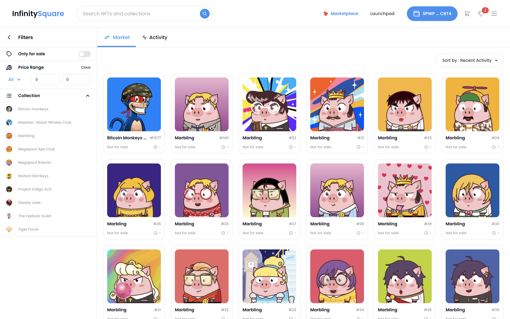

### My Full Tech stack ⚡

### Todo stack ✨

- - -

### 🔥 InfinitySquare - NFT Marketplace, launchpad
 
<table>
  <tr>
    <td>
      
    </td>
    <td>
      
    </td>
  </tr>
</table>

- - -
### 🔥 Transtacks - Transfer Stacks coin, fungible tokens and NFT all together at once
 
<table>
  <tr>
    <td>
      
    </td>
    <td>
      
    </td>
  </tr>
</table>

- - -
### 🔥 Stxbet - A game that predicts and bets the price of the stack coin of the upcoming block
 
<table>
  <tr>
    <td>
      
    </td>
    <td>
      
    </td>
  </tr>
</table>

<!--
<kbd></kbd>&nbsp;&nbsp;&nbsp;
DDF56D
**LookLukeLemon/LookLukeLemon** is a ✨ _special_ ✨ repository because its `README.md` (this file) appears on your GitHub profile.

Here are some ideas to get you started:

- 🔭 I’m currently working on ...
- 🌱 I’m currently learning ...
- 👯 I’m looking to collaborate on ...
- 🤔 I’m looking for help with ...
- 💬 Ask me about ...
- 📫 How to reach me: ...
- 😄 Pronouns: ...
- ⚡ Fun fact: ...
👋
-->
